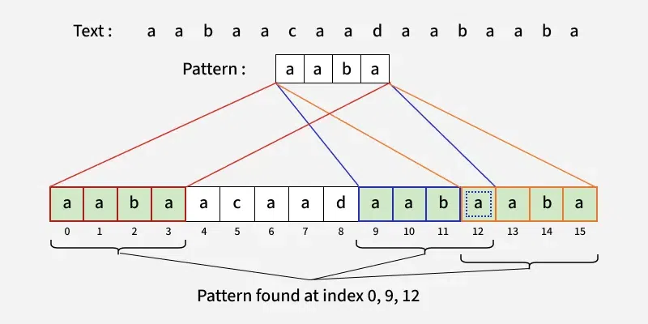
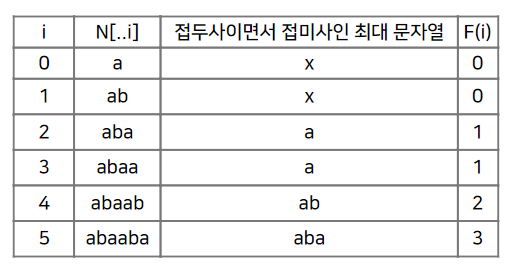

[ geeksforgeeks - KMP Algorithm for Pattern Searching ](https://www.geeksforgeeks.org/kmp-algorithm-for-pattern-searching/)   

# KMP Algorithm
txt와 pat이라는 두 문자열이 주어졌을 때, txt 내부에 pat이 존재하는 모든 indices를 반환하는 알고리즘이다.   
```
Input: txt = "aabaacaadaabaaba", pat = "aaba"
Output: [0, 9, 12]
```
   
The string "aaba" occurs third in txt, first occurrence starts from index 0, second from index 9 and third from index 12.   

즉, KMP 알고리즘은 효율적으로 text 내부의 pattern 문자열을 찾는 방법이다.   

## How
naive pattern searching algorithm는 txt와 pat이 불일치하면 pattern의 시작 부분부터 다시 탐색한다.   
이와 달리 KMP는 pat과 txt의 불일치가 발생했을 때 중복 연산을 피하는데, 이를 위해서 불일치시 얼만큼 건너 뛰고 비교 연산을 할 것인지 판단해야 한다.   

O(M + N) : LPS 생성과 Pattern Searching을 고려한 시간 복잡도   

### 1. Construction of LPS Array
**Longest Prefix Suffix**( lps ) 배열을 만든다.   
**pat 문자열의 prefix와 suffix의 일치 부분을 계산해서 배열로 저장**한다.   
LPS 말고도 **Partial Match Table**( 부분 일치 테이블 ) 또는 **Failure Function**이라 말하기도 한다.   

   

여기서 `len`은 `j`로 대체한다.   
변수 **j는 현재까지 일치한 prefix의 길이**를 나타낸다.   

pattern의 각 문자에 대해 이전 prefix와의 일치를 검사하고, 부분 일치 값을 lps에 저장한다.   
```cpp
std::vector<int> LPS(const std::string& pat) {
  int m = pat.length();
  std::vector<int> table(m, 0);

  int j = 0;      // prefix index
  for (int i = 1; i < m; ++i) {   // create table
    // 일치하지 않을 경우, 이전 접두사의 부분 일치 값으로 이동
    while (j > 0 && pat[i] != pat[j]) {
      j = table[j - 1];
    }

    if (pat[i] == pat[j]) {
      table[i] = ++j;
    }
    else {
      table[i] = 0;
    }
  }

  return table;
}
```
`table[0]`은 항상 `0`이다. 왜냐하면 prefix index( 또는 현재 인덱스 )를 나타내는 `j`가 suffix index를 나타내는 `i`와 같은 위치에 존재하기 때문이다.   

따라서 `i`는 1부터 시작한다.   
**table[i]에 저장된 정보는 해당 위치까지의 prefix와 suffix가 일치하는 최대 길이**를 나타낸다.   

**현재 문자( pat[j] )와 prefix의 다음 문자( pat[i] )를 비교**한다.   
1. **일치하는 경우**
   1. `j`를 증가시키고, `table[i]`에 `j`를 저장한다.
2. **일치하지 않는 경우**
   1. `j`가 0이 될 때까지 `table[j - 1]`로 이동하고, 이전 prefix의 부분 일치 값을 참조한다.
   2. 계속 불일치하면 `table[i]`는 `0`이 된다.


### 2. Pattern Searching
```cpp
int KMP_search(const std::string& text, const std::string& pattern) {
  int n = text.length();
  int m = pattern.length();
  int count = 0;            // pattern이 나타나는 횟수
  int j = 0;                // pattern index

  std::vector<int> table = LPS(pattern);

  for (int i = 0; i < n; ++i) {
    // 불일치가 발생하면 부분 일치 테이블을 참고해서 pattern index 조정
    while (j > 0 && text[i] != pattern[j]) {
      j = table[j - 1];
    }

    if (text[i] == pattern[j]) {
      ++j;
    }

    // pattern 전체가 일치한 경우
    if (j == m) {
      ++count;
      j = table[j - 1]; // 다음 검색을 위해 pattern index 조정
    }
  }

  return count;
}
```
text 부분 문자열과 pattern이 일치하는 횟수를 반환한다.   
```cpp
std::vector<int> KMP_search(const std::string& text, const std::string& pattern) {
  int n = text.length();
  int m = pattern.length();
  std::vector<int> result;  // pattern이 나타나는 시작 index를 저장
  int j = 0;                // pattern index

  std::vector<int> table = LPS(pattern);

  for (int i = 0; i < n; ++i) {
    // 불일치가 발생하면 부분 일치 테이블을 참고해서 pattern index 조정
    while (j > 0 && text[i] != pattern[j]) {
      j = table[j - 1];
    }

    if (text[i] == pattern[j]) {
      ++j;
    }

    // pattern 전체가 일치한 경우
    if (j == m) {
      result.emplace_back(i - m + 1);
      j = table[j - 1]; // 다음 검색을 위해 pattern index 조정
    }
  }

  return result;
}
```
text에서 pattern이 나타나는 시작 index를 저장하는 배열을 반환한다.   