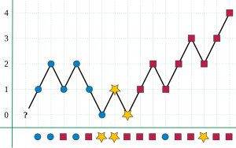

# Introduce
배열 내에서 과반수가 될 수 있는 원소를 고르는 방법을 생각하면, brute force와 hash-map을 이용한 방법이 먼저 떠오른다. brute force는 O(N^2)만큼의 시간이 걸리고, hash-map은 memory를 많이 사용한다.   
이러한 방법들 보다 시간/공간 복잡도 측면에서 유리한 알고리즘을 소개한다.   

[simultion - moore](https://www.cs.utexas.edu/~moore/best-ideas/mjrty/example.html)   

Majority vote algorithm( 과반수 투표 알고리즘 )이라고 불리는 **Moore Voting Majority Algorithm은 배열에 포함된 원소들 중 절반이 넘게 포함된 원소를 O(N)[ Linear TIME ]과 O(1)[ Constant SPACE ]로 찾을 수 있는 알고리즘**이다.   

**배열 내 절반이 넘는 수에 해당하는 원소가 존재한다고 보장**하면, **결과값은 항상 과반수 원소**가 된다.   
만약 배열에서 과반수( 무조건 절반이 넘는 경우 )만큼 등장하는 원소가 없으면, 결과값으로 의미없는 값이 나온다.   

# Explanation
**majority element가 될 수 있는 후보( `candidate` )를 고르는 부분**과 **그 후보가 실제로 majority element인지 확인하는 부분**으로 나뉜다.   

   

위 이미지의 y축은 `count`를 나타내고, x축은 배열의 원소를 나타낸다.   
여기서 10번째 원소까지 판단하는 경우, 사각형이 후보로 선택될 수 있지만 과반수가 아니다. 즉, `candidate`는 후보를 뜻하고 majority element가 아닐 수 있다.   

# Algorithm
[leetcode problem](https://leetcode.com/problems/majority-element/solutions/3676530/3-method-s-beats-100-c-java-python-beginner-friendly/?envType=study-plan-v2&envId=top-interview-150)를 기준으로 설명한다.   
해당 문제는 과반수임을 보장하기 때문에 확인하는 과정은 필요없다.   

## 1. Majority Element 후보 고르기
**loop를 순회하면서 majority element의 후보를 고른다.**   

`count`와 `candidate` 변수를 `0`으로 초기화한다.   
`nums`를 순회한다.   
- 만약 `count`가 `0`이라면, 현재 원소를 새로운 `candidate`로 초기화하고 `count++`을 수행한다.
- 만약 현재 원소가 `candidate`와 같다면, `count++`
- 만약 현재 원소가 `candidate`와 다르다면, `count--`

```cpp
int majorityElement(vector<int>& nums) {
  int count = 0, candidate = 0;
  for (int num : nums) {
    if (count == 0) {
      candidate = num;
    }

    if (num == candidate) {
      count++;
    }
    else {
      count--;
    }
  }

  // ...
}
```
for문 내부에서 `if, if-else`로 코드를 작성한 이유는 두 과정이 별개이기 때문이다.   
처음에 `candidate`를 배열의 첫 원소로 지정하고, `count`를 1 증가시킬 때도 사용한다.   

만약 현재 원소가 `candidate`와 동일하다면 빈도수가 증가한 것이므로 `count`를 증가시킨다. 그렇지 않으면, 현재 `candidate`와 다른 원소가 나왔음으로 `count`를 감소시킨다.   

`count`가 0이라는 의미는 현재 `candidate`가 다른 원소들과 나온 횟수가 같은 상황에서 새로운 원소를 만났다는 의미다.   
따라서 더 이상 majority element가 될 수 없기 때문에 현재 원소를 새로운 `candidate`로 선택한다.   


## 2. 후보의 과반수 확인
배열 내에 절반이 넘게 존재하는 과반수를 원하기 때문에 **후보로 골라진 원소가 절반 이하인지 확인**한다.   

```cpp
int majorityElement(vector<int>& nums) {
  // ...

  int freq = 0;
  for (int num : nums) {
    if (num == candidate) {
      ++freq;
    }
  }

  if (freq > nums.size() / 2) {
    return candidate;
  }
  return -1;
}
```