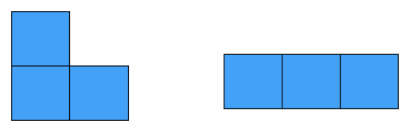

# 문제
[코드트리 - 트로미노](https://www.codetree.ai/missions/2/problems/tromino?&utm_source=clipboard&utm_medium=text)

n * m크기의 이차원 영역의 각 위치에 자연수가 하나씩 적혀있습니다. 이 때 아래의 그림에 주어진 2가지 종류의 블럭 중 한 개를 블럭이 격자를 벗어나지 않도록 적당히 올려놓아 블럭이 놓인 칸 안에 적힌 숫자의 합이 최대가 될 때의 결과를 출력하는 프로그램을 작성해보세요. 단, 주어진 블럭은 자유롭게 회전하거나 뒤집을 수 있습니다.



### 입력
첫 번째 줄에는 n과 m이 공백을 사이에 두고 주어지고, 두 번째 줄부터 (n+1)번째 줄까지는 각 행의 숫자가 공백을 사이에 두고 주어집니다.

( 3 ≤ n, m ≤ 200, 1 ≤ 자연수 ≤ 1,000 )

### 출력
블럭 안에 적힌 숫자합의 최대값을 출력합니다.

### 제한
시간 제한: 1000ms
메모리 제한: 80MB

### 테스트 케이스
```cpp
// 입력
3 3
1 2 3
3 2 1
3 1 1
// 출력
8
```

# 풀이
풀지 못한 문제.
</br>L자와 I자 모양의 블럭을 일일이 비교하는 것까지는 접근했다.
</br>하지만 모양을 배열에 저장해서 사용할 생각을 못했고, for문에서 index를 통해 모양을 만들어가면서 풀려고 했다.

### 코드
```cpp
#include <iostream>
#include <vector>
#include <utility>
#include <algorithm>

using namespace std;

// block의 모든 상태를 나타내는 함수
vector<vector<pair<int, int>>> GetBlockShapes()
{
	vector<vector<pair<int, int>>> blockShapes;

	// L-block
	blockShapes.push_back({ {0, 0}, {1, 0}, {1, 1} });
	blockShapes.push_back({ {0, 0}, {0, 1}, {1, 0} });
	blockShapes.push_back({ {0, 0}, {0, 1}, {1, 1} });
	blockShapes.push_back({ {0, 0}, {1, 0}, {1, -1} });
	blockShapes.push_back({ {0, 0}, {0, -1}, {1, 0} });
	blockShapes.push_back({ {0, 0}, {-1, 0}, {-1, -1} });
	blockShapes.push_back({ {0, 0}, {0, -1}, {-1, 0} });
	blockShapes.push_back({ {0, 0}, {-1, 0}, {-1, 1} });

	// I-block
	blockShapes.push_back({ {0, 0}, {0, 1}, {0, 2} });
	blockShapes.push_back({ {0, 0}, {1, 0}, {2, 0} });

	return blockShapes;
}

int GetMaxSum(const vector<vector<int>>& grid, int row, int col, int N, int M)
{
	int maxSum = 0;
	vector<vector<pair<int, int>>> blockShapes = GetBlockShapes();

	// 하나의 block을 꺼낸다.
	for (const auto& block : blockShapes) {
		int curSum = 0;
		bool valid = true;

		// 꺼낸 block의 좌표값을 가져온다.
		for (const auto& inBlock : block) {
			int y = row + inBlock.first;
			int x = col + inBlock.second;
			if (y >= 0 && y < N && x >= 0 && x < M) {
				curSum += grid[y][x];
			}
			else {
				valid = false;
				break;
			}
		}

		if (valid) {
			maxSum = max(maxSum, curSum);
		}
	}

	return maxSum;
}

int main()
{
	int N, M;
	cin >> N >> M;

	vector<vector<int>> grid(N, vector<int>(M));
	for (int row = 0; row < N; ++row) {
		for (int col = 0; col < M; ++col) {
			cin >> grid[row][col];
		}
	}

	int maxSum = 0;
	for (int row = 0; row < N; ++row) {
		for (int col = 0; col < M; ++col) {
			maxSum = max(maxSum, GetMaxSum(grid, row, col, N, M));
		}
	}


	cout << maxSum;
}
```

배열을 이용해서 모양을 저장해도 된다.
</br>하나의 좌표를 기준으로 L, I자 블럭을 모두 탐색할 수 있다.