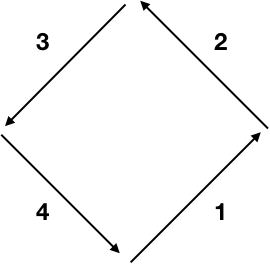
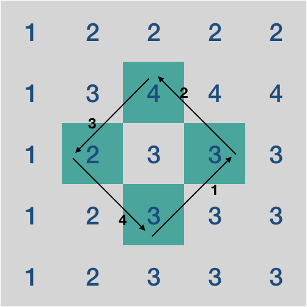
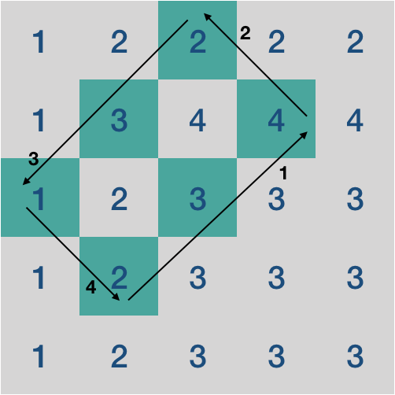

# 문제
[코드트리 - 기울어진 직사각형](https://www.codetree.ai/missions/2/problems/slanted-rectangle?&utm_source=clipboard&utm_medium=text)

1이상 100이하의 숫자로만 이루어져 있는 n * n 크기의 격자 정보가 주어집니다.
</br>이때, 이 격자 내에 있는 기울어진 직사각형들을 살펴보려고 합니다.

기울어진 직사각형이란, 격자내에 있는 한 지점으로부터 체스의 비숍처럼 대각선으로 움직이며 반시계 순회를 했을 때 지나왔던 지점들의 집합을 일컫습니다. 이 때 반드시 아래에서 시작해서 1, 2, 3, 4번 방향순으로 순회해야하며 각 방향으로 최소 1번은 움직여야 합니다. 또한, 이동하는 도중 격자 밖으로 넘어가서는 안됩니다.

| | | |
|:--:|:--:|:--:|
|  |  |  |

예를 들어 왼쪽의 규칙에 따라 다음과 같은 기울어진 직사각형을 2개 만들어 볼 수 있습니다.

가능한 기울어진 직사각형들 중 해당 직사각형을 이루는 지점에 적힌 숫자들의 합이 최대가 되도록 하는 프로그램을 작성해보세요.

위의 예에서는 다음과 같이 기울어진 직사각형을 잡게 되었을 때 합이 21이 되어 최대가 됩니다.

### 입력
첫 번째 줄에는 격자의 크기를 나타내는 n이 주어집니다( 3 ≤ n ≤ 20 ).

두 번째 줄부터는 n개의 줄에 걸쳐 격자에 대한 정보가 주어집니다. 각 줄에는 각각의 행에 대한 정보가 주어지며, 이 정보는 1이상 100이하의 숫자로 각각 공백을 사이에 두고 주어집니다.


### 출력
가능한 기울어진 직사각형들 중 최대의 합을 출력해주세요.

### 테스트 케이스
```cpp
// 입력
5
1 2 2 2 2
1 3 4 4 4
1 2 3 3 3
1 2 3 3 3
1 2 3 3 3
// 출력
21
```

# 풀이

처음에는 한 쪽 방향으로 계속 이동해서 grid 범위를 벗어나면 다른 방향으로 이동하면서 최대 합을 구했다.

하지만 "/"와 같은 1자형 모양이 발생하여 답을 맞추지 못했다.

이 부분을 해결하지 못해서 해설을 보고 풀었다.

```cpp
#include <iostream>
#include <algorithm>
#include <utility>

using namespace std;

const int MAX_N = 20;
int grid[MAX_N][MAX_N];

// grid 밖으로 나가지 않으면 true
bool InRanged(int x, int y, int N)
{
	return y >= 0 && y < N && x >= 0 && x < N;
}

// 만들어진 직사각형에 존재하는 합
int GetSumOfRhombus(int x, int y, int len1, int len2, int N)
{
	// 1, 2, 3, 4번 이동 방향
	pair<int, int> dir[] = { {-1, 1}, {-1, -1}, {1, -1}, {1, 1} };

	int sum = 0;
	int nextX, nextY;
	int curX = x, curY = y;

	// 중복 코드를 하나로 합치기엔 반환값( next좌표와 sum값 )이 2개
	// 1번 방향
	for (int i = 1; i <= len1; ++i) {
		nextX = curX + dir[0].first;
		nextY = curY + dir[0].second;
		if (!InRanged(nextX, nextY, N)) return -1;

		sum += grid[nextX][nextY];
		curX = nextX;
		curY = nextY;
	}

	// 2번 방향
	for (int i = 1; i <= len2; ++i) {
		nextX = curX + dir[1].first;
		nextY = curY + dir[1].second;
		if (!InRanged(nextX, nextY, N)) return -1;

		sum += grid[nextX][nextY];
		curX = nextX;
		curY = nextY;
	}

	// 3번 방향
	for (int i = 1; i <= len1; ++i) {
		nextX = curX + dir[2].first;
		nextY = curY + dir[2].second;
		if (!InRanged(nextX, nextY, N)) return -1;

		sum += grid[nextX][nextY];
		curX = nextX;
		curY = nextY;
	}

	// 4번 방향
	for (int i = 1; i <= len2; ++i) {
		nextX = curX + dir[3].first;
		nextY = curY + dir[3].second;
		if (!InRanged(nextX, nextY, N)) return -1;

		sum += grid[nextX][nextY];
		curX = nextX;
		curY = nextY;
	}

	return sum;
}

// 현재 좌표에서 만들 수 있는 가장 큰 직사각형을 만든 뒤 최대합을 반환한다.
int GetMaxSumOfRhombus(int x, int y, int N)
{
	int maxSum = 0;

	// len1: 1, 3번 방향의 길이
	// len2: 2, 4번 방향의 길이 - 서로 같은 길이를 가짐
	for (int len1 = 1; len1 < N; ++len1) {
		for (int len2 = 1; len2 < N; ++len2) {
			maxSum = max(maxSum, GetSumOfRhombus(x, y, len1, len2, N));
		}
	}

	return maxSum;
}

int main()
{
	int N;
	cin >> N;

	for (int x = 0; x < N; ++x) {
		for (int y = 0; y < N; ++y) {
			cin >> grid[x][y];
		}
	}

	int maxSum = 0;

	// 최상단 + 그 밑, 최좌단, 최우단은 제외
	for (int x = 2; x < N; ++x) {
		for (int y = 1; y < N - 1; ++y) {
			maxSum = max(maxSum, GetMaxSumOfRhombus(x, y, N));
		}
	}

	cout << maxSum;
}
```

(1, 3), (2, 4)번 방향의 크기가 같음을 알고 있었지만 이를 활용하지 않아서 해결책을 생각 못한 것 같다.

1, 2, 3, 4번 방향으로 len1, len2만큼 이동할 때의 로직이 비슷했다.
</br>이를 하나의 함수로 통합하려고 했으나 반환 값이 2개가 필요했기에 중복 코드를 제거하지 않았다.