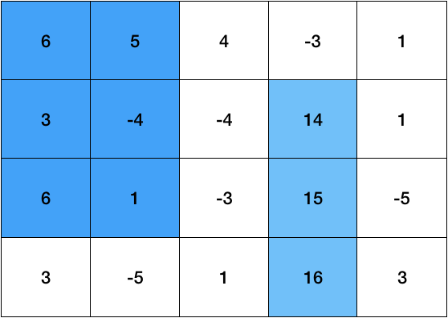

# 문제
[코드트리 - 겹쳐지지 않는 두 직사각형](https://www.codetree.ai/missions/2/problems/non-overlapping-two-rectangles?&utm_source=clipboard&utm_medium=text)

n * m크기의 이차원 영역의 각 위치에 정수 값이 하나씩 적혀있습니다. 이 영역 안에서 서로 겹치지 않는 두 직사각형을 적절하게 잡아, 두 직사각형 안에 적힌 숫자들의 총 합을 최대로 하는 프로그램을 작성해보세요. 이때, 각 직사각형의 변들은 격자 판에 평행해야 하고 꼭 2개의 직사각형을 골라야만 하며, 두 직사각형의 경계는 서로 닿아도 됩니다.

예를 들어 다음 그림의 경우에는, 두 직사각형을 적절히 잡아 합을 62 만큼 만들 수 있습니다.



### 입력
첫 번째 줄에는 n과 m이 공백을 사이에 두고 주어지고, 두 번째 줄부터 (n+1)번째 줄까지는 각 행의 숫자가 공백을 사이에 두고 주어집니다.

( 2 ≤ n, m ≤ 5 )
</br>( -1,000 ≤ 정수 값 ≤ 1,000 )

### 출력
겹치지 않게 두 직사각형을 잡았을 때, 얻을 수 있는 최대 합을 출력해주세요.
- 시간 제한: 1000ms
- 메모리 제한: 80MB

### 테스트 케이스
```cpp
// 입력
4 5
6 5 4 -3 1
3 -4 -4 14 1
6 1 -3 15 -5
3 -5 1 16 3
// 출력
63
```

# 풀이
직사각형의 범위를 위해선 x1 ~ x2 구간과 y1 ~ y2구간이 필요했고, 이는 4중 for문으로 나타낼 수 있다.
</br>하지만 4중 for문은 잘못된 접근 방법인 것 같았고, 다른 방식으로 풀려고 했으나 생각이 나지 않았다.
</br>그래서 해설을 봤더니 하나의 직사각형을 4중 for문으로 만드는 것이 맞았다..

### prefix sum
구간 합을 O(1) 시간으로 찾을 수 있는 방법이다.
</br>자세한 내용은 [prefix_sum.md](/3_Math/matrix/prefix_sum.md)에서 살펴보자.

```cpp
#include <iostream>
#include <vector>
#include <algorithm>
#include <climits>

using namespace std;

void InitPrefixSum(const vector<vector<int>>& grid, vector<vector<int>>& prefix)
{
	int N = grid.size();
	int M = grid[0].size();
	prefix.assign(N, vector<int>(M, 0));
	for (int y = 0; y < N; ++y) {
		for (int x = 0; x < M; ++x) {
			prefix[y][x] = grid[y][x];
			if (y > 0) prefix[y][x] += prefix[y - 1][x];				// (y, x) + (y - 1, x)까지의 합
			if (x > 0) prefix[y][x] += prefix[y][x - 1];				// (y, x) + (y, x - 1)까지의 합
			if (y > 0 && x > 0) prefix[y][x] -= prefix[y - 1][x - 1];	// (y, x) - (y - 1, x - 1)까지의 합
		}
	}
}

// 구간 합
int GetSum(const vector<vector<int>>& prefix, int y1, int x1, int y2, int x2)
{
	int sum = prefix[y2][x2];
	if (y1 > 0) sum -= prefix[y1 - 1][x2];
	if (x1 > 0) sum -= prefix[y2][x1 - 1];
	if (y1 > 0 && x1 > 0) sum += prefix[y1 - 1][x1 - 1];
	return sum;
}

int GetMaxSum(const vector<vector<int>>& grid)
{
	int N = grid.size();
	int M = grid[0].size();

	vector<vector<int>> prefix;
	InitPrefixSum(grid, prefix);

	int maxSum = INT_MIN;

	// 첫 번째 직사각형
	for (int y1 = 0; y1 < N; ++y1) {
		for (int x1 = 0; x1 < M; ++x1) {
			for (int y2 = y1; y2 < N; ++y2) {
				for (int x2 = x1; x2 < M; ++x2) {
					int sumRect1 = GetSum(prefix, y1, x1, y2, x2);

					// 두 번째 직사각형
					for (int yy1 = 0; yy1 < N; ++yy1) {
						for (int xx1 = 0; xx1 < M; ++xx1) {
							for (int yy2 = yy1; yy2 < N; ++yy2) {
								for (int xx2 = xx1; xx2 < M; ++xx2) {
									if (yy1 > y2 || yy2 < y1 || xx1 > x2 || xx2 < x1) {
										int sumRect2 = GetSum(prefix, yy1, xx1, yy2, xx2);
										maxSum = max(maxSum, sumRect1 + sumRect2);
									}
								}
							}
						}
					}
				}
			}
		}
	}

	return maxSum;
}

int main()
{
	int N, M;
	cin >> N >> M;

	vector<vector<int>> grid(N, vector<int>(M));
	for (int y = 0; y < N; ++y) {
		for (int x = 0; x < M; ++x) {
			cin >> grid[y][x];
		}
	}

	cout << GetMaxSum(grid);
}
```

prefix를 초기화하는 방법과 구간 합을 구하는 방법은 [prefix_sum.md](/3_Math/matrix/prefix_sum.md)를 살펴보자.
</br>두 개의 직사각형 범위를 탐색하는 방법과 두 직사각형이 겹치지 않도록 도와주는 if문이 아직 어렵다.

</br>if문은 직접 그려보면 이해하기 쉽다.

```cpp
if (yy1 > y2 || yy2 < y1 || xx1 > x2 || xx2 < x1)
```

yy1 > y2와 yy2 < y1은 2번 직사각형이 1번 직사각형의 아래 또는 위에 있는 경우를 나타낸다.
</br>xx1 > x2와 xx2 < x1은 2번 직사각형이 1번 직사각형의 오른쪽 또는 왼쪽에 있는 경우를 나타낸다.