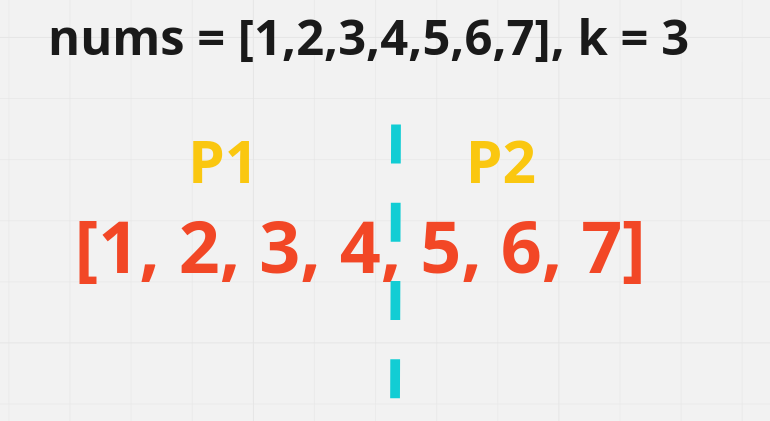
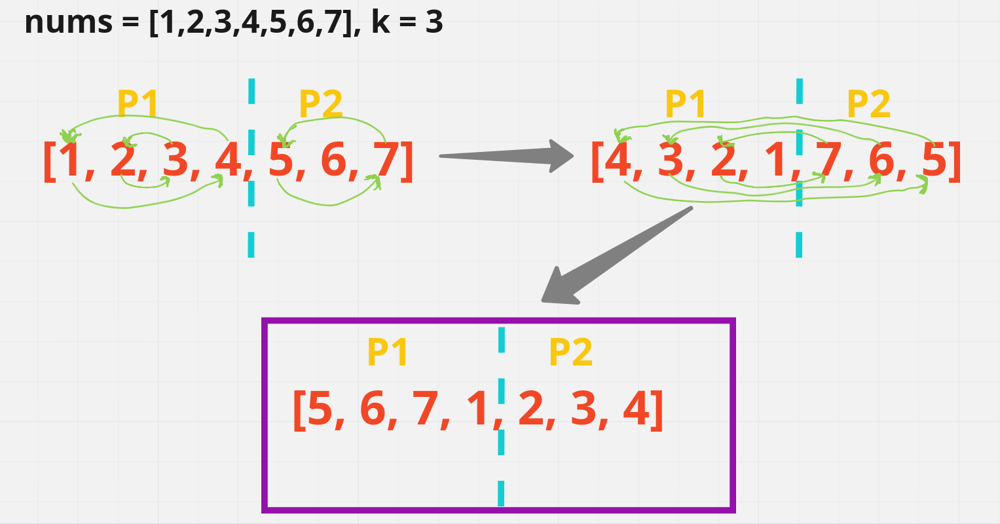

[leetcode](https://leetcode.com/problems/rotate-array/description/?envType=study-plan-v2&envId=top-interview-150)   

정수형 배열 `nums`가 주어지고, 이 원소들을 오른쪽으로 `k`번 이동시킨 `nums`를 구한다.   
이때 `k`는 0 이상의 값을 가진다.   

# ME
```cpp
// FUNC
int size = nums.size();
  int cnt = k % size;
  cout << size << endl;
  while (cnt--) {
    int temp = nums[size - 1];
    for (int i = size - 2; i >= 0; --i) {
      nums[i + 1] = nums[i];
    }
    nums[0] = temp;
}
```
O(1)의 공간 복잡도를 위해서 O(N^2)의 시간 복잡도로 접근했더니 Time Limit Exceeded가 떠서 틀렸다.   

# Other
시간 및 공간 복잡도가 O(N)인 알고리즘을 살펴본다.   
```cpp
class Solution {
public:
    void reverse(vector<int>& nums, int i, int j) {
      int li = i;
      int ri = j;

      while (li < ri) {
        int temp = nums[li];
        nums[li] = nums[ri];
        nums[ri] = temp;

        li++;
        ri--;
      }
    }

    void rotate(vector<int>& nums, int k) {
        int size = nums.size();
        k = k % size;
        if (k < 0) {  // k가 음수인 경우( left-rotation effect )
          k += size;
        }

        reverse(nums, 0, size - k - 1);
        reverse(nums, size - k, size - 1);
        reverse(nums, 0, size - 1);
    }
};
```
`k`가 음수인 경우( left-shift )도 고려한 풀이다.   
배열을 두 Part로 나누고 다시 원래 배열로 합치는 방식이다.   

## TESTCASE
```
nums = [1,2,3,4,5,6,7], k = 3
```


part1은 배열의 마지막 3 원소를 제외한 `[1, 2, 3, 4]` 부분을 의미한다.   
part2는 배열의 남겨진 3 원소를 의미하는 `[5, 6, 7]` 부분을 나타낸다.   



각 part의 원소를 reverse( 뒤집기 )하고, right-shift한 `nums`를 나타내기 위해 parts로 나눈 기준 위치를 중심으로 reverse를 수행한다.   

## 어떻게 이런 생각을?
배열을 오른쪽으로 `k`칸 이동한다는 것은 **마지막 `k`개의 원소를 앞으로 가져오고, 나머지 앞의 `n - k`개 원소를 뒤로 보내는 것과 같다**.   

**두 구간( 앞/뒤 )을 뒤집고, 배열 전체를 뒤집는 것이 오른쪽 회전과 같은 결과를 가져오기 때문**이다.   