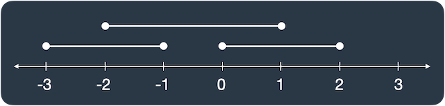

# 겹치는 선분의 길이
[겹치는 선분의 길이](https://school.programmers.co.kr/learn/courses/30/lessons/120876)   

   
처음에는 freq 배열에 각 점의 빈도를 저장했지만, 선분이 끊어졌음에도 freq의 빈도수가 2 이상이므로 선분으로 판단하는 경우가 발생했다   
결국 해답을 찾지 못해 GPT에게 요청하여 `Sweep Line` Algorithm을 알았다   

# 풀이
## Sweep Line Algorithm
선분의 시작과 끝을 이벤트로 처리하여, 현재 활성화된 선분의 개수를 추적하면서 겹치는 부분의 길이를 계산한다   
[sweep line algorithm - 겹치는 선분의 길이](../1_Sweep_Line_Algorithm.md/#1-겹치는-선분의-길이)   

## ME - 2
```cpp
#include <vector>
#include <algorithm>

using namespace std;

struct Event {
    int position;
    int type;
    
    Event(int _position, int _type) : position(_position), type(_type) {}
    
    bool operator<(const Event& other) const {
        return position != other.position ? position < other.position : type > other.type;
    }
};

int solution(vector<vector<int>> lines) {
    // 1. Event 정의( position, type )
    // 2. 각 line을 Event로 관리
    // 3. vector<Event>를 정렬( position이 오름차순으로 정렬하되, 같은 위치는 시작점이 앞에 위치 )
    // 4. Event를 순회하면서 활성화된 line이 2개 이상이면 이전 Event의 poisition에서 현재 position의 거리를 ret에 더함
    // 5. 활성화 여부를 위해 type을 (1 - 시작점, -1 - 끝점)으로 관리
    vector<Event> events;
    for (const auto& line : lines) {
        int start = line[0];
        int end = line[1];
        events.emplace_back(start, 1);
        events.emplace_back(end, -1);
    }
    sort(events.begin(), events.end());
    
    int total_overlap = 0;
    int active = 0;
    int prev_position = 0;
    for (const Event& event : events) {
        if (active >= 2) {
            total_overlap += (event.position - prev_position);
        }
        
        active += event.type;
        prev_position = event.position;
    }
    
    return total_overlap;
}
```