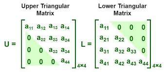

- [Introduce](#introduce)
- [Checking the Lower/Upper Triangular Matrix](#checking-the-lowerupper-triangular-matrix)
    - [1. for문](#1-for문)
    - [2. string(count, ch)](#2-stringcount-ch)

<br>

# Introduce
Problem Solving을 하던 중 생각하기 어려운 방법으로 matrix를 사용하여 문제를 푸는 방법을 기록한다.<br>

<br>

# Checking the Lower/Upper Triangular Matrix
`행렬의 대각선 아래쪽 또는 위쪽만 검사하는 방법`을 알아본다<br>

### 1. for문
[ Programmers - 특별한 이차원 배열 2 ](https://school.programmers.co.kr/learn/courses/30/lessons/181831)<br>
`[r][c] == [c][r]`에 대해 조건을 제시한 문제<br>
```cpp
#include <vector>
using namespace std;

int solution(vector<vector<int>> arr)
{
  for (int r = 0; r < arr.size(); ++r) {
    for (int c = 0; c < r; ++c) {         // upper triangular matrix의 0 부분을 검사
      if (arr[r][c] != [c][r]) return 0;
    }
  }
  return 1;
}
```
<br>
위 이미지는 어떤 면을 계산하는지 보여주는 용도이다<br>
중복 연산을 피하기 위해서 2차원 배열 대각선을 기준으로 왼편( upper triangular matrix의 0 부분 )에 대해서만 연산을 수행한다<br>

<br>

### 2. string(count, ch)
[ Programmers - 직각삼각형 출력 ](https://school.programmers.co.kr/learn/courses/30/lessons/120823)<br>
lower-triangular matrix( 0부분을 제외한 matrix )에 string constructor를 이용하는 방법으로 별을 찍어본다<br>
```cpp
#include <string>
#include <iostream>
using namespace std;

int main() {
  int n;
  cin >> n;
  for (int i = 1; i <= n; ++i)
    cout << string(i, '*') << '\n';
}
```
[ string(count, ch) constructor 참고 ](/1_Algorithm/Skills/2_string.md/#문자-반복-출력)<br>
해당 문자열 생성자를 이용해서 lower-triangular matrix 자리에 별을 찍었다<br>
```cpp
// string constructor to for
for (int row = 0; row < n; ++row) {
  for (int col = 0; col <= row; ++col)
    cout << '*';
  cout << '\n';
}
```