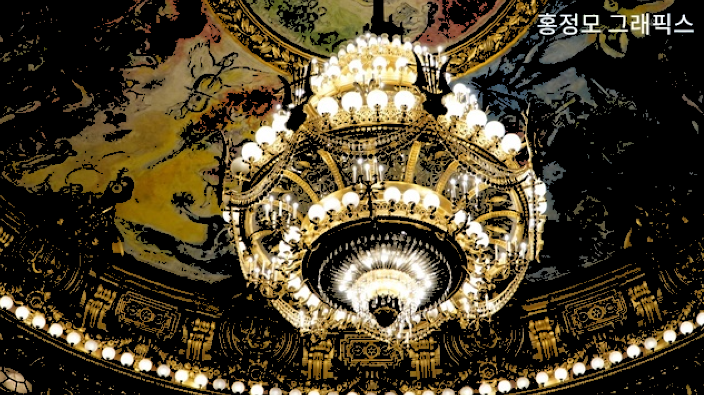

Bloom Effect를 만들기 위해 알아야 할 개념
# 목차
- [목차](#목차)
- [1. 이미지 읽고 저장하기](#1-이미지-읽고-저장하기)
  - [channels](#channels)
  - [이미지 읽기](#이미지-읽기)
  - [이미지 저장](#이미지-저장)
  - [이미지 밝게 하기](#이미지-밝게-하기)
    - [Relative Luminance Y](#relative-luminance-y)
- [2. convolution 이해하기](#2-convolution-이해하기)
  - [kernel](#kernel)
  - [convolution](#convolution)
  - [seperable convolution](#seperable-convolution)
- [3. Gaussian 필터 만들기](#3-gaussian-필터-만들기)
- [4. Bloom 효과 만들기](#4-bloom-효과-만들기)
  - [순서](#순서)

# 1. 이미지 읽고 저장하기
## channels
R, G, B, A가 채널을 의미한다.
</br>RGB만 있으면 3개 채널, RGBA라면 4개 채널이 존재한다. 

## 이미지 읽기
색깔 값을 이미지 파일에 저장할 때는 uint8_t( unsigned char, 8bit, 0 ~ 255 )을 사용한다.
</br></br>
Image Processing( 이미지 프로세싱 )을 통해 이미지를 읽어들일 때는 중간 단계로 uint8_t을 4채널 float( 32bit, 0.0f ~ 1.0f )로 변환( 8bit -> 32bit )하고, 이후에 저장한다. </br>
HDR( High Dynamic Range )을 사용하거나 컴퓨터 shader로 수치 연산을 할 때는 float를 사용하는 경우가 많기 때문이다.
</br>
</br>
32bit 또는 64bit를 사용할지는 직접 제어할 수 있다. 참고로 딥러닝에서는 32bit가 부담되기 때문에 16bit float를 사용하는 경우도 있다.

## 이미지 저장
반대로 이미지 파일로 저장할 때는 32bit( float )를 8bit( unsigned char, uint8_t )로 다시 변환해야 한다.

## 이미지 밝게 하기
이미지의 RGB 값에 1보다 큰 값을 곱하면 밝아지고, 1보다 작은 값을 곱하면 어두워진다.
</br>즉, 이미지의 각 픽셀에 존재하는 RGB에 1.Nf 값을 곱해서 밝게 만들 수 있다.

</br>문제는 이렇게 밝게 만든 이미지를 저장하면 다른 이미지로 보일 수 있다. 위 이미지의 왼쪽이 원본이고, 오른쪽이 원본을 밝게 만든 뒤 저장한 이미지다.
</br></br>0.0f ~ 1.0f 사이의 값에 1.Nf를 곱하면 1.0f를 초과( overflow )할 수 있다. 이 상태에서 255를 곱하고 uint8_t로 캐스팅하면 overflow 때문에 원하는 값으로 저장할 수 없다.
</br></br>이러한 문제는 코드 상에서 직접 조절해야 한다. cpp의 경우, std::clamp()를 통해 0.0f ~ 1.0f 값을 벗어나지 않도록 고정할 수 있다.
</br>

또 다른 문제는 최대한 밝게 하더라도 이미지에 노란색 또는 빨간색이 남는 현상이 발생한다.
</br>이를 해결하려면 이미지를 읽어들일 때 각 픽셀의 RGB 값에 아주 작은 값을 한 번만 더하면 해결할 수 있다.

### Relative Luminance Y
"픽셀의 RGB에 어떤 값을 곱해야 사람의 눈으로 밝게 보일까?"에 대한 답을 과학자들이 도출해낸 값이다.

```cpp
Relative_Luminance_Y = 0.2126 * R + 0.7152 * G + 0.0722 * B

// cpp 예시
auto& a = this->GetPixel(x, y);
const float relativeLuminance = a.color[0] * 0.2126f + a.color[1] * 0.7152f + a.color[2] * 0.0722f;
```


# 2. convolution 이해하기
## kernel
Image Processing에서의 kernel이란? ( **[wiki](https://en.wikipedia.org/wiki/Kernel_(image_processing))** 참고 )
|Operation|Kernel|
|:---|:---:|
| `Identity` | $`\begin{bmatrix} 0 & 0 & 0 \\ 0 & 1 & 0 \\ 0 & 0 & 0 \end{bmatrix}`$ |
| `Box blur` | $`\frac{1}{9}\begin{bmatrix} 1 & 1 & 1 \\ 1 & 1 & 1 \\ 1 & 1 & 1 \end{bmatrix}`$ |
| `Gaussian blur 3 * 3` | $`\frac{1}{16}\begin{bmatrix} 1 & 2 & 1 \\ 2 & 4 & 2 \\ 1 & 2 & 1 \end{bmatrix}`$ |
| `Gaussian blur 5 * 5` | $`\frac{1}{256}\begin{bmatrix} 1 & 4 & 6 & 4 & 1 \\ 4 & 16 & 24 & 16 & 4 \\ 6 & 24 & 36 & 24 & 6 \\ 4 & 16 & 24 & 16 & 4 \\ 1 & 4 & 6 & 4 & 1 \end{bmatrix}`$ |

아래는 원본 이미지( identity )에 kernel 값을 convolution 한 결과이다.

| identity | box blur | gaussian blur3 | gaussian blur5 |
| :---: | :---: | :---: | :---: |
|  |  |  |  |

Box blur를 보면 3 * 3 행렬에 모든 값이 1이고, 이를 9로 나눈다. 즉, 평균을 구한다.
</br>Gaussian blur는 행렬이 어떤 방향으로 보더라도 대칭을 이룬다. 
</br>Box와 Gaussian blur는 행렬의 총합으로 행렬을 나눈다는 것을 알 수 있다.

## convolution


kernel을 이미지의 모든 픽셀에 적용시키는 과정을 convolution이라 한다.( **[wiki](https://en.wikipedia.org/wiki/Convolution)** 의 Discrete convolution gif 참고 )
</br>원본 이미지에 kernel 값을 convolution해서 결과 이미지를 얻는다.
</br>즉, 이미지에 특정 효과를 주고 싶으면 효과에 맞는 kernel 값을 찾아서 convolution하면 된다.

## seperable convolution
한 번에 2차원 kernel을 적용하는 대신에 1차원 kernel을 두 번 적용한다.


# 3. Gaussian 필터 만들기
box blur는 모든 픽셀이 동등한 가치를 가졌다. 하지만 Gaussian blur는 가운데 값에 가중치가 높고 주변으로 멀어질수록 가중치가 낮아진다.
</br>얼마나 가중치가 낮아지는지 Gaussian Function을 이용해서 구하지만, 이미 전문가분들이 최적화 해놓은 값이 있다.
```cpp
const float weights[5] = { 0.0545f, 0.2442f, 0.4026f, 0.2442f, 0.0545f };
```
위 가중치가 전문가분들이 가장 좋다고 보이는 값이다.
</br>가운데 픽셀값은 가중치가 높고 주변으로 멀어질수록 가중치가 낮아진다.
</br>참고로 위 5개의 숫자를 더하면 1이다.


# 4. Bloom 효과 만들기
## 순서


1. Bloom 효과를 만들기 위해서는 이미지의 모든 픽셀 중 밝은 부분은 그대로 둔 뒤에 어두운 부분은 검정색으로 바꾼다.
</br></br>그렇다면 밝음과 어두움을 결정 짓는 기준이 필요하다.
</br>[Relative Luminance Y](#relative-luminance-y) 값이 사람의 눈으로 인지할 수 있는 밝음의 기준이다.
</br></br>


2. 바꾼 이미지에 Gaussian blur를 적용한다.
</br>위 이미지는 Gaussian blur를 100번 적용한 결과 이미지이다.


3. 위 순서로 만들어진 이미지와 원본 이미지를 더하면 Bloom 효과가 적용된다.

