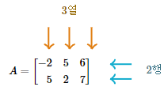

# m by n matrix
행렬의 헷갈리는 개념을 정확히 짚고 넘어간다.</br>
2차원 배열을 for문을 이용해서 탐색할 때, row와 col 변수를 사용하면서 발생하는 헷갈림을 잡는다.<br>

<br>

## row( 행 )와 column( 열 )

row는 `가로줄`, column은 `세로줄`을 의미한다.<br>

<br>
```cpp
a00 a01 a02
a10 a11 a12
```

### m * n 행렬
- m은 `row의 개수`
- n은 `col의 개수`

따라서 위 그림은 2 * 3 행렬이다.<br>
<br>
또한 row는 `가로줄의 위치, row_index`, column은 `세로줄의 위치, col_index`이다.<br>

<br>

## for문 순회
데이터가 row-major 방식으로 저장되는 경우( c/c++ )에는 row-major order가 효율적이다.

### 1. row, col 용어

```cpp
// row-major order
for (int row = 0; row < m; ++row) {
  for (int col = 0; col < n; ++col) {
    arr[row][col];
  }
}
```

row는 `row_index` 즉, 행 인덱스를 의미한다.
</br>row를 row 전체라고 생각하지 않는다.


```cpp
// column-major order
for (int col = 0; col < n; ++col) {
  for (int row = 0; row < m; ++row) {
    arr[row][col];
  }
}
```

col을 column 전체라고 생각하지 않는다.
</br>col은 `column_index` 즉, 열 인덱스를 의미한다.

### 2. x, y 좌표계

이미지에서의 좌표 개념을 적용한다.
</br>2차원 이미지는 행렬로 표현하며, 각 pixel의 위치는 (x, y) 좌표에 있다.

</br>x는 `가로 방향`, 이미지의 가장 왼쪽( 0 )에서 오른쪽( X )으로 이동한다.
</br>y는 `세로 방향`, 이미지의 가장 위쪽( 0 )에서 아래쪽( Y )으로 이동한다.

</br>수학 좌표계와 달리 이미지 좌표계는 y축이 위에서 아래로 증가하는 것이 일반적이다.
</br>(x, y) 좌표는 `이미지의 왼쪽 상단에서 오른쪽으로 x pixel, 아래로 y pixel 이동한 위치에 해당하는 pixel`을 가리킨다.

```cpp
// row-major order
for (int y = 0; y < n; ++y) {
  for (int x = 0; x < m; ++x) {
    arr[y][x];
  }
}

// column-major order
for (int x = 0; x < m; ++x) {
  for (int y = 0; y < n; ++y) {
    arr[y][x];
  }
}
```
