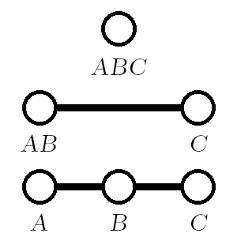
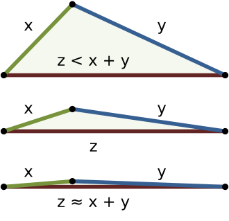

- [Triangle Inequality Theorem( 삼각형 완성 조건 )](#triangle-inequality-theorem-삼각형-완성-조건-)
  - [1. Degenerate Triangle](#1-degenerate-triangle)
  - [2. Triangle Inequality](#2-triangle-inequality)
    - [2.1. Triangle Inequality Expression](#21-triangle-inequality-expression)
    - [2.2. Counting the Number of Integers in a Closed Interval](#22-counting-the-number-of-integers-in-a-closed-interval)
  - [3. Code Example](#3-code-example)

<br><br>

# Triangle Inequality Theorem( 삼각형 완성 조건 )
`삼각형 세 변의 길이가 서로를 만족해야 삼각형을 성립`할 수 있다는 조건   

## 1. Degenerate Triangle
   
두 변의 길이의 합이 나머지 한 변의 길이보다 같은 경우, degenerate triangle을 나타낸다   
이는 넓이가 0인 삼각형을 의미한다   

## 2. Triangle Inequality
   
두 변의 길이의 합이 나머지 한 변의 길이보다 크거나 같아야 한다   
이때, 나머지 한 변이 가장 긴 변이다   

### 2.1. Triangle Inequality Expression
세 변 c, b, a가 다음의 삼각형 부등식을 만족해야 한다   
1. $a + b > c$
2. $a + c > b$
3. $b + c > a$

1번과 3번 조건을 이용하여 세 번째 변 c가 만족해야 하는 조건을 정리할 수 있다   

$$|a - b| < c < a + b$$

주어진 두 변 a, b와 세 번째 변 c는 위 조건을 만족한다   
이때 a, b는 주어진 두 변 중 더 큰 값이 a이고, 더 작은 값이 b이다($a \geq b$)   

### 2.2. Counting the Number of Integers in a Closed Interval
더 나아가 `닫힌 구간[L, U] 내에 있는 정수의 개수를 구하는 공식`을 사용하면, c가 가질 수 있는 가능한 값이 몇 개인지 판단할 수 있다   
$$\textnormal{Number of Integers between L and U = U - L + 1}$$
$$\textnormal{Number of possible c = (Upper Bound) - (Lower Bound) + 1}$$
$$\textnormal{Number of possible c =} ( a + b - 1 ) - (a-b+1) + 1 = 2b - 1$$

## 3. Code Example
[240924_삼각형의완성조건(2)](/1_Algorithm/Programmers/240924_삼각형의완성조건2.md)   
[Triangle Inequality Expression](#2-triangle-inequality)   
```cpp
#include <vector>
#include <algorithm>

using namespace std;

int solution(vector<int> sides) {
    // 두 변을 정렬하여 a는 더 큰 값, b는 더 작은 값이 되도록 함
    int a = max(sides[0], sides[1]);
    int b = min(sides[0], sides[1]);
    
    // 가능한 c의 개수는 2 * b - 1
    return 2 * b - 1;
}
```
