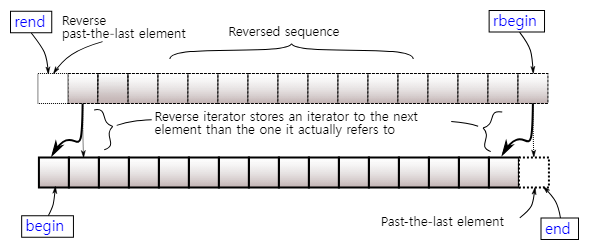

- [Iterator Functions: begin, end](#iterator-functions-begin-end)
  - [1. Regular Iterator](#1-regular-iterator)
    - [1.1. begin(), end()](#11-begin-end)
    - [1.2. cbegin(), cend()](#12-cbegin-cend)
  - [2. Reverse Iterator](#2-reverse-iterator)
    - [2.1. rbegin(), rend()](#21-rbegin-rend)
    - [2.2. crbegin(), crend()](#22-crbegin-crend)

 

# Iterator Functions: begin, end
 
container의 시작과 끝을 가리키는 iterator를 알아본다 

 

## 1. Regular Iterator
정방향 iterator를 알아본다 

### 1.1. begin(), end()
container의 `첫 번째 element를 가리키는 begin()`과 `마지막 element의 다음을 가리키는 end()`가 존재한다 

위 이미지를 보면, container의 elements를 처음부터 끝까지 `순차적으로 접근`할 수 있다 

### 1.2. cbegin(), cend()
const_begin(), const_end()라고 보면 된다 
`const_iterator`로 불리며, `container의 element를 읽기 전용으로 접근`한다 

  

## 2. Reverse Iterator
역방향 iterator를 알아본다 

### 2.1. rbegin(), rend()
container의 `마지막 요소를 가리키는 rbegin()`과 `첫 번째 요소 앞을 가리키는 rend()`가 있다 

위 이미지에서 container의 elements를 `역순으로 탐색`할 수 있다 

### 2.2. crbegin(), crend()
`const_reverse_iterator`를 반환한다 
각 iterator가 가리키는 element를 `read-only`으로 접근한다 