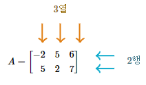

# m by n matrix
행렬의 헷갈리는 개념을 정확히 짚고 넘어간다.
</br>2차원 배열을 for문을 이용해서 탐색할 때, row와 col 변수를 사용하면서 발생하는 헷갈림을 잡는다.

## row( 행 )와 column( 열 )

row는 `가로줄`, column은 `세로줄`을 의미한다.
</br>

</br>

m * n 행렬의 m과 n은 
</br>m은 `row의 개수`
</br>n은 `col의 개수`

</br>따라서 위 그림은 2 * 3 행렬이다.

## for문 순회
데이터가 row-major 방식으로 저장되는 경우( c/c++ )에는 row-major order가 효율적이다.

### 1. row, col 용어

```cpp
// row-major order
for (int row = 0; row < m; ++row) {
  for (int col = 0; col < n; ++col) {
    arr[row][col];
  }
}
```

row는 `row_index` 즉, 행 인덱스를 의미한다.
</br>row를 row 전체라고 생각하지 않는다.


```cpp
// column-major order
for (int col = 0; col < n; ++col) {
  for (int row = 0; row < m; ++row) {
    arr[row][col];
  }
}
```

col을 column 전체라고 생각하지 않는다.
</br>col은 `column_index` 즉, 열 인덱스를 의미한다.

### 2. y, x 용어

일반적으로 아래와 같은 의미로 사용한다.

</br>y는 `row_index`
</br>x는 `column_index`

</br>이 순서는 표준이 있는 것이 아니라 사람 또는 상황에 따라 다를 수 있다.

```cpp
// row-major order
for (int y = 0; y < m; ++y) {
  for (int x = 0; x < n; ++x) {
    arr[y][x];
  }
}

// column-major order
for (int x = 0; x < n; ++x) {
  for (int y = 0; y < m; ++y) {
    arr[y][x];
  }
}
```