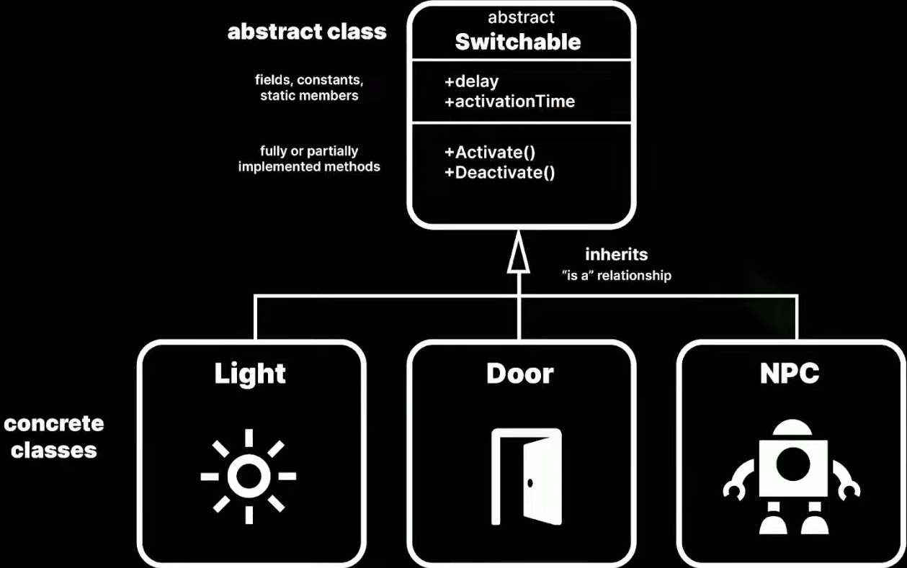
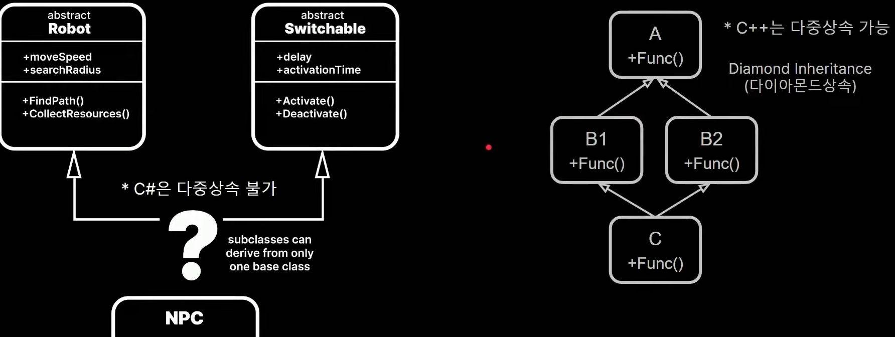
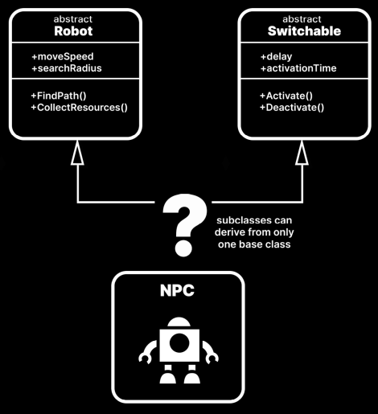

# Abstract class VS Interface

## 1. abstract class

concrete class는 abstract class를 상속 받아서 기능을 구현한다. 
Light와 Door, NPC는 Switchable이다.( is-a 관계 ) 

 

### 1.1. inheritance의 문제점을 해결하기 위한 c#의 설계

cpp은 다중 상속이 가능하지만, C class에서 Func() 함수를 호출했을 때, A, B1, B2 중에서 어떤 Func()를 상속받는지 판단할 수 없다. 

이 때문에 c#은 하나의 abstract class만 상속 받을 수 있다. 

 

### 1.2. 무엇을 inheritance 하나?
 
Robot 혹은 Switchable 두 기본 class 중에서 무엇을 선택해야 하나? 

abstract class를 사용해 `abstract의 기본 기능을 정의`한다. 
`interface`를 통해 `유연성이 필요한 주변 기능을 정의`한다. 

abstract class는 기능을 정의할 수 있고, interface는 로직의 구체화를 이를 사용하는 class에게 맡긴다. 

### 1.2. is-a, has-a

Robot의 기본 클래스에서 NPC를 파생시키고 핵심 기능을 상속했다. 
ISwitchable interface를 이용해서 NPC를 켜고 끄는 기능을 추가했다. 

NPC는 Robot이다. 
NPC는 Switchable 할 수 있는 Robot이다. 

## 2. 차이점
| abstract class | interface |
| :---: | :---: |
| method를 완전히 또는 일부만 구현 | method 선언만 가능 |
| field 선언 및 사용 | method, property 선언만 가능( field 제외 ) |
| static 멤버 가능 | static 멤버 불가 |
| constructor 가능 | constructor 불가 |
| 모든 access modifier 가능 | public로만 취급 및 가능 |
