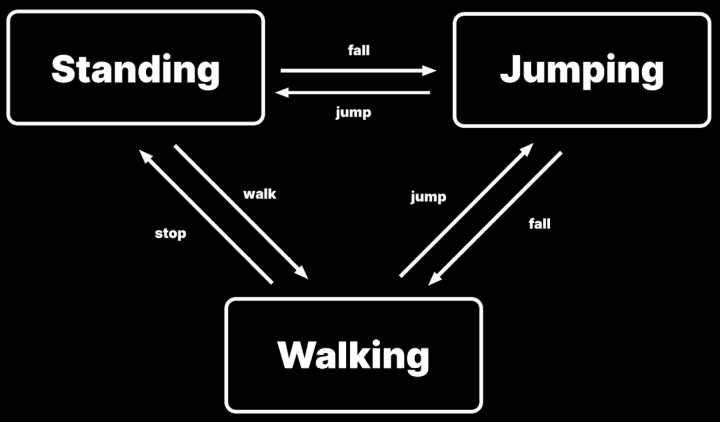
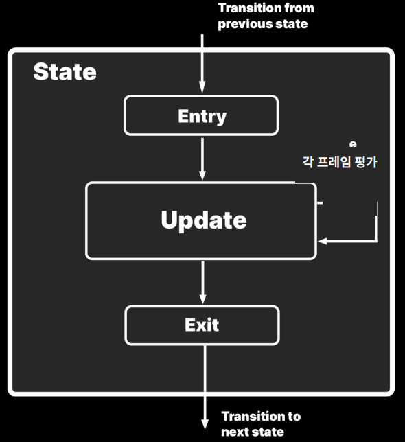

- [사용하는 이유](#사용하는-이유)
  - [장점과 단점](#장점과-단점)
    - [`장점`](#장점)
    - [`단점`](#단점)
- [FSM( Finite State Machine )](#fsm-finite-state-machine-)
    - [`FSM 구성`](#fsm-구성)
- [예시 : Simple IState](#예시--simple-istate)
    - [`Enter, Execute, Exit`](#enter-execute-exit)
- [예시 : Simple StateMachine](#예시--simple-statemachine)
    - [`SM에 대해`](#sm에-대해)
- [예시 : State](#예시--state)
- [예시 : In Unity](#예시--in-unity)
    - [Unity API - `StateMachineBehaviour`](#unity-api---statemachinebehaviour)
  - [Behaviour](#behaviour)

<br>

# 사용하는 이유

1. Object가 상태를 변경할 때 자신의 동작을 변경한다.
2. State 별 동작은 독립적으로 정의한다. 따라서 새로운 상태를 추가해도 기존 상태 동작에 영향을 주지 않는다.

`사용 예시`: Animation, Monster AI, Tutorial, Network, Tool <br>

`활용 예시`: Unity - 3D Game Kit Lite : 몬스터 AI를 State Pattern을 이용하여 구현했다. <br>

<br>

## 장점과 단점

### `장점`
1. `유연하게 상태를 전환`할 수 있다<br>
2. 각 상태는 상대적으로 크기가 작으며 `다른 상태로 전환하기 위한 조건만 추적`한다.<br>
3. Open-close principle에 따라 `기존 상태에 영향을 주지 않고 상태를 더 많이 추가`할 수 있다.<br>
4. `switch, if문을 사용하지 않아도 된다`.<br>

### `단점`
1. 추적해야 하는 상태가 많지 않으면 과한 사양일 수 있다.<br>
2. `클래스 수가 증가`하여 `복잡`해질 수 있다<br>

<br>
<br>

# FSM( Finite State Machine )

System이 가질 수 있는 모든 상태와, 한 상태에서 다른 상태로 전환하는 규칙을 정의하는 모델<br>

### `FSM 구성`
1. `State`
   - 시스템이 가질 수 있는 각각의 상태
2. `Transition`
   - 한 상태에서 다른 상태로의 전환 규칙
3. `Event`
   - 상태 전환을 일으키는 외부 입력이나 조건
4. `Action`
   - 상태 전환 시 또는 특정 상태에 있을 때 수행되는 행동

<br>

<br>

Jump to Standing이 fall이다.<br>

위 상태 다이어그램은 여러 가지 상태로 구성되며 `어떤 시점에도 현재 상태 하나만 Active`하다.<br>
각 상태는 runtime 시 조건에 따라 `다른 한 가지 상태로 전환`을 Trigger 할 수 있다<br>

`상태 변경 사항을 외부 오브젝트에 전달하기 위해 Event를 활용`할 수 있다( Command Pattern )<br>
상태를 시작하거나 종료하는 Event에 관련된 Listener에 알리고 runtime에 응답할 수 있다<br>

`HFSM`( Hierachical Finite State Machine )<br>
`FSM보다 복잡한 Entity가 존재하면 고려`한다.<br>
특정 상태끼리 서로 유사해진다. 예를 들면, Player가 지면에 닿아 있는 경우에 Walking 이든 Running 이든 피하거나 점프할 수 있다<br>
`SuperState를 구현하면 일반적인 동작을 한꺼번에 유지`할 수 있다<br>
GroundedState를 먼저 선언한 뒤에 RunningState 또는 WalkingState를 상속할 수 있다<br>

<br>
<br>

# 예시 : Simple IState

<br>

```c#
public interface IState
{
  public void Enter() { }   // 상태에 처음 진입할 때 실행
  public void Update() { }  // frame logic, 새로운 상태로 전환하는 조건 포함
  public void Exit() { }    // 상태에서 벗어날 때 실행
}
```
상태에 진입하고 조건에 의해 flow가 종료될 때까지 각 frame을 계속 loop 처리한다.<br>

### `Enter, Execute, Exit`

1. `Entry( Enter )` : 상태에 처음 진입할 때 실행
2. `Update( Execute, Tick )` : frame logic
   - FixedUpdate, LateUpdate 등을 사용해서 MonoBehaviour 처럼 Update 메서드를 추가로 segment화 할 수 있다
   - 상태 변경 trigger 조건이 감지될 때까지 각 frame을 실행한다.
3. `Exit` : 상태에서 벗어나 새로운 상태로 전환되기 전에 실행

<br>
<br>

# 예시 : Simple StateMachine

```c#
[Serializable]
public class StateMachine
{
  public IState CurrentState { get; private set; }

  // IState를 구현한다
  public WalkState walkState;
  public JumpState jumpState;
  public IdleState idleState;

  public StateMachine(PlayerController player)
  {
    this.walkState = new WalkState(player);
    this.jumpState = new JumpState(player);
    this.idleState = new IdleState(player);
  }

  public void Initialize(IState startingState)
  {
    CurrentState = startingState;
    startingState.Enter();
  }

  public void TransitionTo(IState nextState)
  {
    CurrentState.Exit();
    CurrentState = nextState;
    nextState.Enter();
  }

  public void Update()
  {
    if (CurrentState != null) CurrentState.Update();
  }
}
```
StateMachine은 `flow가 상태에 진입하고 상태에서 벗어나는 방법을 관리`한다.<br>

SM은 `관리 받는 각 상태에 대한 공용 오브젝트( Player )를 참조`한다.<br>

`PlayerController는 각 상태에서 참조`되며, `frame마다 각 상태를 업데이트하는 데 사용`한다.<br>

### `SM에 대해`

Serializable 속성을 사용해서 SM 및 공용 field를 inspector view에 표시한다.<br>
다른 MonoBehaviour( PlayerController, EnemyController 등 )가 SM을 Field로 사용할 수 있다<br>

CurrentState는 readonly이다.<br>
SM 자체는 명시적으로 이 field를 설정하지 않는다.<br>
외부 오브젝트( PlayerController )에서 Initialize 메서드를 호출하여 CurrentState를 설정한다.<br>

각 상태는 자체적으로 TransitionTo 메서드 호출 조건을 결정하여 CurrentState를 변경한다.<br>

SM Instance를 설정할 때 필요한 종속 관계를 각 상태로 전달할 수 있다.<br>

<br>
<br>

# 예시 : State

각 상태 오브젝트가 자체 내부 logic을 관리한다<br>

```c#
public class IdleState : IState
{
  private PlayerController player;

  public IdleState(PlayerController player)
  {
    this.player = player;
  }

  public void Enter() {}
  public void Update()
  {
    if (!player.IsGrounded) {
      player.PlayerStateMachine.TransitionTo(player.PlayerStateMachine.jumpState);
    }

    // threshold( 0.1f )보다 속도가 높아지면
    if (Mathf.Abs(player.CharController.velocity.x) > 0.1f || Mathf.Abs(player.CharController.velocity.y) > 0.1f) {
      player.PlayerStateMachine.TransitionTo(player.PlayerStateMachine.walkState);
    }
  }
  public void Exit() {}
}
```
생성자를 이용해서 PlayerController 오브젝트를 전달한다.<br>
이 player는 SM에 대한 참조를 비롯해 Update logic에 필요한 모든 정보가 있다.<br>

<br>
<br>

# 예시 : In Unity

3D Game Kit Lite를 참고했다<br>

### Unity API - `StateMachineBehaviour`
ScriptableObject를 상속 받는다.<br>

ScriptableObject에 대한 내용은 `Create Modular Game Architectrue in Unity with ScriptableObjects`를 참고한다.<br>

## Behaviour
```c#
public class ChomperBehaviour : MonoBehaviour, IMessageReceiver
{
  public static readonly int hashInPursuit = Animator.StringToHash("InPursuit");
  public static readonly int hashAttack = Animator.StringToHash("Attack");
  public EnemyController controller { get => m_Controller; }

  ...

  public void StartPursuit()
  {
    if (m_FollowerInstance != null) {
      m_FollowerInstance.requireSlot = true;
      RequestTargetPosition();
    }
    m_Controller.animator.SetBool(hashInPursuit, true);
  }

  ...

  public void TriggerAttack()
  {
    m_Controller.animator.SetTrigger(hashAttack);
  }
}
```
`실제로 행동 로직이 있는 클래스는 MonoBehaviour를 상속 받아서 게임 오브젝트로 존재`한다<br>

State와 Behaviour를 따로 클래스로 구현하여 관리한다.<br>

해당 프로젝트에서는 `State를 관리하는 Script가` 게임 오브젝트가 아니라 `Animator Controller에 있는 State에 붙는다`.<br>
유지 보수 관점에서 이런 구조를 채택했다<br>