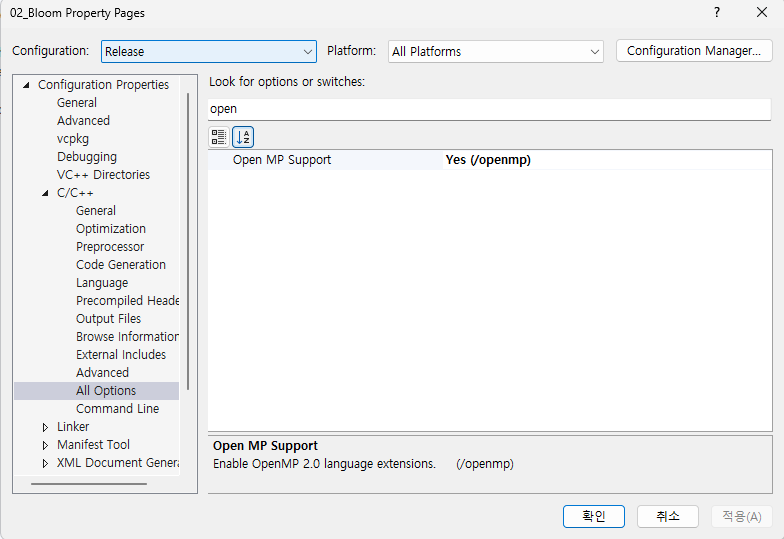

# vcpkg
## 1. vcpkg 설치
1. `CMD에서 실행`
2. [vcpkg 개요 - MS](https://learn.microsoft.com/en-us/vcpkg/get_started/overview#get-started-with-vcpkg)에서 `Get started with vcpkg`의 `Package a library with vcpkg`로 이동
3. Terminal Options를 `CMD`로 수정 후, `vcpkg clone`
```
git clone https://github.com/microsoft/vcpkg.git
```
4. 설치가 끝나면 `cd vcpkg`
```
cd vcpkg
```
5. dir 명령어를 통해 vcpkg 내부의 파일을 볼 수 있으며, `bootstrap-vcpkg.bat`
```
bootstrap-vcpkg.bat
```

## 2. library 설치
vcpkg 경로 내부에서 명령어를 수행한다.   
### IMGUI
`GUI`   
어떤 종류의 imgui가 있는지 확인( window32bit, directx11 환경설정 ) 후 설치   
```
vcpkg search imgui
vcpkg install imgui[win32-binding,dx11-binding]:x64-windows
```
### Math
`GLM`, `SimpleMath`
```
vcpkg install glm:x64-windows
vcpkg install directxtk:x64-windows
```
### STB
`Image Processing`   
```
vcpkg install stb:x64-windows
```

### Integrate
library를 설치하고 `항상 마지막엔 아래의 명령어를 수행`   
```
vcpkg integrate install
```

<br><br>

# visual studio 2022

## 1. 멀티쓰레드 이용을 위한 open MP 사용
   

1. 프로젝트의 properties로 이동
2. C/C++ -> All Options -> open 검색
3. Configuration을 Release로 변경
4. Open MP Support를 YES로 세팅