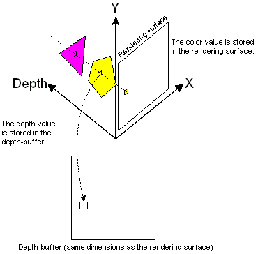

- [Depth Bufer( z-buffer )](#depth-bufer-z-buffer-)
  - [1. Basic Concept](#1-basic-concept)
  - [2. Depth Buffer in Orthographic Projection](#2-depth-buffer-in-orthographic-projection)

<br><br>

# Depth Bufer( z-buffer )
[ wiki - depth buffer ](https://en.wikipedia.org/wiki/Z-buffering)   
[ MS Learn - Depth Buffers(Direct3D9) ](https://learn.microsoft.com/en-us/windows/win32/direct3d9/depth-buffers)   
   
3차원 공간에서 objects의 depth 정보를 표현하기 위해서 컴퓨터 그래픽스에서 사용되는 data buffer의 한 종류다   
3D 장면을 2D 화면에 rendering할 때 각 pixel의 depth 정보를 저장하는 buffer이다   
depth는 camera까지의 거리를 나타내는 값으로 0이 가장 가깝다   

## 1. Basic Concept
```
1. init
2. rendering
```
rendering 시작 시, depth buffer는 최대 깊이 값( 1.0f )로 초기화한다   
DirectX의 일반적인 최대 깊이 값은 1.0f이다   

각 pixel에 대해 rendering 하려는 object의 depth 값을 계산한다   
계산된 depth 값과 depth buffer에 저장된 값을 비교한다   
새로운 depth 값이 기존 값보다 작으면( 더 앞에 있으면 ), 해당 pixel의 color와 depth buffer를 업데이트한다   
## 2. Depth Buffer in Orthographic Projection
Orthographic Projection( 정투영 )에서는 depth 값이 선형적으로 분포하여 depth interpolation이 비교적 단순하다   
projection 변환 과정에서 복잡한 원근 처리 없이도 depth 값을 정확히 계산할 수 있다   
```cpp
// Orthographic Projection

void Render() {
  // depth buffer init
  depthBuffer.resize(pixels.size());                        // size: WIDTH * HEIGHT
  std::fill(depthBuffer.begin(), depthBuffer.end(), 1.0f);

  // draw()
}

// object render
void Draw() {
  // Bary-centric coordinate를 이용해서 z좌표 찾기( 0.0f ~ 1.0f )
  const float depth = ... ;

  if (depth < depthBuffer[i + width * j]) {
    depthBuffer[i + width * j] = depth;
    pixels[i + width * j] = vec4(color, 1.0f);
  }
}S
```
depth buffer를 생성하고 각 elements를 1.0f( 최댓값 )로 초기화한다   
그 후 rendering 과정에서 object를 그린다   

object를 그리기 전에, 각 object의 depth를 계산한다   
만약 새로운 depth 값이 기존 값보다 더 앞에 있으면( camera에 근접 ) pixel의 색상과 깊이 값을 업데이트한다   