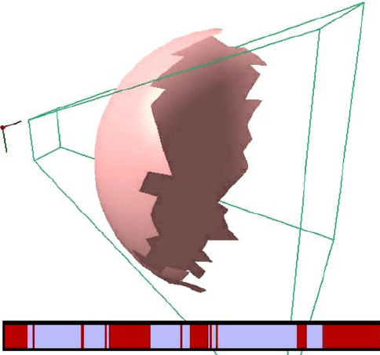
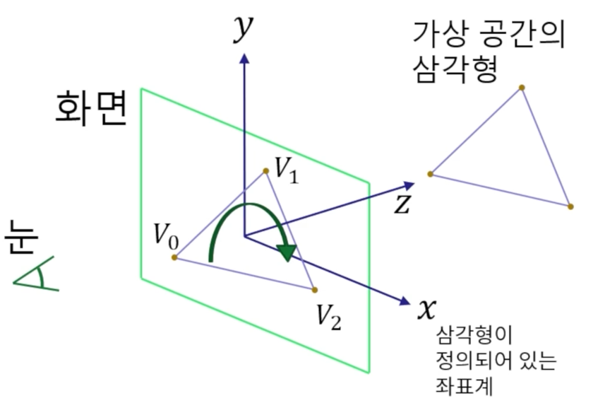

# Back-face Culling
Culling은 최적화를 위해 rendering 과정에서 굳이 rendering하지 않아도 된다고 판단한 objects를 제외하는 것을 말한다   
   
Back-face Culling은 `rendering 시 보이지 않는 polygon( triangle )의 뒷면을 그리지 않는 기법`이다   

## 1. 가상 공간( world coord )의 삼각형을 rendering하는 과정   
   
1. 삼각형의 vertex 3개를 screen( screen coord )에 projection 시킨다
2. 삼각형이 앞면인지 뒷면인지 판단하는 방법은 vertex의 순서를 보고 판단
   1. 시계 방향이라면, 눈에 보이는 면( 앞면 )
3. 뒷면인 경우, rendering 하지 않는다

world coord는 z가 화면 안쪽으로 향하지만, screen coord는 바깥쪽으로 향한다   
screen coord에 있는 vertex를 보고 앞면인지 판단하려면, Edge Function을 적용했을 때 양수가 나오면 된다   