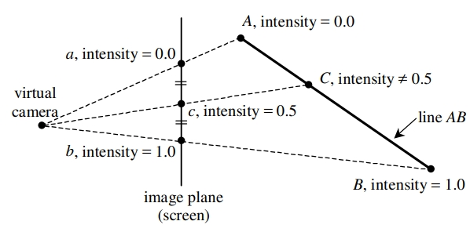
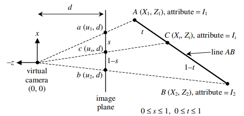
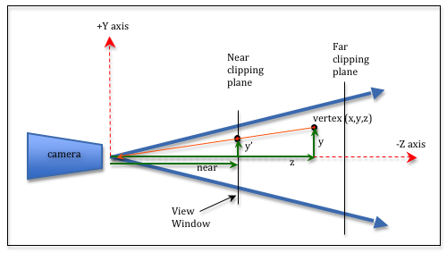

- [Projection](#projection)
- [1. Orthographic Projection](#1-orthographic-projection)
- [2. Perspective Projection](#2-perspective-projection)
  - [2.1. 왜곡 현상](#21-왜곡-현상)
    - [2.1.1. 원인](#211-원인)
      - [**Nonlinear Transformation**](#nonlinear-transformation)
      - [**Barycentric Coordinates와 Interpolation**](#barycentric-coordinates와-interpolation)
    - [2.1.2. Perspective-Correct Interpolation](#212-perspective-correct-interpolation)

<br><br>

# Projection
Orthographic Projection( 정투영 )과 Perspective Projection( 원근투영 )이 있다   
`Ray Tracing을 이용해서 Projection 효과를 구현`할 수 있다   

# 1. Orthographic Projection
`Ray를 Screen의 모든 pixel에서 수직인 방향( vec3(0, 0, 1) )으로 Scene에 쏴 준다`   


<br>

# 2. Perspective Projection
`Ray가 Screen의 pixel마다 쏴주는 방향이 다르다`   
방향을 다르게 하는 방법은 virtual camera( 가상의 눈, 카메라 )의 위치에서 Screen의 pixel 위치로 Ray를 쏜다   

## 2.1. 왜곡 현상
[Learn WebGL - perspective projection](https://learnwebgl.brown37.net/08_projections/projections_perspective.html)   
[scratchapixel - Perspective Correct Interpolation ](https://www.scratchapixel.com/lessons/3d-basic-rendering/rasterization-practical-implementation/perspective-correct-interpolation-vertex-attributes.html)   
[Computer Graphics Paper - Perspective-Correct Interpolation](https://www.comp.nus.edu.sg/~lowkl/publications/lowk_persp_interp_techrep.pdf)   
가상 세계의 object를 screen으로 투영할 때, 왜곡이 발생할 수 있다   

### 2.1.1. 원인
   
Rasterization에서 하나의 삼각형을 screen에 투영할 때, bary-centric coordinates와 interpolation을 이용하여 screen 좌표인 c를 구했다   
문제는 위 연산은 screen 상에서 이뤄지지만, perspective projection은 가상 세계( 3D )에서 이뤄진다   
   
3D 공간의 A, B를 2D 공간으로 projection 시키면 a, b이다   
이러한 a, b에 barycentric coordinates와 interpolation을 사용하여 c를 구한다   
그러면서 s와 1 - s의 길이를 알게 되는데, 문제는 t와 1 - t를 모른다   
`t와 s를 같다고 가정하면, 왜곡이 발생`한다   
가상 세계의 A, B, C 좌표와 screen 상의 a, b, c 좌표 사이의 거리가 다르다   
이로 인해, line ac와 AC가 서로 다르게 계산되며, depth 정보를 이용한 interpolation 과정에서 잘못된 값이 나와 왜곡이 발생한다   

#### **Nonlinear Transformation**
perspective projection은 3D 공간을 2D 화면에 projection할 때 Nonlinear Transformation( 비선형 변환 )을 사용한다   
이는 Foreshortening( 원근감 )을 자연스럽게 표현하기 위해 필요하지만, 이 과정에서 depth( z축 ) 정보가 화면 좌표에 비례적으로 반영된다   
이러한 비선형성 때문에 단순한 linear interpolation( 선형 보간 )이 원래 3D 공간의 관계를 정확히 반영하지 못한다   

#### **Barycentric Coordinates와 Interpolation**
Rasterization 과정에서 삼각형 내부의 pixel을 계산할 때, barycentric coordinates를 사용하여 각 pixel의 속성( color, normalized 등 )을 interpolation한다   
하지만 `perspective projection에서 pixel에 depth 정보가 포함`되기 때문에 `screen 상에서의 linear interpolation은 원래 3D 공간의 선형 관계를 왜곡`시킬 수 있다   

Orthographics에서는 line ac와 line AC가 같아서 문제 없다   

### 2.1.2. Perspective-Correct Interpolation
`Bary-Centric Coordinates를 depth에 대해 보정하여 왜곡을 방지`하기 위해 필요한 기법이다   
각 pixel의 depth 정보를 고려해서 interpolation을 수행하여, 3D 공간에서의 선형 관계를 screen 상에 나타낼 수 있다   

일반적으로 각 pixel의 속성을 1/z로 interpolation한 후, 최종적으로 다시 z로 나누어 원래의 값을 복원하는 방식을 사용한다   
```cpp
// barycentric coordinates와 interpolation으로 삼각형 내부 점을 계산
float w0 = EdgeFunction(v1, v2, point) / area;
float w1 = EdgeFunction(v2, v0, point) / area;
float w2 = EdgeFunction(v0, v1, point) / area;

// 삼각형 내부의 점들의 depth 값을 계산
const float z0 = vertexBuffer[].z + distEyeToScreen;
const float z1 = vertexBuffer[].z + distEyeToScreen;
const float z2 = vertexBuffer[].z + distEyeToScreen;

// w0, w1, w2를 z0, z1, z3를 이용해서 보정
w0 /= z0;
w1 /= z1;
w2 /= z2;
const float wSum = w0 + w1 + w2;
w0 /= wSum;
w1 /= wSum;
w2 /= wSum;
```
   
camera와 vertex( x, y, z )의 거리와 depth( z )는 다르다   
