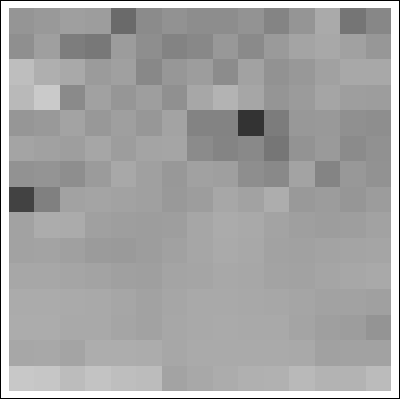
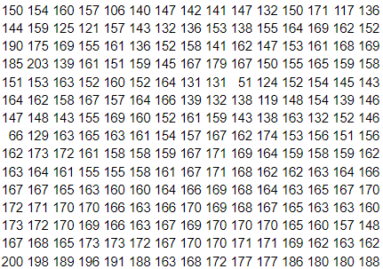
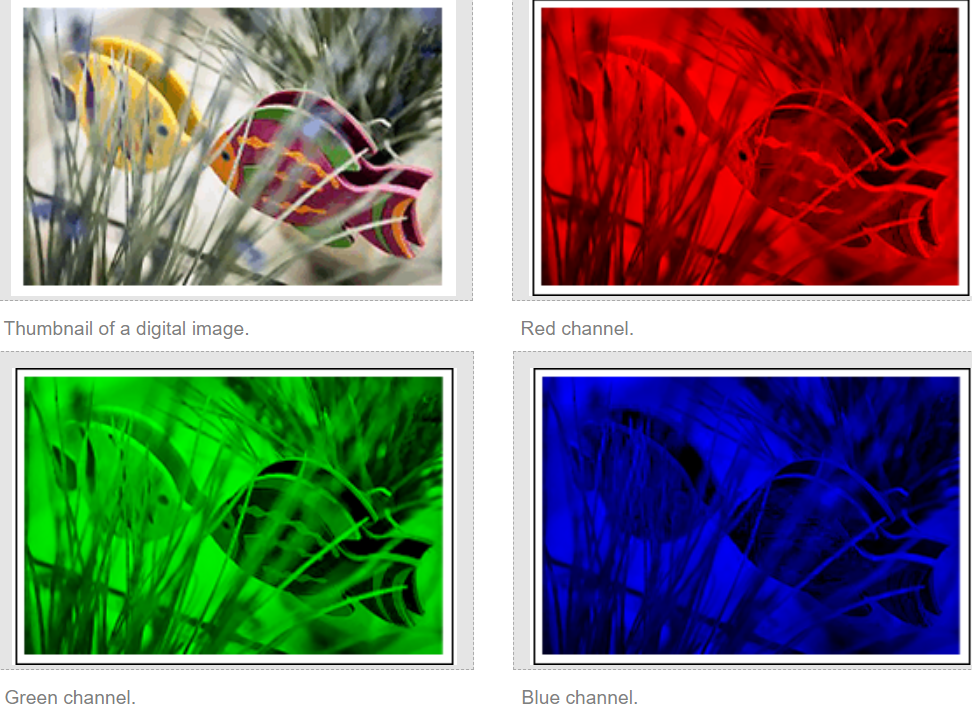
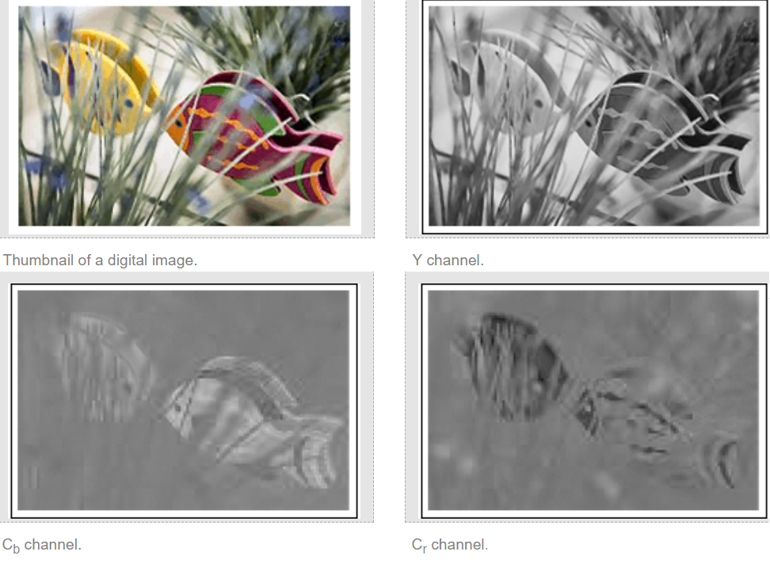
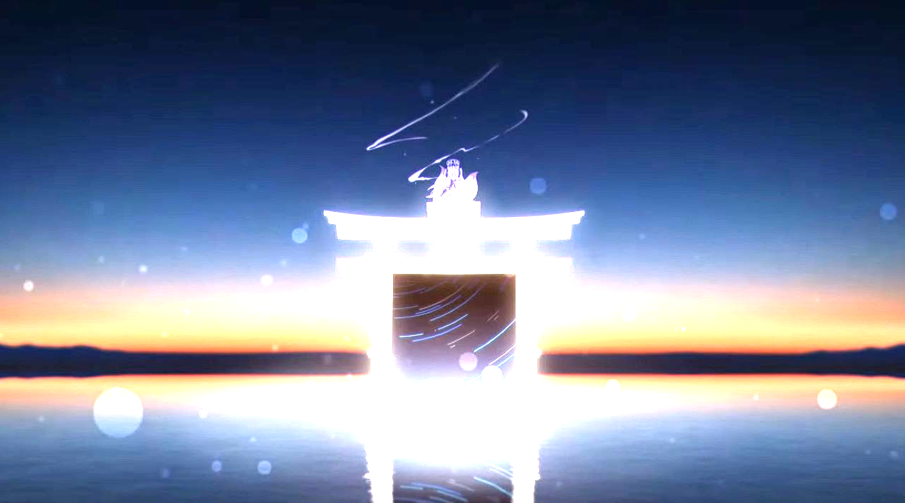
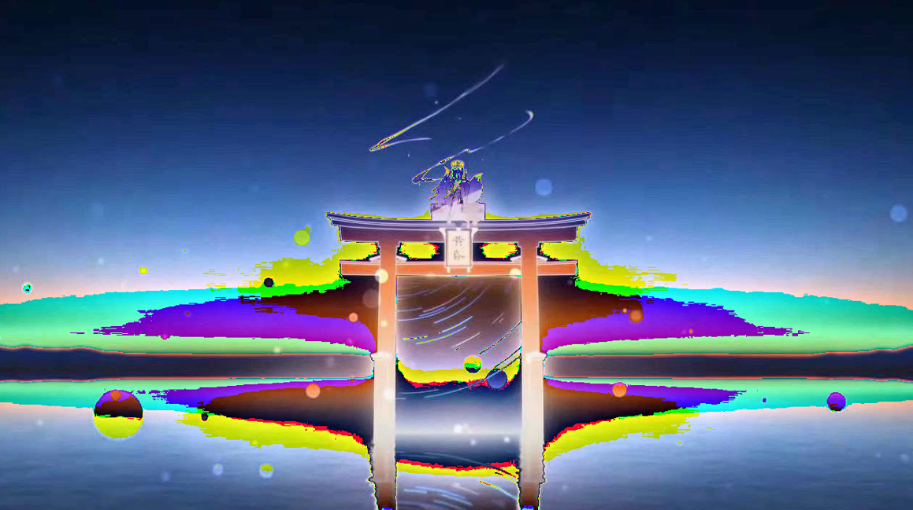

- [Digital Image Basics](#digital-image-basics)
  - [1. Grayscale Images](#1-grayscale-images)
    - [1.1. Pixel Intensity( Image intensity )](#11-pixel-intensity-image-intensity-)
    - [1.2. Resolution( 해상도 )](#12-resolution-해상도-)
    - [1.3. (15 \* 15) Pixel Portion of the Image](#13-15--15-pixel-portion-of-the-image)
    - [1.4. Stored Image Size](#14-stored-image-size)
  - [2. Color Images](#2-color-images)
    - [2.1. Pixel Intensity](#21-pixel-intensity)
    - [2.2. Channels](#22-channels)
    - [2.3. Color Space Conversion - luminance, chrominance](#23-color-space-conversion---luminance-chrominance)
    - [2.4. RGB space to YCbCr space](#24-rgb-space-to-ycbcr-space)
- [Image Processing](#image-processing)
  - [1. Image Loading](#1-image-loading)
    - [Code Example](#code-example)
  - [2. Image Saving](#2-image-saving)
    - [Code Example](#code-example-1)
  - [1.3. Image Manipulation](#13-image-manipulation)
    - [1.3.1. Problem1: Overflow Issue](#131-problem1-overflow-issue)
    - [1.3.2. Problem2: RGB channel 포화](#132-problem2-rgb-channel-포화)

<br>

# Digital Image Basics
[ **Digital Image Basics** ](https://www.whydomath.org/node/wavlets/imagebasics.html)<br>
`Image는 2차원 함수( 좌표, 행렬 )로 정의`한다<br>

`pixel`: picture element<br>

<br>

## 1. Grayscale Images
`흑백 이미지`를 알아본다<br>

### 1.1. Pixel Intensity( Image intensity )
`Image의 특정 지점 (x, y)에서의 amplitude( 진폭 )은 image intensity( 이미지 강도, 밝기 )를 나타낸다`<br> 
Digital Image는 amplitude value가 유한한 범위 내에서 정의된다<br>

<br>

### 1.2. Resolution( 해상도 )
`high-resolution image를 만드려면 더 많은 pixel이 필요`하다<br>
pixel이 많으면 많을수록 더 세밀한 이미지를 얻을 수 있다<br>

<br>

### 1.3. (15 * 15) Pixel Portion of the Image
 <br>
15 * 15 pixel의 크기를 가진 image를 표현하는 방법<br>

<br>

### 1.4. Stored Image Size
`image of size M * N pixels를 저장할 때, 하나의 pixel을 8bit로 저장하기 때문에 image의 용량은 M * N * 8 bits`이다<br>
pixel 하나가 0 ~ 255 값을 표현할 수 있기 때문에 $2^8$ bits( = 1 byte ) 크기를 차지하며, 이러한 pixel이 m * n개 있기 때문이다<br>

만약 768 * 512 크기의 image라면, 768 * 512 * 8 = 3,145,728 bits 용량을 차지한다<br>

<br><br>

## 2. Color Images
color images는 grayscale images 보다 더 많은 용량을 차지한다<br>
Grayscale images에서 하나의 pixel이 screen에 render되는데 필요한 gray intensity는 1bytes이다<br>
`Color images는 screen에 render되려면 하나의 pixel이 red, green, blue의 intensity를 가지기 때문에 3bytes`이다<br>

<br>

### 2.1. Pixel Intensity
color image의 pixel intensity는 grayscale image와 같은 0 ~ 255 값을 가진다<br>

<br>

### 2.2. Channels
`channel이란, image에서 각 기본 색상 성분을 분리한 grayscale image를 말한다`<br>
예시를 보면 이해가 빠르다<br>

color image에서 channel은 R, G, B가 존재하며, JEPG2000에서 channel은 Y, Cb, Cr이 존재한다<br>

<br>

여기서 Red channel은 빨간색 성분을 담당하며, 이 channel의 각 pixel 값은 빨간색의 intensity를 나타낸다<br>
각 channel은 전체 image와 동일한 크기를 가지며, 해당 색상에 대한 밝기 정보를 가진다<br>

즉, `하나의 channel은 그 image에서 특정 색상만 표현한 grayscale image이다`<br>

<br>

### 2.3. Color Space Conversion - luminance, chrominance
`이미지 압축`을 시도하는 application에서 RGB color space가 최적이 아니라, `인간은 luminance와 chrominance에서 작은 변화에 잘 적응`하는 것으로 나타났다<br>

`luminance channel은 pixel의 밝기에 관한 정보`를 전달하고, `Chrominance는 동일한 밝기에서 color와 기준 channel 간의 차이`를 나타낸다<br>

RGB color에는 3가지 channels이 있기 때문에 `luminance가 1개, chrominance가 2개의 channel을 사용해서 color image의 image compression을 위한 새로운 공간을 사용`한다<br>
예를 들면, 압축 이미지 space에는 JPEG2000이 있는데, 이것은 YCbCr space이다<br>
Y channel은 luminance이고, 나머지 Cb, Cr은 chrominance channels이다<br>

<br>

### 2.4. RGB space to YCbCr space
압축된 이미지를 저장하려면 `RGB space를 YCbCr space로 변환`하는 것이 좋다<br>

먼저 `rgb의 각 pixel intensity 값에서 255를 나눠서 0 ~ 1 사이의 값`을 가져야 한다<br>

$(r, g, b) = (r / 255, g / 255, b / 255)$<br>

`Y channel( luminance )`는 $y = 0.299r + 0.587g + 0.114b$ 공식을 이용해서 얻는다<br>
이러한 공식은 시간이 지나면서 달라질 수 있다<br>
한 가지 변하지 않는 내용은 `r, g, b와 곱하는 실수를 모두 더하면 1`이다<br>

YCbCr space는 blue와 red를 사용하며, `Cb channel`은 $Cb = (b - y)/1.772$로 정의하고, `Cr channel`은 $Cr = (r - y)/1.402$로 정의한다<br>
여기서 Y channel이 refernce channel( 기준 채널 )이다<br>

<br>
RGB space를 YCbCr space로 변환한 결과이다<br>
이는 `이미지를 압축해서 저장하는 방식에서 사용`할 수 있다<br>


<br><br>

# Image Processing
[ Digital Image Processing Basics ](https://www.geeksforgeeks.org/digital-image-processing-basics/)<br>
Image Processing은 computer가 `High-Quality Image를 얻는 것`,  `Image로부터 의미 있는 정보를 얻는 것`, `Image 작업을 자동화하는 것`이 목표다<br>

<br><br>

## 1. Image Loading
위에서 설명했듯이 Image의 pixel intensity는 0 ~ 255로 표현하기 때문에 Image의 크기는 Width * Height * 8 bytes를 차지했다<br>
이러한 `이미지를 가져와서 화면에 출력하려면, unsigned char( 8bit )를 0 ~ 1.0f 사이의 float( 32bit )로 표현`한다<br>
HDR( High Dynamic Range )을 사용하거나 컴퓨터 shader로 수치 연산을 할 때는 `float를 사용하는 경우가 많기 때문`이다.<br>
이때 0.0f는 검정색이고, 1.0f는 흰색이다<br>

### Code Example
`파일을 읽어서 화면에 표현하기 위해서 먼저 unsigned char( 8bit, 0 ~ 255 )로 저장된 이미지를 float( 32bit, 0 ~ 1.0f )로 변환하여 memory에 저장`한다<br>

```cpp
#include <vector>
#include <glm/glm.hpp>

#define STB_IMAGE_IMPLEMENTATION
#include <stb_image.h>

int width = 0, height = 0, channels = 0;    // image의 width pixel cnt, height pixel cnt, channel cnt
std::vector<glm::vec4> pixels;              // image의 각 pixel RGBA 값을 저장

// RGB image만 load함을 가정
unsigned char* img = stbi_load(image_path, &width, &height, &channels, 0);

pixels.resize(width * height);
for (int i = 0; i < width * height; ++i) {    // RGB channels
  pixels[i].r = img[i * channels] / 255.0f;
  pixels[i].g = img[i * channels + 1] / 255.0f;
  pixels[i].b = img[i * channels + 2] / 255.0f;
  (channels == 4) ? pixels[i].v[3] = img[i * channels + 3] / 255.0f : pixels[i].v[3] = 1.0f;
}

stbi_image_free(img);   // = delete[] img;
```
stb_image library를 사용해서 image를 load 한다.<br>
stbi_load()에서 image 경로와 해당 경로에 있는 image의 크기( width, height의 pixel cnt ), 그리고 몇 개의 channel이 있는지 가져온다<br>
이때 해당 image의 정보( width, height, channel cnt )를 가져와서 할당한다<br>

각 image의 pixel을 RGB image로 표현하기 위해 glm::vec4로 변환한다<br>

<br><br>

## 2. Image Saving
`Memory에 있는 Image를 파일로 저장하기 위해서는 float 값을 unsigned char로 변환`해야 한다<br>
`Image는 정해진 해상도( pixel counts )`와 `pixel 당 정해진 밝기 값( 대부분 0 ~ 255, white ~ black )`을 가지기 때문이다<br>

따라서 float 값을 unsigned char로 변환하기 위해 `float * 255 연산을 수행`한다<br> 

### Code Example
`Memory에 있는 image data를 PNG 파일로 변환하여 DISK에 저장`한다<br>

```cpp
#include <vector>
#include <glm/glm.hpp>

#define STB_IMAGE_WRITE_IMPLEMENTATION
#include <stb_image_write.h>

std::vector<unsigned char> img(width * height * channels, 0);
for (int i = 0; i < width * height; ++i) {
  img[i * channels] = unsigned char(pixels[i].r * 255.0f);
  img[i * channels + 1] = unsigned char(pixels[i].g * 255.0f);
  img[i * channels + 2] = unsigned char(pixels[i].b * 255.0f);
}

stbi_write_png(image_path, width, height, channels, img.data(), width * channels);
```
`img vector의 크기가 width * height * channels인 이유는 RGB space`를 나타내기 위함이다<br>
RGB space를 저장하기 위해서는 width * height로 image의 총 pixel 수를 구한 뒤, 여기에 channel의 수를 곱해야 한다<br>
[ color image size ](#14-stored-image-size) 참고<br>
따라서 `M * N * 3 bytes 용량`을 가진다<br>

<br>

float를 unsigned char로 변환할 때, pixels의 r, b, g 값은 0.0 ~ 1.0f 값을 가진다고 가정한다<br>
[ Image Manipulation ](#13-image-manipulation)를 참고<br>
`overflow 가능성을 배제하기 위함`이다<Br>

<br><br>

## 1.3. Image Manipulation
`이미지의 RGB 값에 1보다 큰 값을 곱하면 밝아지고, 1보다 작은 값을 곱하면 어두워진다`.<br>
즉, `각 channels의 pixel intensity에 1.Nf를 곱하면 image를 밝게 만들 수 있다`<Br>

이제 Image를 밝기를 높이기 위해서 각 pixel intensity에 1.Nf를 곱한 상황에서 발생할 수 있는 문제를 살펴본다<br>

### 1.3.1. Problem1: Overflow Issue
화면에 출력할 때는 우리가 예상한 밝기로 보여줄 수 있지만, `문제는 image를 저장할 때 발생`한다<br>

 <br>

첫 번째 이미지는 화면에 출력한 상태이고, 그 다음은 DISK에 저장한 이미지다<br>

`0.0f ~ 1.0f 사이의 값에 1.Nf를 곱하면 1.0f를 초과( overflow )할 수 있다`. 이 상태에서 float에 255를 곱해서 unsigned char로 캐스팅하면 overflow 때문에 원하는 값으로 저장할 수 없다.<br>
```cpp
#include <glm/glm.hpp>
#include <algorithm>

pixels.resize(width * height);
for (int i = 0; i < width * height; ++i) {    // RGB channels
  pixels[i].r = std::clamp(img[i * channels] / 255.0f * 1.99f, 0.0f, 1.0f);
  pixels[i].g = std::clamp(img[i * channels + 1] / 255.0f * 1.99f, 0.0f, 1.0f);
  pixels[i].b = std::clamp(img[i * channels + 2] / 255.0f * 1.99f, 0.0f, 1.0f);

  (channels == 4) ? pixels[i].v[3] = img[i * channels + 3] / 255.0f : pixels[i].v[3] = 1.0f;
}
```
이러한 문제는 코드 상에서 직접 조절해야 한다. cpp의 경우, `std::clamp()를 통해 0.0f ~ 1.0f 값을 벗어나지 않도록 고정`할 수 있다.<br>

<br>

### 1.3.2. Problem2: RGB channel 포화
또 다른 문제는 `최대한 밝게 처리해도 이미지에 특정 색상( 노란색 또는 빨간색 )이 남는 현상`이 발생할 수 있다.<br>

<br>

RGB 이미지에서 밝기를 증가시키면 각 픽셀의 RGB 값에 동일한 `scale factor`( 어떤 양을 늘리거나 줄이거나 또는 곱하는 수 )가 곱해진다<br>
(0.8, 0.7, 0.6)인 RGB 값에 밝기를 증가시키기 위해 1.5f를 곱하면, (1.2, 1.05, 0.9)로 변환된다<br>
R과 G는 `channel이 포화`되면서 255로 clamping되고 B는 229로 변환된다<br>
이때 `포화되지 않은 채널이 여전히 더 낮은 값을 가지기 때문에 이미지가 밝게 처리된 후에도 특정 색상이 강하게 남는 현상이 발생`한다<br>

이는 `이미지를 Memory로 읽어들일 때 각 픽셀의 RGB 값에 아주 작은 값을 한 번만 더하면 해결`할 수 있다.<br>
```cpp
pixels.resize(width * height);
for (int i = 0; i < width * height; ++i) {
  pixels[i].r = std::clamp((img[i * channels] / 255.0f + 0.001f) * 1.99f, 0.0f, 1.0f);
  pixels[i].g = std::clamp((img[i * channels + 1] / 255.0f + 0.001f) * 1.99f, 0.0f, 1.0f);
  pixels[i].b = std::clamp((img[i * channels + 2] / 255.0f + 0.001f) * 1.99f, 0.0f, 1.0f);

  (channels == 4) ? pixels[i].v[3] = img[i * channels + 3] / 255.0f : pixels[i].v[3] = 1.0f;
}
```
epsilon 같은 매우 작은 값( 0.001f 또는 0.0001f = 1e-3 또는 1e-4 )을 더한다<br>

이는 `밝기 증가에 따른 왜곡을 줄이고 균형을 맞추기 위한 방법`이다<br>
모든 channel에 작은 값을 더해서 상대적으로 낮은 channel이 너무 어두워지지 않도록 하고, 포화된 channel은 덜 부각되게 만든다<br>