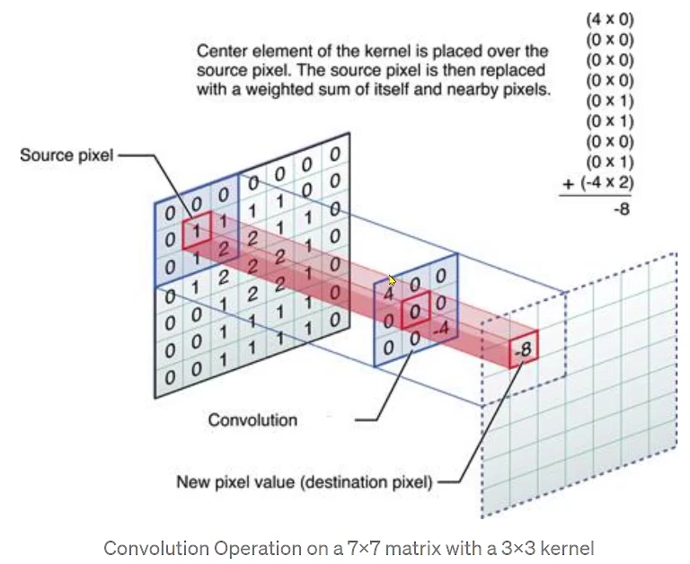

- [1. Convolution](#1-convolution)
  - [1.1. kernel: `box, gaussian`](#11-kernel-box-gaussian)
  - [1.2. convolution](#12-convolution)
  - [1.3. seperable convolution](#13-seperable-convolution)
    - [1.3.1. 2D Gaussian kernel](#131-2d-gaussian-kernel)
    - [1.3.2. 왜 사용하나?](#132-왜-사용하나)
    - [1.3.3. Code Example : `5*5 Box Kernel`](#133-code-example--55-box-kernel)
      - [1. `GetPixel(row, col)`](#1-getpixelrow-col)
      - [2. `#pragma omp parallel for`](#2-pragma-omp-parallel-for)
      - [3. `swap`](#3-swap)
      - [4. `Box Blur`](#4-box-blur)
    - [1.3.4. Code Exmaple : `5*5 Gaussian Kernel`](#134-code-exmaple--55-gaussian-kernel)
- [2. Bloom Effect](#2-bloom-effect)
  - [2.1. 어두운 pixel은 검정색으로 바꾼다](#21-어두운-pixel은-검정색으로-바꾼다)
    - [Relative Luminance Y](#relative-luminance-y)
  - [2.2. 바꾼 이미지에 Gaussian Filter를 적용](#22-바꾼-이미지에-gaussian-filter를-적용)
  - [2.3. 원본 이미지 + (1, 2번 과정을 거친)이미지](#23-원본-이미지--1-2번-과정을-거친이미지)
  - [2.4. Code Example](#24-code-example)
      - [`pixelsBackup`](#pixelsbackup)
      - [`어두운 pixel을 검정색으로 변환`](#어두운-pixel을-검정색으로-변환)
      - [`blur 처리`](#blur-처리)
      - [`원본 이미지 + blur 이미지`](#원본-이미지--blur-이미지)

<br>


# 1. Convolution 
Bloom Effect를 구현하기 위한 사전 지식<br>

## 1.1. kernel: `box, gaussian`
Image Processing에서의 kernel이란? ( **[wiki](https://en.wikipedia.org/wiki/Kernel_(image_processing))** 참고 )<br>

|Operation|Kernel|
|:---|:---:|
| `Identity` | $`\begin{bmatrix} 0 & 0 & 0 \\ 0 & 1 & 0 \\ 0 & 0 & 0 \end{bmatrix}`$ |
| `Box blur` | $`\frac{1}{9}\begin{bmatrix} 1 & 1 & 1 \\ 1 & 1 & 1 \\ 1 & 1 & 1 \end{bmatrix}`$ |
| `Gaussian blur 3 * 3` | $`\frac{1}{16}\begin{bmatrix} 1 & 2 & 1 \\ 2 & 4 & 2 \\ 1 & 2 & 1 \end{bmatrix}`$ |
| `Gaussian blur 5 * 5` | $`\frac{1}{256}\begin{bmatrix} 1 & 4 & 6 & 4 & 1 \\ 4 & 16 & 24 & 16 & 4 \\ 6 & 24 & 36 & 24 & 6 \\ 4 & 16 & 24 & 16 & 4 \\ 1 & 4 & 6 & 4 & 1 \end{bmatrix}`$ |

아래는 `원본 이미지( identity )에 kernel 값을 convolution 한 결과`이다.<br>

| identity | box blur | gaussian blur3 | gaussian blur5 |
| :---: | :---: | :---: | :---: |
|  |  |  |  |

`Box blur`를 보면 3 * 3 행렬에 모든 값이 1이고, 이를 9로 나눈다. 즉, `평균을 구한다`.<br>
`Gaussian blur`는 행렬이 어떤 방향으로 보더라도 `대칭`을 이룬다.<br>

Box와 Gaussian blur는 행렬의 총합으로 행렬을 나눈다는 것을 알 수 있다.<br>
Box blur를 위한 kernel 값의 elements를 모두 더하면 1이며, Gaussian blur도 똑같다<br>

<br>

## 1.2. convolution
`image와 kernel( 또는 필터 )라고 불리는 두 행렬을 합성하여 새로운 이미지를 생성하는 과정`이다<br>
<br>

`kernel을 이미지의 모든 픽셀에 적용시키는 과정`을 convolution이라 한다.( **[wiki](https://en.wikipedia.org/wiki/Convolution)** 의 Discrete convolution gif 참고 )<br>
원본 이미지에 kernel 값을 convolution해서 결과 이미지를 얻는다.<br>

즉, `이미지에 특정 효과를 주고 싶으면 효과에 맞는 kernel 값을 찾아서 convolution한다`<br>

<br>

## 1.3. seperable convolution
image processing 및 computer vision에서 사용하는 `최적화 기법`이다<br>
`2D convolution을 두 개의 1D convolution으로 분리하여 계산하는 방법으로, 계산 복잡도를 크게 줄인다`<br>
즉, 이미지에 한 번에 2차원 kernel을 적용하는 대신에 1차원 kernel을 두 번 적용한다.<br>

### 1.3.1. 2D Gaussian kernel
```
[ 2D Gaussian kernel ]
1 2 1
2 4 2
1 2 1
```
이를 2개의 1D kernel로 분리<br>
```
horizontal: [1 2 1]
vertical:   [1 2 1]
```
수평 1D kernel은 원본 이미지의 모든 행에 대해 연산을 수행한다<BR>
수직 1D kernel은 원본 이미지의 모든 열에 대해 연산을 수행한다<br>
그 결과는 `2D kernel을 한 번 연산한 것과 동일한 결과`를 얻게 된다<br>

<br>

### 1.3.2. 왜 사용하나?
`계산 비용이 절감`된다<br>
2D convolution의 계산 복잡도는 $O(K^2 * n^2)$이다.<br>
반면에 Seperable Convolution은 두 번의 1D convolution을 수행하기 때문에 $O(k * n^2)$로 줄어든다<br>

`memory 사용량이 감소`된다<br>
2D kernel에 비해 1D kernel 2개가 memory 공간을 덜 차지한다<br>
이로 인해 큰 이미지를 처리할 때 유리하다<br>

<br>

### 1.3.3. Code Example : `5*5 Box Kernel`
`memory에 load한 image를 가져와서 box blur를 적용`한다<br>
```cpp
#include <vector>
#include <algorithm>

#include <omp.h>
#include <glm/glm.hpp>

glm::vec4& GetPixel(int i, int j)
{
  i = std::clamp(i, 0, width - 1);
  j = std::clamp(j, 0, height - 1);
  return pixels[i + width * j];
}

void ApplyBoxBlur(std::vector<glm::vec4>& destPixels, bool horizontal)
{
#pragma omp parallel for    // 가로 방향
  for (int row = 0; row < height; ++row) {
    for (int col = 0; col < width; ++col) {
      glm::vec4 neighborColorSum{ 0.0f, 0.0f, 0.0f, 1.0f };
      for (int i = 0; i < 5; ++i) {
        glm::vec4 neighborColor;
        if (horizontal) {
          neighborColor = GetPixel(row + i - 2, col);   // 가로 방향
        }
        else {
          neighborColor = GetPixel(row, col + i - 2);   // 세로 방향
        }
        
        neighborColorSum.r += neighborColor.r;
        neighborColorSum.g += neighborColor.g;
        neighborColorSum.b += neighborColor.b;
      }

      destPixels[row + width * col].r = neighborColorSum.r * 0.2f;
      destPixels[row + width * col].g = neighborColorSum.g * 0.2f;
      destPixels[row + width * col].b = neighborColorSum.b * 0.2f;
    }
  }
}

void BoxBlur()
{
  std::vector<glm::vec4> pixelsBuffer(pixels.size());

  ApplyBoxBlur(pixelsBuffer, true);

  std::swap(pixels, pixelsBuffer);

  ApplyBoxBlur(pixelsBuffer, false);

  std::swap(pixels, pixelsBuffer);
}
```
#### 1. `GetPixel(row, col)`
index 범위를 벗어나면 가장 가까운 pixel 값으로 지정<br>
   - (row, col) 값을 구하기 위해서 주변 5개의 pixel( 좌우 또는 위아래 2칸과 현재 좌표 ) intensity의 평균을 구한다
   - index 범위를 벗어난다면, (0과 width - 1) 또는 (0과 height - 1) 값 중 가까운 값으로 세팅한다


#### 2. `#pragma omp parallel for`
for loop를 병렬로 실행하는 명령<br>
   - for loop를 여러 thread로 나누어 실행한다
   - loop가 처리하는 반복 작업을 병렬로 수행하여 처리 속도를 높인다


#### 3. `swap`
Separable Convolution에서 각 1D matrix 연산이 끝날 때마다 swap을 수행한다<br>
2D filter를 한 번에 처리하는 대신, 1D filter를 적용한 후 그 결과를 다시 1D filter에 적용하는데, 이는 `첫 번째 filter 결과가 두 번째 filter 결과에 의존하기 때문`이다<br>
즉, 가로 방향 blur 결과를 세로 방향 blur에서 사용한다<br>

그렇지 않으면 2D filter 연산 결과와 다르다<br>


#### 4. `Box Blur`
box blur를 적용한 image를 pixels 벡터에 저장했다<br>
image에 `separable convolution를 이용하여 blur 처리하려면, convolution 작업 중에 원본 pixel은 read-only`여야 한다<Br>
때문에 `임시 벡터를 생성하여 convolution 결과를 저장`한다<br>

`(row, col)의 값을 구하기 위해 주변 pixel 5개의 평균을 구하여 이를 pixelsBuffer에 저장`한다<Br>
이를 위해 neighborColorSum에 주변 pixel 5개의 합을 저장하고, pixelsBuffer에 저장할 때 5로 나눈다<br>

<br>

### 1.3.4. Code Exmaple : `5*5 Gaussian Kernel`
`Box Blur와 비슷하며, 차이점은 주변 pixel의 합을 구할 때 가중치가 필요`하다<br>
Box blur는 모든 픽셀이 동등한 가치를 가졌고, Gaussian blur는 가운데 값에 가중치가 높고 주변으로 멀어질수록 가중치가 낮아진다.<br>

```cpp
void ApplyGaussianBlur(std::vector<glm::vec4>& destPixels, bool horizontal)
{
  // 위치에 따른 가중치: 합하면 1
  const float weights[5] = { 0.0545f, 0.2442f, 0.4026f, 0.2442f, 0.0545f };

  // TODO
      for(int i = 0; i < 5; ++i) {
        glm::vec4 neighborColor;
        if (horizontal) {
          neighborColor = this->GetPixel(row + i - 2, col);   // 가로 방향
        }
        else {
          neighborColor = this->GetPixel(row, col + i - 2);   // 세로 방향
        }
        neighborColorSum.r += neighborColor.r * weights[i];
        neighborColorSum.g += neighborColor.g * weights[i];
        neighborColorSum.b += neighborColor.b * weights[i];
      }
}
```
`Gaussian Blur의 weights는 이미 연구자들이 값을 지정`했다<br>
보통 library에서 Gaussian Function을 지원하지만, [여기서( coeffs[] )](https://followtutorials.com/2013/03/gaussian-blurring-using-separable-kernel-in-c.html) 제시한 값을 사용했다<br>
`이러한 weights는 주변 pixel의 합을 구할 때 곱한다`<br>

<br><br>

# 2. Bloom Effect
`Bloom Effect는 특정 밝기 이상의 pixel을 강조하여 빛이 번지는 듯한 효과를 주는 방식`이다<br>


## 2.1. 어두운 pixel은 검정색으로 바꾼다
특정 밝기 미만을 어둡다고 판정하여 검정색으로 바꾼다<br>
`밝은 pixel에만 blur 효과를 넣기 때문`이다<br>

<br>

Bloom 효과를 만들기 위해서는 `이미지의 모든 픽셀 중 밝은 부분은 그대로 둔 뒤에 어두운 부분은 검정색으로 바꾼다`.<br>

### Relative Luminance Y
[ wiki - relative luminance ](https://en.wikipedia.org/wiki/Relative_luminance)<br>
그렇다면 `밝음과 어두움을 결정 짓는 기준`이 필요하다.<br>
```cpp
// 0.0f( 어둡 ) ~ 1.0f( 밝음 )
float Relative Luminance Y = 0.2126 * R + 0.7152 * G + 0.0722 * B;
```
`Relative Luminance Y 값이 사람의 눈이 인지하는 밝음을 수치적으로 표현한 값`이다.<br>
일반적으로 많이 사용하는 어두움의 기준은 분야마다 다르다<br>
지금은 이미지 처리이기 떄문에 `Y = 0.2f ~ 0.3f를 기준으로 어두운 영역을 정의`할 수 있다<br>
일반적으로 0.3f이지만, 텍스트의 대비를 평가하는 기준은 0.179f도 있다<br>

<br>

## 2.2. 바꾼 이미지에 Gaussian Filter를 적용
`밝은 pixels이 주변으로 퍼지는 blur 효과`를 적용받는다<br>

<br>

`바꾼 이미지에 Gaussian blur를 여러 번 적용`한다.<br>
위 이미지는 Gaussian blur를 100번 적용한 결과 이미지이다.<br>

<br>

## 2.3. 원본 이미지 + (1, 2번 과정을 거친)이미지
<br>

`위 순서로 만들어진 이미지와 원본 이미지를 더하면 Bloom 효과가 적용`된다.<br>
```
// loop
result pixel = blur image pixel * weight + origin pixel;
```
이때 blur 처리된 이미지와 원본 이미지를 결합할 때, `blur 이미지의 강도를 조절하는 weight`가 필요하다<br>

`weight가 클수록 blur 처리된 pixel의 영향이 더 커지며 bloom effect가 강해진다`<br>

<br>

## 2.4. Code Example
```cpp
void BloomEffect(const float& threshold, const int& repeat, const float& weight)
{
  const std::vector<glm::vec4> pixelsBackup = pixels;

  for (int row = 0; row < height; ++row) {
    for (int col = 0; col < width; ++col) {
      glm::vec4& pixel = pixels[row * width + col];
      const float RelativeLuminanceY = 0.2126 * pixel.r + 0.7152 * pixel.g + 0.0722 * pixel.b;

      if (RelativeLuminanceY < threshold) {
        pixel.r = 0.0f;
        pixel.g = 0.0f;
        pixel.b = 0.0f;
      }
    }
  }

  for (int i = 0; i < repeat; ++i) {
    GaussianBlur();
  }

  for (int i = 0; i < pixelsBackup.size(); ++i) {
    pixels[i].r = std::clamp(pixels[i].r * weight + pixelsBackup[i].r, 0.0f, 1.0f);
    pixels[i].g = std::clamp(pixels[i].g * weight + pixelsBackup[i].g, 0.0f, 1.0f);
    pixels[i].b = std::clamp(pixels[i].b * weight + pixelsBackup[i].b, 0.0f, 1.0f);
  }
}
```
#### `pixelsBackup`
원본 이미지의 pixel을 저장하는 벡터다<br>

#### `어두운 pixel을 검정색으로 변환`
첫 for문에서 blur 처리할 pixel에 어두운 부분을 검정색으로 바꾼다<br>
이때 어두움의 기준을 0.3f로 설정한 threshold로 판단한다<br>

#### `blur 처리`
Gaussian Blur를 N번 반복함으로써 image를 blur 처리한다<br>

#### `원본 이미지 + blur 이미지`
원본 이미지( pixelsBackup )과 blur 이미지( pixels )를 더해서 bloom effect를 표현한다<br>
이때 weight를 조절하여 원하는 bloom effect를 나타낼 수 있다<br>