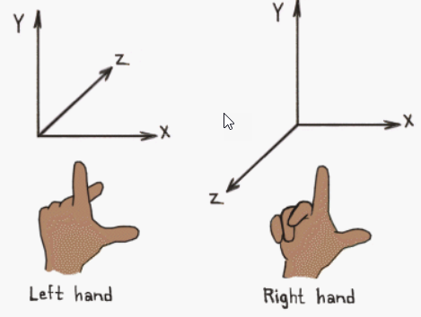
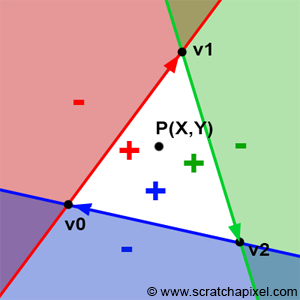

- [Handed Coordinates](#handed-coordinates)
  - [1. Left-handed Coordinates](#1-left-handed-coordinates)
  - [2. Right-handed Coordinates](#2-right-handed-coordinates)
  - [3 Cross Product](#3-cross-product)
- [Texture Coordinates](#texture-coordinates)
  - [1. Texture와 Texture Coordinates](#1-texture와-texture-coordinates)
  - [2. Mapping Texels to Screen Space in DirectX](#2-mapping-texels-to-screen-space-in-directx)
    - [2.1. inverse mapping](#21-inverse-mapping)
    - [2.2. texture filtering](#22-texture-filtering)
    - [2.3. texel address range](#23-texel-address-range)
    - [2.4. texel mapping process](#24-texel-mapping-process)
      - [2.4.1. pixel vertex to 3D primitive mapping](#241-pixel-vertex-to-3d-primitive-mapping)
      - [2.4.2. distorted pixel](#242-distorted-pixel)
      - [2.4.3. mapped pixel vertex to texture space mapping](#243-mapped-pixel-vertex-to-texture-space-mapping)
      - [2.4.4. sampling pixel color from texel](#244-sampling-pixel-color-from-texel)
- [Bary-Centric Coordinates - 무게 중심 좌표계](#bary-centric-coordinates---무게-중심-좌표계)
  - [1. Weights : 가중치](#1-weights--가중치)
    - [1.1. Weights Properties](#11-weights-properties)
    - [1.2. Weights의 물리적 해석](#12-weights의-물리적-해석)
  - [2. 삼각형 내부의 임의의 점 P 구하기( GLM )](#2-삼각형-내부의-임의의-점-p-구하기-glm-)
  - [3. pixel color를 결정하기 전 `pixel이 삼각형 내부에 존재하는지 판단`](#3-pixel-color를-결정하기-전-pixel이-삼각형-내부에-존재하는지-판단)
    - [3.1. Edge Function](#31-edge-function)
  - [Interpolation](#interpolation)
  - [blending triangle color](#blending-triangle-color)

<br>

[Normalized Device Coordinates](http://www.directxtutorial.com/lesson.aspx?lessonid=111-4-1)   
- 해상도와 상관 없이 Screen을 표현하기 위해 가로 세로 길이가 2인 정사각형 좌표계를 말한다
- 
Local/World 좌표계   
이미지 좌표계   
스크린 좌표계   
좌표계 변환   
Homogeneous Coordinates: 동차 좌표계( vector와 point를 혼용해서 쓰는 좌표 )   
aspect ratio: 화면의 가로 세로 비율   

# Handed Coordinates
<br>

`OpenGL에서 Ray의 방향( z축 )은 현실 세계를 향하고`, `DirectX는 가상 세계를 바라본다`<br>
## 1. Left-handed Coordinates
DirectX는 Left-handed Coordinates이다.<br>
**X is to the right, and Y is up, then Z is towards screen**<br>
**library의 cross()를 사용할 때 인자로 들어가는 순서**는 `X cross Y = -Z`이다<br>

<br>

## 2. Right-handed Coordinates
OpenGL은 Right-handed System이다.<br>
**X is to the right, and Y is up, then Z is towards you**<br>

<br>

## 3 Cross Product
**[ How do you use the right-handed rule for glm::cross? ](https://stackoverflow.com/questions/37519476/how-do-you-use-the-right-hand-rule-for-glmcross)**<br>
대부분의 library( GLM, DirectXMath )의 cross API는 right-handed coordinates를 따른다<br>
```cpp
#include <glm/glm.hpp>
glm::vec3 crossXY = glm::cross(vecX, vecY);   // (0, 0, 1)
glm::vec3 crossYX = glm::cross(vecY, vecX);   // (0, 0, -1)
```
따라서 **library의 cross()를 사용할 때 인자로 들어가는 순서**는 `X cross Y = Z`이다<br>


<br><br>


# Texture Coordinates
**[ Texture Coordinates( Direct3D 9 ) ](https://learn.microsoft.com/en-us/windows/win32/direct3d9/texture-coordinates)**<br>
**[ Texture Coordinates ](https://docs.safe.com/fme/html/FME-Form-Documentation/FME-ReadersWriters/!FME_Geometry/Texture_Coordinates.htm)**<br>
Texturing은 정교한 modeling이 아닌, 간단한 model에 image를 씌우는 작업이다<Br>
이러한 texturing 작업을 할 때는 model과 texture image를 mapping하는데, 이때 Texture Coordinates가 필요하다<br>

<br>

## 1. Texture와 Texture Coordinates
Cubic Evironment map textures를 제외한 대부분의 `textures는 color value를 저장하는 2D matrix( image )`이다<br>

`각 color value는 texture element 또는 texel`라고 부르며, texture의 unit element이다<br>
`texture 내에서 texel은 고유한 주소`를 가진다. 이 주소는 column과 row 번호로 나타내며, `대표적으로 u( column ), v( row )로 분류`한다<br>

<br>

`Texture Coordinates는 texture space`이다<br>
즉, texture의 location(0, 0)을 기준으로 좌표를 계산한다<br>

Texturing을 통해 texture image를 3D 공간의 model에 적용하려면, texel 좌표를 model 좌표로 mapping이 필요하다<Br>
그 다음에 screen space의 pixel 좌표로 변환하여 화면에 보여준다<br>

<br>

## 2. Mapping Texels to Screen Space in DirectX

### 2.1. inverse mapping
Direct3D는 `texel 좌표를` 중간 단계를 건너뛰고 `바로 screen space로 변환`하기 때문에 효율적이다<br>
또한 Texture space에서 Screen space로 직접 mapping하는 대신, inverse mapping을 사용한다<br>
즉, `screen에서 각 pixel을 기준으로 해당 pixel이 texture의 어느 position에 대응하는지 계산`한다<br>

### 2.2. texture filtering
inverse mapping을 통해 `screen pixel에 대응되는 texture space position이 계산되면, 그 position에서 texture color를 sampling( 추출 )`한다<br>
이때 해당 position의 정확한 color 뿐만 아니라 주변 색상까지 고려해서 부드러운 결과를 생성할 수 있다<br>

이렇게 texture color를 추출하는 방법을 texture filtering이라고 부른다<br>

<br>

### 2.3. texel address range
<br>
texture coordinates의 texel address의 uv 값은 각각 0.0f ~ 1.0f로 지정한다<br>
이 값은 상대적이기 때문에 texture마다 다른 위치를 가리킨다<br>

<br>

### 2.4. texel mapping process
inverse mapping을 위해 pixel의 vertex와 texture의 vertex를 mapping하는 과정을 살펴본다<br>
`mapping을 통해 pixel의 color 값을 계산`한다<Br>

<br>

#### 2.4.1. pixel vertex to 3D primitive mapping
- `primitive`
  - model 또는 scene을 구성하는 기본적인 기하학적 도형, 특정 공간에서 표현할 수 있는 가장 단순한 형태의 도형
- `object space`
  - 3D object의 local coordinates

`pixel의 vertex를 object space( 3D object의 local coordinates )의 3D primitive에 mapping`한다<br>

#### 2.4.2. distorted pixel
`mapping된 pixel의 모양은 3D space의 primitive 모양과 시야각에 따라 왜곡`된다<br>
즉, 화면에 보이는 pixel의 vertex가 3D model의 표면 위에  mapping 될 때, primitive의 모양에 따라 pixel의 원래 형태가 찌그러지거나 변형될 수 있다<br>
위 그림에서 primitive surface에 mapping된 pixel은 왜곡됐다<br>

#### 2.4.3. mapped pixel vertex to texture space mapping
`primitive surface에 mapping한 pixel의 vertex는 texture space에 mapping`된다<br>
2D matrix로 구성된 texture image를 3D model에 입히기 위해서 각 pixel은 texture의 어느 부분에 해당하는지 알아야 한다<br>
이 과정에서 일반적으로 또 pixel의 모양이 왜곡된다<br>

#### 2.4.4. sampling pixel color from texel
pixel color는 texture space에 mapping된 지점( texel )에서 계산된다<br>
pixel color를 계산하는 방법이 texture filtering이며, DirectX의 method를 통해 pixel color를 추출할 수 있다<br>


<br><br>


# Bary-Centric Coordinates - 무게 중심 좌표계
한 점의 위치를 simplex( n차원 다면체 )의 vertice에 대한 가중 평균으로 표현하는 좌표계이다   
즉, `삼각형의 세 꼭지점과 가중치를 이용하여 삼각형 내부의 임의의 점을 표현하는 방법`이다   
```
simplex
0차원 simplex : 한 개의 Point
1차원 simplex : 두 점을 잇는 line segment
2차원 simplex : 세 점을 연결하여 만든 Trigangle
3차원 simplex : 네 점을 연결하여 만든 Tetrahedron( 사면체 )
```
<br>

Graphics에서 `Texture Mapping`과 `screen 상의 각 pixel이 object 내부에 존재하는지 판단`할 때 사용한다   

$$P = \alpha A + \beta B + \gamma C$$

위 수식은 vertice가 A, B, C인 삼각형에서 평면상의 임의의 점 P를 표현하는 방법이다   
$\alpha + \beta + \gamma = 1$이며, 각 $\alpha, \beta, \gamma$는 Point P의 중심 좌표다   
bary-centric coordinates를 이용해서 $\alpha, \beta, \gamma$ 값을 찾는다   

<br>

## 1. Weights : 가중치
```
          C
          /\
         /  \
      γ /    \ β
       /  P   \
      /________\
     A    α     B
```
bary-centric coordinates에서 weights( $\alpha, \beta, \gamma$ )는 삼각형의 각 꼭지점 A, B, C가 점 P의 위치를 결정하는 데 얼마나 기여하는지 나타내는 값이다   

- $\alpha$: P가 꼭지점 A에 얼마나 가깝나?
- $\beta$: P가 꼭지점 B에 얼마나 가깝나?
- $\gamma$: P가 꼭지점 C에 얼마나 가깝나?

### 1.1. Weights Properties
`weights가 클수록 해당 꼭지점에 더 가깝다`

`weights의 합은 항상 1`이며, 점 P가 삼각형 내부/외부 어디에 있든 항상 성립한다.   

- `삼각형 내부`: 모든 가중치가 양수
- `삼각형의 변 위의 점`: 한 가중치가 0이고, 나머지 두 가중치는 양수
- `삼각형 외부의 점`: 하나 이상의 가중치가 음수

위 세 가지 경우에 대한 설명은 [Edge Function](#31-edge-function)에 있다   
`Weights는 삼각형의 부분 면적과도 관련`이 있다   
$\alpha$는 점 P를 꼭지점으로 하는 삼각형 PBC의 면적이 전체 삼각형 ABC 면적에서 차지하는 비율과 비례한다   

### 1.2. Weights의 물리적 해석
질량 분포로 생각할 수 있다. `각 꼭지점에 Weights 만큼의 질량이 있다고 가정하면, P는 이 질량들의 무게 중심`이다   

<br>

## 2. 삼각형 내부의 임의의 점 P 구하기( GLM )
`임의의 점 P에 대한 가중치와 세 꼭지점이 존재할 때`, 삼각형 내부의 임의의 점 P를 구하는 방법을 알아본다   
```
          C (0, 5)
           /\
          /  \
       γ /    \ β
        /  P   \
       /________\
    A (0, 0)     B (5, 0)
           α
```

$$P = \begin{cases}
  \mathnormal{x}_{P} = \alpha \mathnormal{x}_{A} + \beta \mathnormal{x}_{B} + \gamma \mathnormal{x}_{C} \\
  \mathnormal{y}_{P} = \alpha \mathnormal{y}_{A} + \beta \mathnormal{y}_{B} + \gamma \mathnormal{y}_{C}
\end{cases}$$

```cpp
#include <glm/glm.hpp>
#include <iostream>

int main() {
    // 삼각형의 세 꼭지점
    glm::vec2 A(0.0f, 0.0f);
    glm::vec2 B(5.0f, 0.0f);
    glm::vec2 C(0.0f, 5.0f);

    // 중심 좌표 (α, β, γ)
    float alpha = 0.3f;
    float beta = 0.3f;
    float gamma = 0.4f;

    // 중심 좌표의 합이 1인지 확인
    if (alpha + beta + gamma != 1.0f) {
        std::cerr << "가중치의 합이 1이 아닙니다." << std::endl;
        return -1;
    }

    // 점 P의 좌표 계산
    glm::vec2 P = alpha * A + beta * B + gamma * C;

    // 결과 출력
    std::cout << "점 P의 좌표: (" << P.x << ", " << P.y << ")" << std::endl;

    return 0;
}
```
math library에서는 Point와 Vector를 구분하지 않기 때문에 코드를 작성하는 개발자가 vector와 point를 결정한다   

## 3. pixel color를 결정하기 전 `pixel이 삼각형 내부에 존재하는지 판단`
screen의 pixel을 순회하면서 각 pixel이 삼각형 내부에 존재하는지 판단하는 경우가 있다   
이때, `특정 pixel이 삼각형 내부에 있는지 판단하는 방법이 Bary-centric coordinates`이다   
이렇게 pixel이 삼각형 내부에 있다면, pixel color를 결정한다   
```
          C
          /\
         /  \
        /    \
       /  P   \
      /________\
     A          B
```
`삼각형 내부의 어느 한 점 P를 기준으로 쪼개지는 세 가지 삼각형의 넓이를 이용해서 판단`할 수 있다   
삼각형 ABC의 넓이는 3개의 부분 삼각형의 넓이( ACP, CBP, BPA )의 합이다   
부분 삼각형의 넓이를 각각 $\alpha_0, \alpha_1, \alpha_2$라고 할 때, 부분 삼각형의 넓이는 두 벡터의 **[Cross Product](Vector_Operation.md/#cross-product-사용처) / 2**로 구할 수 있다   

### 3.1. Edge Function
   

**[Rasterization - Edge Function](https://www.scratchapixel.com/lessons/3d-basic-rendering/rasterization-practical-implementation/rasterization-stage.html)**   
주의할 점은 $\alpha_0 = (C - A) \times (P - A) / 2$의 값이 음수라면 확실히 삼각형 내부를 벗어났지만, 양수라면 삼각형 내부 방향에 있다는 의미다   
왜냐하면 `(C - A) line segment를 기준으로 왼쪽에 있으면 음수이고, 오른쪽에 있으면 양수이기 때문`이다   
이러한 개념을 Edge Function이라 한다   

<br>

## Interpolation
Linear/Barycentric Interpolation<br>

## blending triangle color
<br>
barycentric coordinate system을 응용하면 삼각형 표면의 3개의 색깔을 섞어서 표현할 때 사용될 수 있다<br>