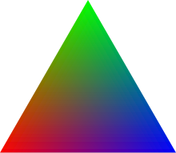

이미지 좌표계
스크린 좌표계
좌표계 변환
aspect ratio: 화면의 가로 세로 비율

 
`OpenGL에서 Ray의 방향( z축 )은 현실 세계를 향하고`, `DirectX는 가상 세계를 바라본다` 
DirectX는 Left-handed System이다. 
OpenGL은 Right-handed System이다. 

# Barycentric coordinate system - 무게 중심 좌표계
### Interpolation
Linear/Barycentric Interpolation 

### blending triangle color
 
barycentric coordinate system을 응용하면 삼각형 표면의 3개의 색깔을 섞어서 표현할 때 사용될 수 있다 