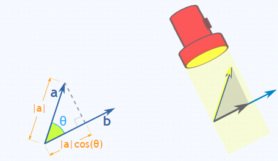
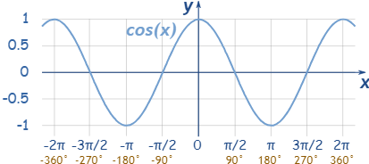
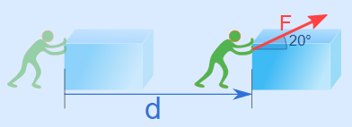
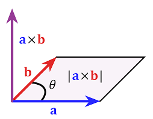
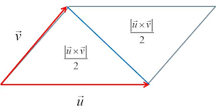

- [vector](#vector)
- [Dot product](#dot-product)
    - [특징](#특징)
    - [사용처](#사용처)
- [Cross product](#cross-product)
    - [특징](#특징-1)
      - [**in Graphics**](#in-graphics)
    - [사용처](#사용처-1)
- [Programming](#programming)
  - [1. GLM](#1-glm)
    - [glm::vec3 사용법](#glmvec3-사용법)
    - [glm::normalize()](#glmnormalize)
    - [glm::dot(), glm::cross()](#glmdot-glmcross)
    - [기타: vec4,](#기타-vec4)

<BR>

# vector
scalar 끼리 연산을 할 때는 dot, cross 연산자에 차이가 없이 곱셈을 의미한다<br>
하지만 vector 끼리 연산은 다르다<br>
<br>
`vector는 magnitude( 크기 )와 direction( 방향 )을 표현`한다<br>

참고로 `unit vector`는 magnitude를 제거했기 때문에 `direction만 표현하고 싶을 때` 구한다<br>

<br>
<br>

# Dot product
[ Dot product ](https://www.mathsisfun.com/algebra/vectors-dot-product.html)<br>
<br>
$A \cdot B$ <br>

`연산 결과가 scalar`이기 때문에 scalar product라고도 불린다<br>
inner product 또는 projection product라는 용어도 있다<br>

`하나의 vector에 투영( projection )한다는 의미`를 가진다<br>

### 특징
`두 vector가 서로 직각일 때, dot product 결과는 0`이다<br>

`두 vector가 같은 방향을 가리키면 a * b`이다<br>

<br>
위 두 가지 특징은 cos 함수를 그려보면 명확하다<br>
이때 180도 구간을 보면 `두 vector의 방향이 서로 반대 방향인 경우, Dot product 결과가 -1`임을 알 수 있다<br>

### 사용처
`두 vector가 직각인지 확인할 때 유용`하다<br>
직각 삼각형에서 두 변의 길이를 알면, 피타고라스 정의를 이용해서 나머지 한 변의 길이를 구할 수 있다<br>

<br>

<br>
`물리학에서 Work를 판단할 때 사용`한다<br>
$Work = Force \cdot Distance$ <br>
$Work = Force \times Distance \times \cos \theta$ <br>
Work가 Force * Distance인 경우는 물건에 힘을 주는 방향과 이동 방향이 같은 경우이다<br>

<br>

`두 vector의 방향이 상대적으로 어떤지 알고 싶을 때 유용`하다<br>
특히 Graphics에서 `두 unit vector의 방향을 판단`할 때 사용한다<br>


<br>
<br>

# Cross product
[ Cross product ](https://www.mathsisfun.com/algebra/vectors-cross-product.html)<br>

<br>
$A \times B$ <br>

Dot product와 달리 `vector 값을 반환`하기 때문에 vector product라는 이름도 있다<br>
`3차원에서 사용`한다<br>

Cross product를 나타내는 `"Right Hand Rule"`도 존재한다<br>

### 특징
`두 vector가 같은 방향 또는 반대 방향을 가리킬 때 길이가 0`이다<br>

`두 vector가 직각일 때 최대 길이`이다<br>


#### **in Graphics**
두 vector a와 b를 Cross Product한 결과로 c vector를 얻었을 때

- `c는 a와 b vector와 수직`이다
- a와 b가 서로 다른 vector인 경우, `a와 b vector로 평면을 정의할 수 있다`

위 두 가지 특징을 보면, a와 b vector로 얻은 한 평면의 normal vector를 구할 수 있다<br>

### 사용처
  <br>
Graphics에서는 `삼각형의 넓이를 구할 때` cross product를 사용한다<br>

$\mathbf{a}와 \mathbf{b}\text{가 이루는 삼각형의 넓이} = \frac{\parallel \mathbf{a} \times \mathbf{b} \parallel}{2}$ <br>

cross product의 결과 vector의 length는 `피연산자 vector의 삼각형 넓이의 2배`이다<br>
이는 반대로 말하면, 두 vector가 이루는 삼각형 넓이를 구하기 위해서는 cross product 결과의 length를 2로 나누면 된다<br>


<br>
<br>

# Programming
[ glm 환경 설정 ](HongLab/part1_BasicConceptsOfRendering/1_DirectX11_환경설정.md)<br>
DirectXMath.h 또는 glm을 이용해서 수학 연산을 진행한다<br>

glm은 수학 연산은 직관적이기 때문에 초보 개발자에게 적합하다<br>
DirectXMath는 성능이 더 좋지만, 복잡한 사용법을 익혀야 한다<br>

## 1. GLM
**[GLM Documents](https://openframeworks.cc/documentation/glm/)**<br>
Open`GL M`athematics<br>

### glm::vec3 사용법
```cpp
#include <glm/glm.hpp>
#include <glm/gtx/string_cast.hpp>    // cout 출력( to_string() )

using namespace std;  // cpp 파일에서는 사용해도 괜찮다
using namespace glm;

int main()
{
  // glm의 vector 생성자( float )
  glm::vec3 a(1.0f, 2.0f, 3.0f);
  glm::vec3 b(7.0f, 8.0f, 9.0f);

  glm::dvec3 double_vec(1.0, 1.0, 1.0);   // Ray Tracing은 정밀도가 높기에 double 활용

  // glm vector를 문자열로 출력
  cout << glm::to_string(b - a) << endl;

  // 사칙연산
  auto c = b - a;

  // vector * scalar
  c = a * 10.0f;

  // vector magnitude
  float len = glm::length(c);

  // vector.size()
  // always glm::vec2.length() == 2, glm::vec3.length() == 3, glm::vec4.length() == 4
  cout << (b - a).length() << endl;
}
```

<br>

### glm::normalize()
```cpp
// unit vector 만들기
auto u = glm::normalize(b - a);
```
normalize() 작업은 인자로 전달받은 vector에 length를 나눠준다<br>
때문에 `length가 0.0인 vector를 unit vector로 만들려고 시도하면 에러가 발생`한다<br>
```cpp
// normalize 못하는 경우
if (glm::length(u) < 1e-4f) {
  // length를 0으로 간주하고 다른 방법으로 처리
  // log 출력, 기본값 지정 등
}
```
원래 length가 0인 vector를 normalize하면 안되지만, 현실적으로 복잡한 계산을 하기 때문에 모든 걸 판단하기 힘들다<br>
이러한 이유로 `if문으로 안전 장치를 마련하는 것을 권장`한다<br>

<br>

### glm::dot(), glm::cross()
```cpp
using namespace glm;

float aDotB = glm::dot(a, b);
cout << aDotB << endl;
cout << glm::dot(vec3(1, 0, 0), vec3(0, 1, 0)) << endl;

glm::vec3 aCrossB = glm::cross(a, b);
cout << to_string(aCrossB) << endl;
cout << length(cross(vec3(1.5, 0, 0), vec3(0, 2, 0)) << endl;
```

<br>

### 기타: vec4, 
```cpp
// vec3, vec4는 Graphics에서 많이 사용
glm::vec4 v4(glm::vec3(2.0f), 1.0f);

// vec3 elements : union으로 3가지 경우를 포함
cout << v3.x << " " << v3.y << " " << v3.z << endl;
cout << v3.r << " " << v3.g << " " << v3.b << endl;
cout << v3[0] << " " << v3[1] << " " << v3[2] << endl;
```
