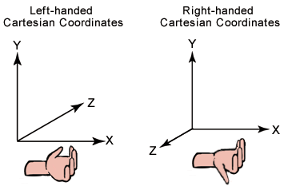
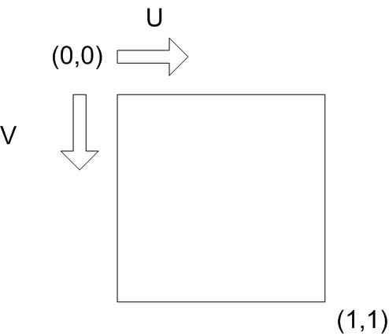
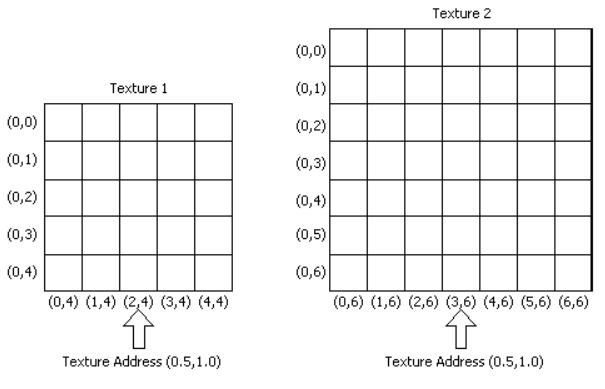
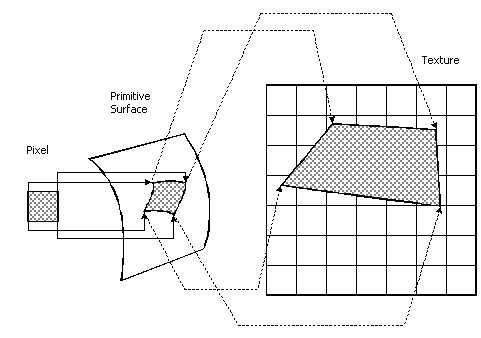
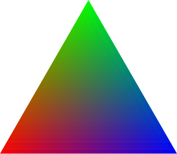

- [Texture Coordinates](#texture-coordinates)
  - [1. Texture와 Texture Coordinates](#1-texture와-texture-coordinates)
  - [2. Mapping Texels to Screen Space in DirectX](#2-mapping-texels-to-screen-space-in-directx)
    - [2.1. inverse mapping](#21-inverse-mapping)
    - [2.2. texture filtering](#22-texture-filtering)
    - [2.3. texel address range](#23-texel-address-range)
    - [2.4. texel mapping process](#24-texel-mapping-process)
      - [2.4.1. pixel vertex to 3D primitive mapping](#241-pixel-vertex-to-3d-primitive-mapping)
      - [2.4.2. distorted pixel](#242-distorted-pixel)
      - [2.4.3. mapped pixel vertex to texture space mapping](#243-mapped-pixel-vertex-to-texture-space-mapping)
      - [2.4.4. sampling pixel color from texel](#244-sampling-pixel-color-from-texel)
- [Barycentric coordinates - 무게 중심 좌표계](#barycentric-coordinates---무게-중심-좌표계)
    - [Interpolation](#interpolation)
    - [blending triangle color](#blending-triangle-color)

 

이미지 좌표계
스크린 좌표계
좌표계 변환
aspect ratio: 화면의 가로 세로 비율

 
`OpenGL에서 Ray의 방향( z축 )은 현실 세계를 향하고`, `DirectX는 가상 세계를 바라본다` 
DirectX는 Left-handed System이다. 
OpenGL은 Right-handed System이다. 

  

# Texture Coordinates
**[ Texture Coordinates( Direct3D 9 ) ](https://learn.microsoft.com/en-us/windows/win32/direct3d9/texture-coordinates)** 
**[ Texture Coordinates ](https://docs.safe.com/fme/html/FME-Form-Documentation/FME-ReadersWriters/!FME_Geometry/Texture_Coordinates.htm)** 
Texturing은 정교한 modeling이 아닌, 간단한 model에 image를 씌우는 작업이다 
이러한 texturing 작업을 할 때는 model과 texture image를 mapping하는데, 이때 Texture Coordinates가 필요하다 

 

## 1. Texture와 Texture Coordinates
Cubic Evironment map textures를 제외한 대부분의 `textures는 color value를 저장하는 2D matrix( image )`이다 

`각 color value는 texture element 또는 texel`라고 부르며, texture의 unit element이다 
`texture 내에서 texel은 고유한 주소`를 가진다. 이 주소는 column과 row 번호로 나타내며, `대표적으로 u( column ), v( row )로 분류`한다 

 

`Texture Coordinates는 texture space`이다 
즉, texture의 location(0, 0)을 기준으로 좌표를 계산한다 

Texturing을 통해 texture image를 3D 공간의 model에 적용하려면, texel 좌표를 model 좌표로 mapping이 필요하다 
그 다음에 screen space의 pixel 좌표로 변환하여 화면에 보여준다 

 

## 2. Mapping Texels to Screen Space in DirectX

### 2.1. inverse mapping
Direct3D는 `texel 좌표를` 중간 단계를 건너뛰고 `바로 screen space로 변환`하기 때문에 효율적이다 
또한 Texture space에서 Screen space로 직접 mapping하는 대신, inverse mapping을 사용한다 
즉, `screen에서 각 pixel을 기준으로 해당 pixel이 texture의 어느 position에 대응하는지 계산`한다 

### 2.2. texture filtering
inverse mapping을 통해 `screen pixel에 대응되는 texture space position이 계산되면, 그 position에서 texture color를 sampling( 추출 )`한다 
이때 해당 position의 정확한 color 뿐만 아니라 주변 색상까지 고려해서 부드러운 결과를 생성할 수 있다 

이렇게 texture color를 추출하는 방법을 texture filtering이라고 부른다 

 

### 2.3. texel address range
 
texture coordinates의 texel address의 uv 값은 각각 0.0f ~ 1.0f로 지정한다 
이 값은 상대적이기 때문에 texture마다 다른 위치를 가리킨다 

 

### 2.4. texel mapping process
inverse mapping을 위해 pixel의 vertex와 texture의 vertex를 mapping하는 과정을 살펴본다 
`mapping을 통해 pixel의 color 값을 계산`한다 

 

#### 2.4.1. pixel vertex to 3D primitive mapping
- `primitive`
  - model 또는 scene을 구성하는 기본적인 기하학적 도형, 특정 공간에서 표현할 수 있는 가장 단순한 형태의 도형
- `object space`
  - 3D object의 local coordinates

`pixel의 vertex를 object space( 3D object의 local coordinates )의 3D primitive에 mapping`한다 

#### 2.4.2. distorted pixel
`mapping된 pixel의 모양은 3D space의 primitive 모양과 시야각에 따라 왜곡`된다 
즉, 화면에 보이는 pixel의 vertex가 3D model의 표면 위에  mapping 될 때, primitive의 모양에 따라 pixel의 원래 형태가 찌그러지거나 변형될 수 있다 
위 그림에서 primitive surface에 mapping된 pixel은 왜곡됐다 

#### 2.4.3. mapped pixel vertex to texture space mapping
`primitive surface에 mapping한 pixel의 vertex는 texture space에 mapping`된다 
2D matrix로 구성된 texture image를 3D model에 입히기 위해서 각 pixel은 texture의 어느 부분에 해당하는지 알아야 한다 
이 과정에서 일반적으로 또 pixel의 모양이 왜곡된다 

#### 2.4.4. sampling pixel color from texel
pixel color는 texture space에 mapping된 지점( texel )에서 계산된다 
pixel color를 계산하는 방법이 texture filtering이며, DirectX의 method를 통해 pixel color를 추출할 수 있다 

  

# Barycentric coordinates - 무게 중심 좌표계
### Interpolation
Linear/Barycentric Interpolation 

### blending triangle color
 
barycentric coordinate system을 응용하면 삼각형 표면의 3개의 색깔을 섞어서 표현할 때 사용될 수 있다 