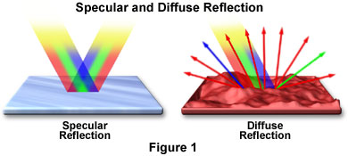
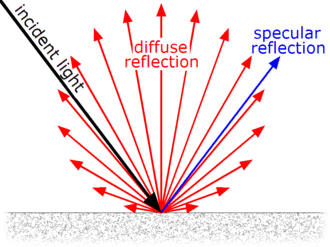
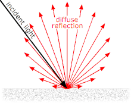
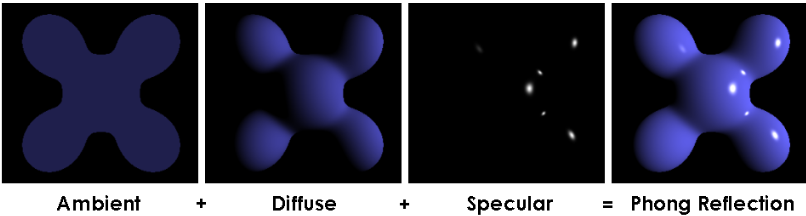

- [Lambertian Reflection( Lambertian Shading )](#lambertian-reflection-lambertian-shading-)
  - [1. Diffuse Surface](#1-diffuse-surface)
  - [2. Diffuse Reflection과 Specular Reflection](#2-diffuse-reflection과-specular-reflection)
  - [3. Lambert's Cosine Law](#3-lamberts-cosine-law)
      - [아주 미세하게 울퉁불퉁한 표면](#아주-미세하게-울퉁불퉁한-표면)
      - [매끈한 표면](#매끈한-표면)
  - [4. Diffuse Lighting Model](#4-diffuse-lighting-model)
- [Phong Reflection Model( Phong Shading )](#phong-reflection-model-phong-shading-)
  - [1. Diffuse Reflection](#1-diffuse-reflection)
  - [2. Specular Reflection](#2-specular-reflection)
  - [3. Ambient Reflection](#3-ambient-reflection)
  - [4. Phong Reflection Model 수식](#4-phong-reflection-model-수식)
- [Blinn-Phong Model( Blinn-Phong Shading )](#blinn-phong-model-blinn-phong-shading-)
  - [1. Phong Model과 차이점](#1-phong-model과-차이점)
  - [2. Halfway Vector](#2-halfway-vector)

 

조명이 빛을 반사해서 우리 눈에 Object가 어떻게 보이는 지에 대한 모델을 알아본다 

# Lambertian Reflection( Lambertian Shading )
Lambertian Reflection은 종종 diffuse reflection을 위한 model로 사용한다 

## 1. Diffuse Surface
light vector가 모든 방향으로 같은 양의 빛을 반사한다 
때문에 `어느 방향에서 봐도 똑같은 밝기로 보이는 표면`이다 

## 2. Diffuse Reflection과 Specular Reflection
Diffuse Surface에서 나타나는 2가지 reflection을 살펴본다 

[ Diffuse reflection - wiki ](https://en.wikipedia.org/wiki/Diffuse_reflection) 
[Specular and Diffuse Reflection - micro](https://micro.magnet.fsu.edu/primer/java/reflection/specular/)   

Diffuse Reflection이란, `빛, 파동, 입자가 반사되어 표면에 입사한 광선이 specular reflection( 정반사 )처럼 한 각도가 아니라 여러 각도로 scatter 되는 것`을 의미한다 

   

specular reflection은 거울 반사가 대표적이고, diffuse reflection은 일반적인 물체의 표면 반사를 생각하면 된다   

 

위 그림은 매끄러운 또는 광택이 있는 표면에서 diffuse reflection과 specular reflection이다 
그림의 `ray는 luminous intensity를 나타내며, 이러한 intensity는 Lambert's consine law에 의해 달라진다` 

## 3. Lambert's Cosine Law
[ Lambert's cosine law - wiki ](https://en.wikipedia.org/wiki/Lambert%27s_cosine_law) 
[ Lambertian Reflection - wiki ](https://en.wikipedia.org/wiki/Lambertian_reflectance) 

`Diffuse Reflection에 대한 법칙`이다 
Lambert's cosine law을 따르는 surface를 lambertian surface라 하며, 위 Diffuse Surface가 이에 해당한다 

 

Diffuse surface로 들어오는 incident light( 입사광 )

Lambertian Surface( Diffuse Surface )에서 반사된 빛의 강도( intensity )는 $I = I_\circ \cdot \cos \theta$로 계산한다 
- $I$: reflction light intensity
- $I_\circ$: incident light
- $\theta$: incident light와 surface의 normal vector 사이의 각도

즉, `surface가 빛을 받았을 때, 그 surface에서 reflected light intensity가 incident light의 방향과 surface's normal vector가 이루는 각도의 cosine 값에 비례`한다 
해가 뜨는 위치에 따른 빛의 세기를 생각하면 편하다 

incident light가 surface에 수직($\theta = 0^\circ$)으로 입사할 때, reflected light intensity가 가장 크며, incident light가 surface에 비스듬히 입사할수록( $\theta$가 커질수록 ) reflected light intensity가 줄어든다 

#### 아주 미세하게 울퉁불퉁한 표면
Diffuse Reflection을 계산할 때는 `빛이 어느 방향에서 오는지`, `표면이 빛을 많이 받을 수 있는 각도인지`를 고려해서 `얼마나 밝은 빛을 반사할지` 계산한다   

#### 매끈한 표면
Diffuse Reflection이 아니라 Specular Reflection을 계산하며, 이는 `특정 방향으로 빛을 강하게 반사`한다   
이때 빛이 얼마나 더 집중이 되는지를 결정하는 surface의 property는 `shininess`이다   

## 4. Diffuse Lighting Model
Graphics에서 Lambert's cosine law를 사용하는 조명 모델이다 
이를 통해 물체의 표면이 특정 조명에서 어느 방향으로든 고르게 빛을 반사하는 것을 시뮬레이션 할 수 있다 

  

# Phong Reflection Model( Phong Shading )
[ Phong Reflection Model - wiki ](https://en.wikipedia.org/wiki/Phong_reflection_model) 

`Graphics에서 물체의 표면이 어떻게 빛을 반사하는지를 시뮬레이션하는 조명 모델 중 하나`이다 

HW의 한계로 인해 저렴한 비용으로 높은 성능을 추구했던 과거에 많이 사용했다 
현실의 물리 법칙을 많이 무시하기 때문에 지금은 잘 사용하지 않는다 
하지만 현대의 reflection model은 phong reflection model 구조에서 확장하는 방식이 많기 때문에 알아두는 것이 좋다. 

 

해당 Model은 object의 surface에서 reflection 되는 빛을 세 가지 요소로 나눈다 
`Diffuse( 난반사 ) Reflection, Specular( 정반사 ) Reflection, Ambient Lighting( 주변광 ) Reflection을 함께 고려`해서 현실적인 조명으로 표현하려고 한다 

 

## 1. Diffuse Reflection
[ Lambert's cosine law ](#3-lamberts-cosine-law)에 따라 `surface에 닿는 빛이 모든 방향으로 고르게 반사되는 현상`이다 

$I_d = k_d \cdot I_{light} \cdot (\mathbf{L} \cdot \mathbf{N})$ 

- $I_d$: diffuse reflection intensity
- $k_d$: surface의 diffuse reflection 계수( 얼마나 diffuse를 반사하나? )
- $I_{light}$: light intensity
- $\mathbf{L}$: light의 방향 벡터
- $\mathbf{N}$: surface normal 벡터
- $L \cdot N$: light direction과 normal vector 사이의 cosine 값( incident light 각도 )

 

## 2. Specular Reflection
`매끄러운 표면에서 빛이 한 방향으로 강하게 반사되는 현상`이다 
이러한 현상은 반짝거리는 효과를 만들 때 사용한다 
시점과 반사된 빛의 방향이 일치할수록 빛의 세기가 강하다   

$I_s = k_s \cdot I_{light} \cdot (\mathbf{R} \cdot \mathbf{V})^n$

- $I_s$: specular reflection intensity
- $k_s$: surface specular reflection 계수
- $\mathbf{R}$: 반사 벡터
- $\mathbf{V}$: viewer의 방향 벡터
- $n$: 표면의 반짝임을 나타내는 지수( n이 클수록 빛의 반사가 더 좁고 날카롭다, shiny )

 

## 3. Ambient Reflection
object가 주변 환경으로부터 간접적으로 받는 빛을 나타낸다   
빛이 없어도 보이는 빛이며, object 자체의 빛이라고 생각하면 된다 
정확히 말하면, `물체가 어두운 환경에서 빛을 완전히 흡수하지 않고 약간의 빛을 반사하는 현상`이다 

$I_a = k_a \cdot I_{ambient}$ 

- $I_a$: ambient lighting reflection intensity
- $k_a$: surface의 ambient reflection 계수( 얼마나 주변광을 반사하나? )
- $I_{ambient}$: 환경에서의 ambient intensity

 

## 4. Phong Reflection Model 수식
$$I = I_d + I_s + I_a$$

$I$는 `물체 표면에서 반사되는 최종 조명의 강도`이다 

  

# Blinn-Phong Model( Blinn-Phong Shading )
real-time rendering에서 효율적이고 현실감 있는 light effect를 제공하기 위해 사용한다   
`Phong Shading Model을 개선하여 속도를 높였으며, 특히 specular reflection 계산에서 효율성과 시각적 품질을 향상`시켰다   

## 1. Phong Model과 차이점
specular reflection을 계산하는 수식은 $I_s = k_s \cdot I_{light} \cdot (\mathbf{R} \cdot \mathbf{V})^n$인데, `반사 벡터인 R은 연산 비용이 높다`   
이러한 Reflection Vector를 사용하는 것이 아닌 `Halfway Vector를 사용`한다   

## 2. Halfway Vector
   
View Vector와 Light Vector의 중간에 위치하기 때문에 Halfway Vector이다   
R을 계산한 후 $\mathbf{R} \cdot \mathbf{V}$하는 대신, H를 계산해서 $\mathbf{H} \cdot \mathbf{N}$을 계산하는 것이 더 효율적이다   

주의할 점은 L과 V는 normal vector 관계이기에 두 vector의 평균이 Halfway Vector가 된다   

$$I_s = k_s \cdot I_{light} \cdot (\mathbf{H} \cdot \mathbf{N})^n$$
