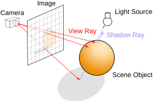
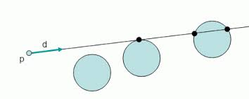
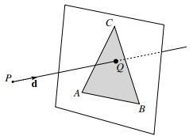
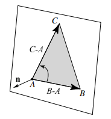
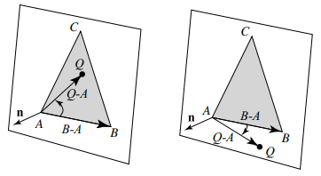

- [Rendering](#rendering)
  - [3D 장면을 2D 화면에 rendering 하는 2가지 방법](#3d-장면을-2d-화면에-rendering-하는-2가지-방법)
    - [1. object-order rendering](#1-object-order-rendering)
    - [2. image-order rendering](#2-image-order-rendering)
    - [3. 차이점](#3-차이점)
- [Ray Tracing Algorithm](#ray-tracing-algorithm)
- [Ray-Sphere Intersection](#ray-sphere-intersection)
  - [Ray-Sphere Intersection을 Ray-Tracing에 사용하는 3가지 경우](#ray-sphere-intersection을-ray-tracing에-사용하는-3가지-경우)
    - [1. Object와 Ray의 충돌 검출](#1-object와-ray의-충돌-검출)
    - [2. Ray 굴절 및 반사 계산](#2-ray-굴절-및-반사-계산)
    - [3. Shadow 계산](#3-shadow-계산)
- [Triangular Mesh](#triangular-mesh)
    - [1. Triangle과 Ray의 충돌](#1-triangle과-ray의-충돌)
    - [2. Triangle 내부에 point Q가 있는지 판단](#2-triangle-내부에-point-q가-있는지-판단)
- [Shadow](#shadow)
    - [기본 개념](#기본-개념)
    - [주의점](#주의점)
- [Reflection](#reflection)
  - [pixel color 연산](#pixel-color-연산)
- [Transparency와 Refraction](#transparency와-refraction)
- [Cube Mapping](#cube-mapping)
- [Ray Tracing을 구현하기 위해 필요한 정보](#ray-tracing을-구현하기-위해-필요한-정보)
    - [1. Ray( 광선 정보 )](#1-ray-광선-정보-)
    - [2. Hit( 충돌 정보 )](#2-hit-충돌-정보-)
    - [3. Ray Tracer( rendering에 필요한 정보 )](#3-ray-tracer-rendering에-필요한-정보-)
    - [4. Object의 Material 정보](#4-object의-material-정보)

 

[Ray Tracing 참고 blog](https://velog.io/@tjswodud/%EA%B7%B8%EB%9E%98%ED%94%BD%EC%8A%A4-4.-%EB%A0%88%EC%9D%B4%ED%8A%B8%EB%A0%88%EC%9D%B4%EC%8B%B1) 
[ wiki Ray Tracing ](https://en.wikipedia.org/wiki/Ray_tracing_(graphics)) 

 

# Rendering
기본적으로 `rendering은 입력으로 object의 집합을 받아 출력으로 pixel 배열을 생성하는 과정`이다 

 

## 3D 장면을 2D 화면에 rendering 하는 2가지 방법
object( 3D )가 pixel( 2D )에 접근하는 2가지 주요 방식이 존재한다 

### 1. object-order rendering
각 `object`는 순서대로 다뤄지고, object마다 영향을 미치는 모든 pixel을 찾고 업데이트한다 

장면의 복잡성이 적은 경우에 효율적이다. 

### 2. image-order rendering
각 `pixel`은 순서대로 다뤄지며 pixel마다 영향을 미치는 모든 object를 찾고 pixel 값을 계산한다 

장면의 복잡성이 높은 경우에 효율적이다 

image-order rendering은 작업이 단순하고 유연하게 effect를 생성할 수 있으며, 비슷한 image를 만드는 데 걸리는 시간이 훨씬 길다 
`Ray-Tracing은 3D 컴퓨터 그래픽에서 디지털 이미지 rendering을 위한 image-order algorithm`이다 

### 3. 차이점
두 방법은 같은 이미지를 연산할 수 있지만, `서로 다른 종류의 effect를 계산하는데 적합`하며, `전혀 다른 성능`을 보여준다 

 
 

# Ray Tracing Algorithm
`Ray Tracing은 3D 컴퓨터 그래픽에서 사실적인 이미지를 제작하는 방법`이다 
광선을 추적하여 광선이 물체와 상호작용하는 방식에 초점을 둔다 

여기서 `Ray는 light가 아니라 Camera, 즉 보는 방향`이다 

 

Scene Object를 Screen에 비추기 위해서 어떻게 할까? 

 

1. **Ray Casting( 광선 발사 )**
   - Camera가 바라보는 방향으로 `모든 pixel에서 Scene으로 pixel 1개당 하나의 Ray를 쏜다` 
   - 나중에는 각 pixel에서 여러 개의 Ray를 Scene으로 쏘는 경우도 있다.
2. **Intersection Calculation( object와 교차점 계산 )**
   - `Ray가 처음으로 충돌한( hit ) 지점( point )을 찾는다`.
   - Ray가 Object와 교차하는 지점을 찾는다.
3. **Ray-Object Interaction( 상호작용 )**
   - `교차 지점에서 object의 surface 속성( 반사, 굴절, 그림자 등 )을 계산`한다.
4. **Lighting and Shading( 빛과의 상호작용 )**
   - `교차 지점에 영향을 주는 light를 고려해서 shadow ray를 쏜다`
   - shawdow ray는 light까지 도달할 수 있는지 체크하는 용도
   - `view ray와 shadow ray와의 관계를 통해 조명과 그림자 효과를 적용`한다 
   - light effect를 phong model을 이용해서 간단하게 구현할 수 있다
5. **Screen**
   - 3, 4 과정을 거쳐 계산된 pixel color를 screen에 적용한다

 

**[ left-handed systems ](/5_CS/Graphics/3_Coordinate_Systems.md/#1-left-handed-coordinates)** 
`Ray의 방향`은 DirectX에서는 `+Z방향( Left-handed Systems )`이다. 

가상의 눈에서 가상 화면의 각 pixel을 통과하는 경로를 추적하고, 이를 통해 보이는 object의 색상을 계산하는 방식이다 
먼저 빛이 screen을 통과하면 가장 가까운 object를 식별한다. 
object를 식별하면 ray tracing 알고리즘을 통해 screen에 보일 pixel 값을 정한다. 
pixel 값은 object의 재질, 광원을 결합하여 최종 pixel( 색상 ) 값을 결정한다 

  

# Ray-Sphere Intersection
[ wiki - Line-Sphere Intersection ](https://en.wikipedia.org/wiki/Line%E2%80%93sphere_intersection) 

Line-Sphere Intersection은 `3D 공간에 주어진 직선과 구가 만나는 지점을 찾을 때 이용`하는 개념이다 

 

Line과 Sphere는 3가지 방법으로 상호작용한다 

1. No Intersection
2. Point Intersection
3. Two point Intersection

 

이러한 상황을 구별하는 것은 Ray-Tracing 알고리즘의 일반적인 연산에서 유용하다 
위 Ray-Tracing 알고리즘의 [2단계 과정( 물체와의 교차점 계산 )](#ray-tracing-algorithm)에서 여러 가지 `Object와 Ray의 교차점을 계산할 때 사용`한다 

 

## Ray-Sphere Intersection을 Ray-Tracing에 사용하는 3가지 경우

### 1. Object와 Ray의 충돌 검출
특정 pixel에 대응하는 Ray가 Scene의 Object와 교차하는지 알아보려면, 그 Object와 Ray의 교차점을 계산해야 한다 

### 2. Ray 굴절 및 반사 계산
Ray와 Object가 교차할 때, 이 교차점을 기준으로 Ray의 방향이 굴절 또는 반사될 수 있다 
이 경우 새로운 Ray에 따라 Line-Sphere Intersection 반복적으로 계산한다 

### 3. Shadow 계산
Lighting이 있을 때, Object에 Shadow가 생긴다 
Shadow Ray와 Light 사이에 Object가 존재하는지 판단하여 그림자를 결정한다 

  

# Triangular Mesh
Graphics에서 삼각형을 그릴 수 있으면, 모든 도형을 그릴 수 있다 

**[ 사전 지식 Cross Product ](Vector_Operation.md/#cross-product)** 

Ray Tracing에서 삼각형을 어떻게 다루는지 알아본다 
먼저 Camera에서 발사하는 Ray가 삼각형에 닿았는지 아닌지 판단한다. 

### 1. Triangle과 Ray의 충돌
`무한히 넓은 삼각형과 Ray가 충돌하는지 판단`한다 
일단 닿았다고 생각하고 point Q를 찾는다 

**[ Ray-Triangle Intersection ](https://courses.cs.washington.edu/courses/csep557/10au/lectures/triangle_intersection.pdf)** 
 
3개의 vertex로 구성된 triangle이 scene에 있다 
`Camera에서 쏜 Ray의 unit vector가 triangle과 충돌하는 지점을 Q` 라고 한다 
$\mathbf{Q} = \mathbf{P} + t \times \mathbf{d}$ ( [Line-Sphere Intersection의 x = o + du 식을 이용 ](https://en.wikipedia.org/wiki/Line%E2%80%93sphere_intersection) ) 
위 수식을 이용하여 Q point를 찾기 위해선 t 값을 구해야 한다 

**t는 ray 시작점과 triangle 사이의 거리**를 나타내며, `ray가 t만큼 진행된 곳에 있는 지점이 Q이기 때문에 구한다`. 

   

1. point Q를 찾기 위해서 `삼각형의 normal vector를 구한다`
   - vec3(B - A)와 vec3(C - A)의 Cross product 결과를 unit vector로 변환
   - `cross product의 곱하는 순서가 z의 방향을 결정`( **[Handed Coordinates - Cross API ](/5_CS/Graphics/3_Coordinate_Systems.md/#3-cross-product)** )
2. `point A, B, C에서 Q로 향하는 vector는 1번에서 찾은 unit normal vector와 수직`
   - 수직은 Dot Product를 이용
   - $\mathbf{(Q - A)} \cdot \mathbf{n} = 0$
   - $\mathbf{((\mathbf{P} + t \times \mathbf{d}) - A)} \cdot \mathbf{n} = 0$
   - point A만 아니라 B 또는 C와도 위 결과가 같기 때문에 이를 이용해서 t를 구한다
3. 2번의 수식을 이용해서 `t를 구한다`
   - $\mathbf{(Q - A)} \cdot \mathbf{n} = \mathbf{(Q - B)} \cdot \mathbf{n} = \mathbf{(Q - C)} \cdot \mathbf{n}$
   - $\mathbf{((\mathbf{P} + t \times \mathbf{d}) - A)} \cdot \mathbf{n} = \mathbf{((\mathbf{P} + t \times \mathbf{d}) - B)} \cdot \mathbf{n} = \mathbf{((\mathbf{P} + t \times \mathbf{d}) - C)} \cdot \mathbf{n}$
   - $t = \frac{\mathbf{A} \cdot \mathbf{n} - \mathbf{P} \cdot \mathbf{n}}{\mathbf{d} \cdot \mathbf{n}}$

 

### 2. Triangle 내부에 point Q가 있는지 판단
$\mathbf{(Q - A)}와 \mathbf{(Q - B)}와 \mathbf{(Q - C)}$로 vertex(A, B, C)인 삼각형을 3조각으로 나눈다 

이렇게 쪼개진 세 삼각형의 normal vector를 각각 n1, n2, n3라 한다 

만약 point Q가 vertex(A, B, C)인 삼각형 내부에 있으면, vertex(A, C, Q), vertex(C, B, Q), vertex(A, Q, B) 삼각형의 n1, n2, n3가 n과 같은 방향이다 

**[ Dot product properties ](/5_CS/Graphics/Vector_Operation.md/#특징)** 
$\mathbf{n1} \cdot \mathbf{n} >= 0$`이면 내부에 있고, 0보다 작으면 삼각형 외부에 point Q가 존재`한다 
**n1, n2, n3가 n과의 연산에서 하나라도 0보다 작으면 point Q는 삼각형 외부에 존재**한다 

  

# Shadow
Ray-Tracing으로 그림자를 표현하는 방법 
참고로 real time graphics에서는 ray tracing으로 그림자를 표현하지 않고, `그림자를 따로 그려서 덧붙이는 방식을 더 많이 사용`한다 

### 기본 개념
 
view ray가 object의 한 지점과 충돌한 부분에서 light와의 관계를 파악한다 
이는 shadow ray를 light를 향해서 발사하면 알 수 있다 
만약 shadow ray가 light에 도달하기 전 object를 만난다면, 그림자 효과를 추가한다 
`그림자 효과는 Ambient만 적용하고, Specular와 Diffuse를 적용하지 않으면 된다` 

### 주의점
이론과는 달리 `프로그래밍에서는 view ray와 object의 충돌 지점에서 바로 light를 향해 shadow ray를 발사하지 않는다` 
컴퓨터에서는 수치상의 문제로 인해 바로 발사하면 view ray와 닿은 object가 shadow ray에 충돌할 수 있기 때문이다 
때문에 view ray와 닿은 지점에서 `0.001f( 1e-3f ) 정도 떨어진 거리에 새로운 shadow ray를 생성하여 발사`한다 

  

# Reflection
pixel color를 결정할 때, shading에 의한 색의 비율이 줄어든 대신, 반사광이 반환해주는 색을 일정 비율만큼 추가한다 

## pixel color 연산
**[ Phong reflection model ](4_Lighting_Model.md/#phong-reflection-model)** 
만약 object에 reflection 속성이 없다면, ray와 충돌한 object의 pixel color를 phong model로 shading을 해서 값을 결정한다.

reflection 속성을 가진다면, `ray와 충돌한 object의 표면에서 다시 ray를 발사`한다. 
`reflection ray가 또 다른 object2를 만났을 때 object2가 reflection 속성을 가지지 않았다면, object2와 ray가 만난 지점의 pixel color2를 결정하고 기존 color와 color2를 적절한 비율로 blending` 한다 
만약 object2가 reflection 속성을 가진다면, 또 reflection ray를 발사한다 

우연히 object1과 object2가 서로 끊임없이 reflection ray를 쏠 수 있기 때문에, 이를 막기 위해 reflection ray를 몇 번 발사할지 제한한다 

  

# Transparency와 Refraction
투명한 object( Transparency )의 pixel color를 구하는 방법을 알아본다 
물체가 투명( water )하다면 object 내부로 ray가 굴절( refraction )되어 들어간다 

  

# Cube Mapping
`배경을 만들 때 많이 사용`하는 Cube Mapping 
cube map texture를 따로 구해야 한다 

  

# Ray Tracing을 구현하기 위해 필요한 정보

### 1. Ray( 광선 정보 )

### 2. Hit( 충돌 정보 )
normal vector란 Ray에 충돌한 위치에서 표면의 수직 벡터를 의미한다 
Graphics에서 normal vector는 unit vector로 저장한다 

### 3. Ray Tracer( rendering에 필요한 정보 )

### 4. Object의 Material 정보