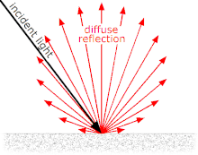

- [Lambertian Reflection](#lambertian-reflection)
  - [Lambertian surface](#lambertian-surface)
  - [Diffuse surface](#diffuse-surface)
- [Phong Reflection Model](#phong-reflection-model)
  - [Description](#description)
    - [Ambient](#ambient)
    - [Diffuse](#diffuse)
    - [Specular](#specular)

 

# Lambertian Reflection
phong model을 알아보기 전에 사전 지식을 알아본다 

[ Lambertian Reflection - wiki ](https://en.wikipedia.org/wiki/Lambertian_reflectance) 
[Lambertian Reflection - blog](https://blog.naver.com/jetarrow82/221252045857) 

 

object의 `surface에 닿는 빛의 세기( intensity, incident light<입사 광도> )`가 `표면의 법선 벡터( normal vector )와 빛의 방향 벡터( light vector, diffuse reflection ) 사이의 각도에 따라 달라진다` 
즉, intensity는 두 벡터가 이루는 $\cos \theta$ 값에 비례한다 
따라서 `두 벡터가 이루는 각도가 작을수록 surface가 받는 intensity가 커진다` 

이 개념은 phong reflection model의 `diffuse refelction에서 사용`된다 

Lambertian Reflection에서 `reflected radiant intensity( light vector )는 모든 방향으로 같은 빛을 반사`하기 때문에 관찰자의 위치에 관계 없이 같은 밝기로 보인다 

## Lambertian surface
light vector가 모든 방향으로 같은 양의 빛을 반사한다 

## Diffuse surface
표면이 완전히 매끈하지 않으면 표면에서 빛을 반사할 때, 난반사가 발생한다 

 
 

# Phong Reflection Model
[ Phong Reflection Model - wiki ](https://en.wikipedia.org/wiki/Phong_reflection_model) 

HW의 한계로 인해 저렴한 비용으로 높은 성능을 추구했던 과거에 많이 사용했다 
현실의 물리 법칙을 많이 무시하기 때문에 지금은 잘 사용하지 않는다 
하지만 현대의 reflection model은 phong model 구조에서 확장하는 방식이 많기 때문에 알아두는 것이 좋다. 

phong model을 이용해서 `조명 효과를 표현하는 방법`을 알아본다 
조명이 빛을 반사해서 우리 눈에 어떻게 보이는 지에 대한 모델이다 

 

## Description
phong model은 object의 surface에서 reflection 되는 빛을 세 가지 요소로 나눈다 
ambient( 주변광 ), diffuse( 난반사광 ), specular( 정반사광 )이 있으며 이 세 가지 요소를 더한 것이 phong reflection model이다 

### Ambient
빛이 없어도 보이는 빛이다 
object 자체의 빛이라고 생각하면 된다 

### Diffuse
[ Lambert's cosine law ](https://blog.naver.com/jetarrow82/221252045857) 
Lambertian surface를 바라볼 때의 Radiant Intensity( 광도 )는 surface의 normal vector와 이루는 각의 cos에 비례한다 
즉, object가 받는 빛의 세기는 normal vector와 light vector의 각도와 관계있다 

### Specular
반짝거리는 효과를 만들 때 사용한다 
specular는 아주 매끈한 surface를 가정한다 
surface를 바라보는 눈이 어디 있는지도 영향을 미친다 