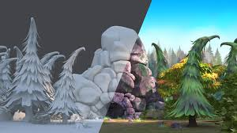

- [Texturing](#texturing)
- [Texture coordinates](#texture-coordinates)
    - [원점과 비율](#원점과-비율)
    - [가져오는 방법](#가져오는-방법)
    - [Texture Sampling](#texture-sampling)

 

# Texturing
 
texturing은 `model을 정교하게 만드는 대신, image를 덧붙인다` 
rendering 속도 측면에서 복잡한 polygon model을 사용하는 것보다 단순한 model에 image를 덧붙이는 것이 훨씬 빠르다 
즉, `핵심은 단순한 model에 image를 덧씌우는 방법`이다 

# Texture coordinates
model에 image를 덧씌우기 전에 model의 vertex에 색깔을 지정해야 한다 
이를 위해 texture image에서 어느 위치의 색깔을 가져오는지 판단해야 하는데, 이때 texture coordinates( 텍스쳐 좌표 )가 필요하다 

### 원점과 비율
texture coordinates의 원점은 openGL은 좌측 하단, DirectX는 좌측 상단을 기준으로 삼는다 
texture coordinates는 해상도와 상관 없이 독립적인 좌표계를 가진다 
해상도가 바뀔 때마다 texture 좌표도 바꾸지 않기 위해서다 
보통 aspect ratio( 가로 세로 비율 )를 1:1로 지정한다 

texture coordinates는 2차원 평면이기 때문에 좌표도 2차원 벡터로 구성한다 

### 가져오는 방법
이제 texture coordinates를 지정했으니 여기서 어느 지점을 가져와 model의 point와 매칭하는지 결정한다 

model의 vertex와 texture의 vertex를 매칭한 뒤에 [ Barycentric Interpolation ](/5_CS/Graphics/3_coordinate_systems.md/#barycentric-coordinate-system---무게-중심-좌표계)을 활용해서 vetex 사이의 지점을 결정한다 
즉, model의 특정 point의 색깔을 texture를 이용해서 결정하고 싶으면, 해당 point의 texture 좌표를 지정해야 한다 
이러한 point를 구할 때 barycentric interpolation을 이용한다 

### Texture Sampling
**point/linear sampling** : sampling 종류 

texture coordinates의 어느 point에서 색깔을 가져오는 작업을 `sampling`이라 한다 
sampling 자체의 의미는 여러 가지의 데이터가 있을 때, 몇 개의 데이터만 가져와서 사용하는 것이다 
그러면 texture의 sampling은 texture image에 있는 여러 pixel 값들 중 필요한 위치에 있는 색깔 값을 가져와 사용하는 것을 의미한다 