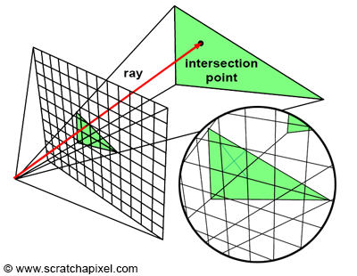
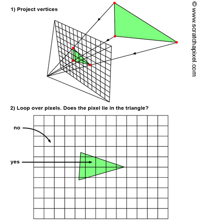

- [Rasterization](#rasterization)
  - [1. Triangle Model](#1-triangle-model)
  - [2. Rasterization 원리](#2-rasterization-원리)
    - [2.1. Bounding Box](#21-bounding-box)
    - [2.2. Ray Tracing과 Rasterization의 코드 구현 차이](#22-ray-tracing과-rasterization의-코드-구현-차이)

 

# Rasterization
`DirectX는 Ray Tracing이 아니라 Rasterization을 사용`한다   
Ray Tracing에서는 Sphere를 rendering할 때는 구의 방정식을 풀어서 ray와 sphere의 충돌점을 계산한다   
Rasterization은 `Sphere를 삼각형 여러 개로 바꿔서 rendering을 수행`한다   
특히 게임 같이 복잡한 장면을 rendering할 때는 삼각형 기반 모델을 Rasterization을 하는 것이 일반적이다   
이처럼 `Rasterization은 물체를 여러 개의 삼각형으로 모델링한 삼차원 형상으로 간주`한다.   

## 1. Triangle Model
모델( object )을 만들 때 삼각형 뿐만 아니라 사, 오, 육각형과 같은 다각형을 사용하는 관점이 Polygon Model인데, 실시간 그래픽스에서는 이러한 `다각형을 삼각형 여러 개로 쪼개서 rendering하는 것`이 일반적이기 때문에 Triangle Model이라고 부르는 것이 명확하다   

## 2. Rasterization 원리
**[ Rasterization Algorithm - scratchapixel ](https://www.scratchapixel.com/lessons/3d-basic-rendering/rasterization-practical-implementation/overview-rasterization-algorithm.html)**   

   

Ray Tracing에서는 Ray를 쏘고 삼각형과 부딪히는지 판단했다   

   
이와 달리 `Rasterization은 Scene의 삼각형의 vertex를 Screen의 pixel로 하나씩 투영( projection )`한다   
Screen에 projected한 vertices를 이어서 삼각형을 정의하고, 삼각형 내부의 pixel color를 정한다  
pixel color를 정하는 방식은 [Bary-Centric Coordinates](3_Coordinate_Systems.md/#bary-centric-coordinates---무게-중심-좌표계)를 이용한다.    

### 2.1. Bounding Box
Screen의 2차원 좌표에서 pixel 색깔을 정하기 때문에 더 빠른 연산을 수행할 수 있지만, **screen의 모든 pixel을 보기 때문에 어차피 비효율적**이라고 생각할 수 있다   
이 문제는 `bounding box라는 필요한 범위에서만 계산하는 방식`을 사용하여 해결한다   
`세 가지 vertex를 모두 담을 수 있는 가장 작은 bounding box를 찾는다`. 이는 `직사각형 영역이기 때문에 좌측 상단과 우측 하단의 좌표만 찾으면 box의 영역을 찾을 수 있다`   

bounding box 내에서만 for문으로 pixel을 순회하기 때문에 효율적인 연산을 수행한다   
이 개념은 Rasterization 뿐만 아니라 Ray Tracing에서도 적용할 수 있다   

### 2.2. Ray Tracing과 Rasterization의 코드 구현 차이
| RayTracing | Rasterization |
|:---:|:---:|
| for pixel | for object |
| for object | for pixel |
| pixel color 결정 | pixel color 결정|
