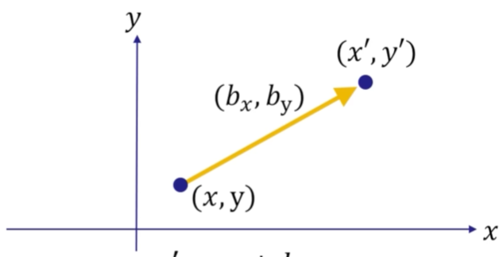
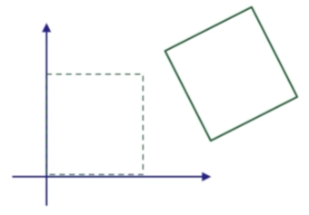
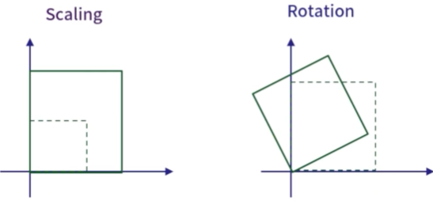

- [2차원 Transformation](#2차원-transformation)
  - [1. 어떤 점을 `원점`에 대해 회전시키는 경우](#1-어떤-점을-원점에-대해-회전시키는-경우)
    - [1.1. 원점에 대한 Point의 Location 구하기](#11-원점에-대한-point의-location-구하기)
    - [1.2. 원점에 대해 $\\theta$만큼 회전한 Point의 Location 구하기](#12-원점에-대해-theta만큼-회전한-point의-location-구하기)
    - [1.3. Matrix와 Vector로 회전 이후의 Location 구하기](#13-matrix와-vector로-회전-이후의-location-구하기)
      - [matrix \* column-vector](#matrix--column-vector)
      - [row-vector \* matrix](#row-vector--matrix)
  - [2. Translate](#2-translate)
  - [3. Vector/Point의 Rotation과 Translation을 하나의 matrix로 표현](#3-vectorpoint의-rotation과-translation을-하나의-matrix로-표현)
    - [Vertex Shader](#vertex-shader)
- [Linear Transformation](#linear-transformation)
  - [1. Translation이 Linear Transformation이 아닌 이유](#1-translation이-linear-transformation이-아닌-이유)
  - [2. Linear Transformation to Matrix](#2-linear-transformation-to-matrix)
    - [2.1. Standard Basis( 표준 기저 벡터 )](#21-standard-basis-표준-기저-벡터-)
      - [벡터 u의 (x, y, z)와 똑같은데 왜 i, j, k를 사용해서 표현하나?](#벡터-u의-x-y-z와-똑같은데-왜-i-j-k를-사용해서-표현하나)
    - [2.2. Scaling을 표현하는 Matrix](#22-scaling을-표현하는-matrix)


#### GPU 특징
화면에 그리기 위한 데이터를 CPU가 아닌 GPU에 저장하는 이유를 살펴본다   

1. CPU보다 GPU가 훨씬 빠르다
2. CPU -> GPU 복사가 느리다. 때문에 한 번 넣어두고 반복해서 사용한다
3. GPU -> CPU 복사는 더 느리다. 
   1. 보통 모니터를 Graphic 카드에 직접 연결한다.
   2. 따라서 GPU에서 rendering한 결과를 모니터로 보내는 작업은 빠르다.
   3. 대신 GPU to CPU로 데이터를 보내는 작업은 엄청나게 느리다.

<br>

Clockwise Winding Order, Counter-Clockwise Winding Order   
DirectX는 삼각형의 vertex 순서를 Clockwise Winding Order로 나열하는 것이 앞면으로 정의한다   

<br>

#### Graphics - Triangle Mesh를 위한 Data Structure
```cpp
class Circle {    // Mesh class로 확장 가능
public:
   // model coordinates의 원점( center )
   void InitCircle(const vec3& center, const float& radius, const int& numTriangles);

private:
   vector<vec3> vertices;     // 원의 중심과 가장자리 vertices
   vector<vec3> colors;       // vertices의 color
   vector<size_t> indices;    // 원의 vertices의 연결 정보
}
```
Triangle Model에서 자주 사용하는 자료 구조: 같은 종류끼리 각 배열에 저장한다   
빠르게, 한 번에 처리하기 위해서 하나의 배열에 저장하지 않고 나눠서 저장한다   

원을 삼각형으로 그릴 때, 각 삼각형은 인접한 vertex를 공유한다   
memory에 저장할 때, 중복을 제거하기 위해 효율적인 자료구조가 필요하다   

삼각형 0은 vertex 0 2 1   
삼각형 1은 vertex 0 3 2
이라면, index buffer에는 0 2 1 0 3 2 ... 가 저장된다   

<br><br>

# 2차원 Transformation
3차원 형상을 가상의 데이터로 표현하는 것을 3D Model이라 한다   

원을 표현할 때 삼각형을 많이 사용할수록 원처럼 보인다   
이러한 여러 개의 삼각형이 얽혀있는 모습이 그물망으로 보여서 Mesh라는 용어를 사용한다   

`Triangle Mesh`로 구성된 원에 `Transformation( rotation, translation, scale ) 연산을 적용`하려면 어떻게 하나?   

## 1. 어떤 점을 `원점`에 대해 회전시키는 경우

참고로 `object( ex. box )를 회전시킬 때는 normal vector도 함께 회전`시켜줘야 한다   

   

`2차원에서는 어떤 Point를 중심으로 회전하는지가 중요`하다   
참고로 `3차원은 축이 중심`이다   

### 1.1. 원점에 대한 Point의 Location 구하기

$$
x = r \times \cos \phi \\
y = r \times \sin \phi
$$

위 식은 `원점을 기준으로 어떠한 점( x, y )의 위치를 구하는 방법`이다   
이를 이용하여 Model을 원점을 기준으로 임의의 각도( $\theta$ )만큼 회전시킬 수 있다   

### 1.2. 원점에 대해 $\theta$만큼 회전한 Point의 Location 구하기

$$
x^{\prime} = x \times \cos \theta - y \times \sin \theta \\
y^{\prime} = x \times \sin \theta + y \times \cos \theta
$$

위 공식은 $\phi$를 없애면서 Model의 회전이 동일한 결과를 나타낸다   
따라서 $x, y, \cos, \sin, \theta$만 알고 있으면 회전한 위치를 구할 수 있다   

### 1.3. Matrix와 Vector로 회전 이후의 Location 구하기
Point를 vector로 표현하여 transformation matrix와 곱하여 회전 이후의 위치를 구한다   

#### matrix * column-vector

$$
\begin{bmatrix}
   x^{\prime} \\
   y^{\prime}
\end{bmatrix} = \begin{bmatrix}
   \cos \theta & -\sin \theta \\
   \sin \theta & \cos \theta
   \end{bmatrix} \begin{bmatrix}
      x \\
      y
   \end{bmatrix}
$$

cos, sin으로 구성된 matrix는 $\theta$ 만큼 회전시킨다는 행위를 하나의 matrix로 표현한 것이다   
즉, **위 식은 원점을 기준으로 $\theta$ 각도만큼 회전한 (x, y)좌표를 행렬로 표현하는 방법**이다   

#### row-vector * matrix

$$
\begin{bmatrix} x' \\ y' \end{bmatrix}^T
= \bigg( 
\begin{bmatrix} \cos \theta & -\sin \theta \\ \sin \theta & \cos \theta \end{bmatrix}
\begin{bmatrix} x \\ y \end{bmatrix}
\bigg)^T
$$

$$
\begin{bmatrix} x' \\ y' \end{bmatrix}^T
= \begin{bmatrix} x \\ y \end{bmatrix}^T
\begin{bmatrix} \cos \theta & -\sin \theta \\ \sin \theta & \cos \theta \end{bmatrix}^T
$$

$$
\begin{bmatrix} x', y' \end{bmatrix}
= \begin{bmatrix} x, y \end{bmatrix}
\begin{bmatrix} \cos \theta & \sin \theta \\ -\sin \theta & \cos \theta \end{bmatrix}
$$

Transpose를 이용하여 column-vector 형태의 Transformation을 row-vector 형태의 Transformation으로 바꾸는 방법이다   

<br>

## 2. Translate

   

Point를 이동시키는 경우를 살펴본다   

$$
x' = x + b_x \\
y' = y + b_y
$$

$$
\begin{bmatrix} x', y', 1 \end{bmatrix}
= \begin{bmatrix} x, y, 1 \end{bmatrix}
\begin{bmatrix}
   1 & 0 & 0 \\ 0 & 1 & 0 \\ b_x & b_y & 1
\end{bmatrix}
$$

`vector의 마지막 1은 Point를 명시`한다   
마지막 자리에 0을 넣으면 vector다. 0을 대입하여 계산하면 `x' = x`, `y' = y`로 나오기 떄문에 이동이 불가함을 알 수 있다   
즉, `Translate는 Point만 가능함`을 수학적으로 표현했고, 이를 [Homogeneous Coordinate( 동차 좌표계 )](3_Coordinate_Systems.md/#homogeneous-coordinates-동차-좌표계)라고 말한다   

<br>

## 3. Vector/Point의 Rotation과 Translation을 하나의 matrix로 표현
Homogeneous Coordinates를 이용하면 Rotation과 Translation의 matrix를 하나로 표현할 수 있다   

    

위 이미지는 box model이 회전하면서 이동하는 모습을 나타낸다   

$$
x' = x\cos\theta - y\sin\theta + wb_x \\ 
y' = x\sin\theta + y\cos\theta + wb_y \\ 
$$

$$
\begin{bmatrix} x', y', w \end{bmatrix}
= \begin{bmatrix} x, y, w \end{bmatrix}
\begin{bmatrix}
   \cos\theta & \sin\theta & 0 \\ -\sin\theta & \cos\theta & 0 \\ b_x & b_y & 1
\end{bmatrix}
$$

여기서 `w는 vector, point를 구분하는 변수`다   


<br>

### Vertex Shader
vertices들의 Transformation이 끝난 후 buffer에 저장하고, 이를 rendering한다.   
여기서 vertex shader는 transformation이 끝난 vertice를 memory에 올리는 작업을 뜻한다.   


<br><br>


# Linear Transformation

$$
\mathbf{u} = (u_x, u_y, u_z) \\
\mathbf{v} = (v_x, v_y, v_z) \\
1. \quad \tau(\mathbf{u} + \mathbf{v}) = \tau(\mathbf{u}) + \tau(\mathbf{v}) \\
2. \quad \tau(k\mathbf{u}) = k\tau(\mathbf{u})
$$

수학적으로 위 성질을 만족하면 Linear Transformation이다   

   
`Graphics에서 Linear Transformation은 도형을 Scaling 및 Rotation 할 때 사용`된다   
$\tau$가 선형 변환을 시켜주는 함수라고 생각하면, 특정 도형이 인자로 왔을 때 $\tau$는 위 그림처럼 Scaling 또는 Rotation 시켜주는 함수다   

<br>

## 1. Translation이 Linear Transformation이 아닌 이유
Linear Transformation의 2가지 성질을 만족하지 않기 때문이다   

$$
\tau(x, y, z) = (x + 1, y, z) \\
\tau(1, 2, 3) = (2, 2, 3) \\
k = 2 \\
\tau(k\mathbf(u)) = \tau(2, 4, 6) = (3, 4, 6) \\
k\tau(\mathbf(u)) = 2\tau(1, 2, 3) = (4, 4, 6)
$$

x + 1만큼 이동하는 tau 함수가 있다   
위 증명 과정을 통해 두 번째 성질이 만족하지 않음을 알 수 있다   

<br>

## 2. Linear Transformation to Matrix
`선형 변환을 행렬로 표현하는 방법`을 알아본다   

### 2.1. Standard Basis( 표준 기저 벡터 )
Basis란, 좌표축과 같이 다른 벡터들을 표현할 때, 기준으로 사용하는 벡터들을 말한다.   
예를 들면, 동쪽과 남쪽을 먼저 정의한 벡터가 있으면, 그 둘의 선형 결합으로 동남쪽을 표현할 수 있다   

$$
\text{표준 좌표계를 나타내는 i, j, k 벡터가 Standard Basis이다} \\
\mathbf{i} = (1, 0, 0), \mathbf{j} = (0, 1, 0), \mathbf{k} = (0, 0, 1) \\
$$

$$
\mathbf{u} = (x, y, z) = x\mathbf{i} + y\mathbf{j} + k\mathbf{k} = x(1, 0, 0) + y(0, 1, 0) + z(0, 0, 1)
$$

Basis를 이용해서 벡터 u를 표현하는 방법이다   
#### 벡터 u의 (x, y, z)와 똑같은데 왜 i, j, k를 사용해서 표현하나?   
이를 이용해서 `Linear Transformation을 vector와 matrix의 곱으로 표현할 수 있기 때문( 핵심 )`이다   

$$
\mathbf{uA} = \begin{bmatrix} x, y, z \end{bmatrix}
\begin{bmatrix}
   \leftarrow & \tau(\mathbf{i}) & \rightarrow \\
   \leftarrow & \tau(\mathbf{j}) & \rightarrow \\
   \leftarrow & \tau(\mathbf{k}) & \rightarrow
\end{bmatrix}
$$

여기서 tau(i), (j), (k)를 row-vector로 나타낸 `A가 Linear Transformation을 표현`한다   

### 2.2. Scaling을 표현하는 Matrix
Point에 Scalar값을 곱하는 것이 Scaling이다   

$$
S(x, y, z) = (s_xx, s_yy, s_zz) \\
S(\mathbf{i}) = (s_x * 1, s_y * 0, s_z * 0) = (s_x, 0, 0) \\
S(\mathbf{j}) = (s_x * 0, s_y * 1, s_z * 0) = (0, s_y, 0) \\
S(\mathbf{k}) = (s_x * 0, s_y * 0, s_z * 1) = (0, 0, s_z) \\
S = \begin{bmatrix} s_x & 0 & 0 \\ 0 & s_y & 0 \\ 0 & 0 & s_z \end{bmatrix}
\qquad
S^{-1} = \begin{bmatrix} 1/s_x & 0 & 0 \\ 0 & 1/s_y & 0 \\ 0 & 0 & 1/s_z \end{bmatrix}
$$

위 S와 S의 역행렬이 Scaling을 나타낸다   
원래 크기에서 2배를 키웠을 때, 다시 되돌리고 싶으면 2로 나누면 된다. 이를 역행렬로 표현해도 똑같다   