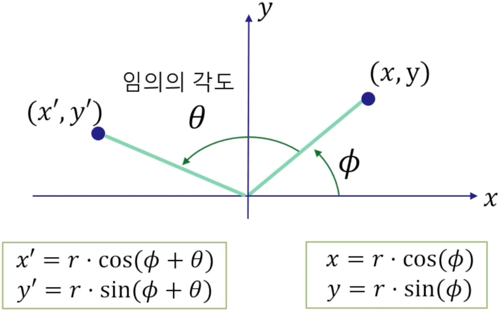

### GPU 특징
화면에 그리기 위한 데이터를 CPU가 아닌 GPU에 저장하는 이유를 살펴본다   

1. CPU보다 GPU가 훨씬 빠르다
2. CPU -> GPU 복사가 느리다. 때문에 한 번 넣어두고 반복해서 사용한다
3. GPU -> CPU 복사는 더 느리다. 
   1. 보통 모니터를 Graphic 카드에 직접 연결한다.
   2. 따라서 GPU에서 rendering한 결과를 모니터로 보내는 작업은 빠르다.
   3. 대신 GPU to CPU로 데이터를 보내는 작업은 엄청나게 느리다.

<br>

Clockwise Winding Order, Counter-Clockwise Winding Order   
DirectX는 삼각형의 vertex 순서를 Clockwise Winding Order로 나열하는 것이 앞면으로 정의한다   

<br>

### Graphics - Triangle Mesh를 위한 Data Structure
```cpp
class Circle {    // Mesh class로 확장 가능
public:
   // model coordinates의 원점( center )
   void InitCircle(const vec3& center, const float& radius, const int& numTriangles);

private:
   vector<vec3> vertices;     // 원의 중심과 가장자리 vertices
   vector<vec3> colors;       // vertices의 color
   vector<size_t> indices;    // 원의 vertices의 연결 정보
}
```
Triangle Model에서 자주 사용하는 자료 구조: 같은 종류끼리 각 배열에 저장한다   
빠르게, 한 번에 처리하기 위해서 하나의 배열에 저장하지 않고 나눠서 저장한다   

원을 삼각형으로 그릴 때, 각 삼각형은 인접한 vertex를 공유한다   
memory에 저장할 때, 중복을 제거하기 위해 효율적인 자료구조가 필요하다   

삼각형 0은 vertex 0 2 1   
삼각형 1은 vertex 0 3 2
이라면, index buffer에는 0 2 1 0 3 2 ... 가 저장된다   


# 2차원 Transformation
3차원 형상을 가상의 데이터로 표현하는 것을 3D Model이라 한다   

원을 표현할 때 삼각형을 많이 사용할수록 원처럼 보인다   
이러한 여러 개의 삼각형이 얽혀있는 모습이 그물망으로 보여서 Mesh라는 용어를 사용한다   

Triangle Mesh로 구성된 원에 Transformation( rotation, translation, scale ) 연산을 적용하려면 어떻게 하나?   

### 어떤 점을 원점에 대해 회전시키는 경우
   

2차원에서는 어떤 Point를 중심으로 회전하는지가 중요하다   
참고로 3차원은 축이 중심이다   
$$x = r \times \cos \phi$$
$$y = r \times \sin \phi$$
위 식은 원점을 기준으로 어떠한 점( x, y )의 위치를 구하는 방법이다   
이를 이용하여 Model을 원점을 기준으로 임의의 각도( $\theta$ )만큼 회전시킬 수 있다   

$$x^{\prime} = x \times \cos \theta - y \times \sin \theta$$
$$y^{\prime} = x \times \sin \theta + y \times \cos \theta$$
위 공식은 $\phi$를 없애면서 Model의 회전이 동일한 결과를 나타낸다   
따라서 $x, y, \cos, \sin, \theta$만 알고 있으면 회전한 위치를 구할 수 있다   

$$\begin{bmatrix}
   x^{\prime} \\
   y^{\prime}
\end{bmatrix} = \begin{bmatrix}
   \cos \theta & -\sin \theta \\
   \sin \theta & \cos \theta
   \end{bmatrix} \begin{bmatrix}
      x \\
      y
   \end{bmatrix}$$
위 식은 원점을 기준으로 $\theta$ 각도만큼 회전한 (x, y)좌표를 행렬로 표현하는 방법이다   
matrix로 코드를 작성하는 방법이 훨씬 간결하다   

### Vertex Shader
vertices들의 Transformation이 끝난 후 buffer에 저장하고, 이를 rendering한다.   
여기서 vertex shader는 transformation이 끝난 vertice를 memory에 올리는 작업을 뜻한다.   