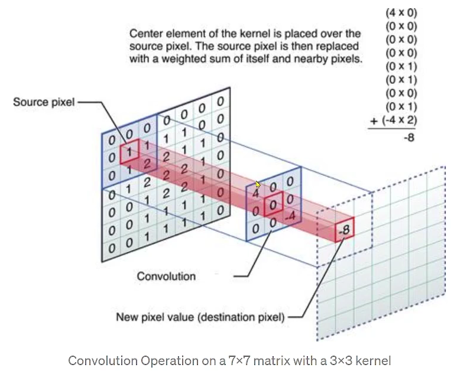

- [Bloom Effect](#bloom-effect)
  - [1. Convolution](#1-convolution)
    - [1.1. kernel](#11-kernel)
    - [1.2. convolution](#12-convolution)
    - [1.3. seperable convolution](#13-seperable-convolution)
      - [1.3.1. 2D Gaussian kernel](#131-2d-gaussian-kernel)
      - [1.3.2. 왜 사용하나?](#132-왜-사용하나)
- [2. Gaussian 필터( kernel ) 만들기](#2-gaussian-필터-kernel--만들기)
- [3. Bloom 효과 만들기](#3-bloom-효과-만들기)
  - [3.1. 이미지의 어두운 픽셀은 검정색으로 바꾼다](#31-이미지의-어두운-픽셀은-검정색으로-바꾼다)
  - [3.2. 바꾼 이미지에 Gaussian Filter를 적용](#32-바꾼-이미지에-gaussian-filter를-적용)
  - [3.3. 원본 이미지 + (1, 2번 과정을 거친)이미지](#33-원본-이미지--1-2번-과정을-거친이미지)

<br>

# Bloom Effect
Bloom Effect를 표현하기 위한 개념을 설명한다<br>

## 1. Convolution 
### 1.1. kernel
Image Processing에서의 kernel이란? ( **[wiki](https://en.wikipedia.org/wiki/Kernel_(image_processing))** 참고 )<br>

|Operation|Kernel|
|:---|:---:|
| `Identity` | $`\begin{bmatrix} 0 & 0 & 0 \\ 0 & 1 & 0 \\ 0 & 0 & 0 \end{bmatrix}`$ |
| `Box blur` | $`\frac{1}{9}\begin{bmatrix} 1 & 1 & 1 \\ 1 & 1 & 1 \\ 1 & 1 & 1 \end{bmatrix}`$ |
| `Gaussian blur 3 * 3` | $`\frac{1}{16}\begin{bmatrix} 1 & 2 & 1 \\ 2 & 4 & 2 \\ 1 & 2 & 1 \end{bmatrix}`$ |
| `Gaussian blur 5 * 5` | $`\frac{1}{256}\begin{bmatrix} 1 & 4 & 6 & 4 & 1 \\ 4 & 16 & 24 & 16 & 4 \\ 6 & 24 & 36 & 24 & 6 \\ 4 & 16 & 24 & 16 & 4 \\ 1 & 4 & 6 & 4 & 1 \end{bmatrix}`$ |

아래는 `원본 이미지( identity )에 kernel 값을 convolution 한 결과`이다.<br>

| identity | box blur | gaussian blur3 | gaussian blur5 |
| :---: | :---: | :---: | :---: |
|  |  |  |  |

`Box blur`를 보면 3 * 3 행렬에 모든 값이 1이고, 이를 9로 나눈다. 즉, `평균을 구한다`.<br>
`Gaussian blur`는 행렬이 어떤 방향으로 보더라도 `대칭`을 이룬다.<br>

Box와 Gaussian blur는 행렬의 총합으로 행렬을 나눈다는 것을 알 수 있다.

<br>

### 1.2. convolution
`image와 kernel( 또는 필터 )라고 불리는 두 행렬을 합성하여 새로운 이미지를 생성하는 과정`이다<br>
<br>

`kernel을 이미지의 모든 픽셀에 적용시키는 과정`을 convolution이라 한다.( **[wiki](https://en.wikipedia.org/wiki/Convolution)** 의 Discrete convolution gif 참고 )<br>
원본 이미지에 kernel 값을 convolution해서 결과 이미지를 얻는다.<br>

즉, 이미지에 특정 효과를 주고 싶으면 효과에 맞는 kernel 값을 찾아서 convolution하면 된다.<br>

<br>

### 1.3. seperable convolution
image processing 및 computer vision에서 사용하는 `최적화 기법`이다<br>
`2D convolution을 두 개의 1D convolution으로 분리하여 계산하는 방법으로, 계산 복잡도를 크게 줄인다`<br>
즉, 이미지에 한 번에 2차원 kernel을 적용하는 대신에 1차원 kernel을 두 번 적용한다.<br>

#### 1.3.1. 2D Gaussian kernel
```
[ 2D Gaussian kernel ]
1 2 1
2 4 2
1 2 1
```
이를 2개의 1D kernel로 분리<br>
```
horizontal: [1 2 1]
vertical:   [1 2 1]
```
수평 1D kernel은 원본 이미지의 모든 행에 대해 연산을 수행한다<BR>
수직 1D kernel은 원본 이미지의 모든 열에 대해 연산을 수행한다<br>
그 결과는 `2D kernel을 한 번 연산한 것과 동일한 결과`를 얻게 된다<br>

<br>

#### 1.3.2. 왜 사용하나?
`계산 비용이 절감`된다<br>
2D convolution의 계산 복잡도는 $O(K^2 * n^2)$이다.<br>
반면에 Seperable Convolution은 두 번의 1D convolution을 수행하기 때문에 $O(k * n^2)$로 줄어든다<br>

`memory 사용량이 감소`된다<br>
2D kernel에 비해 1D kernel 2개가 memory 공간을 덜 차지한다<br>
이로 인해 큰 이미지를 처리할 때 유리하다<br>


<br><br>

# 2. Gaussian 필터( kernel ) 만들기
box blur는 모든 픽셀이 동등한 가치를 가졌다. 하지만 `Gaussian blur는 가운데 값에 가중치가 높고 주변으로 멀어질수록 가중치가 낮아진다`.<br>
얼마나 가중치가 낮아지는지 Gaussian Function을 이용해서 구하지만, 이미 전문가분들이 최적화 해놓은 값이 있다.<br>
```cpp
// 위치에 따른 가중치 계산
const float weights[5] = { 0.0545f, 0.2442f, 0.4026f, 0.2442f, 0.0545f };
```
위 가중치가 전문가분들이 가장 좋다고 보이는 값이다.<br>
가운데 픽셀값은 가중치가 높고 주변으로 멀어질수록 가중치가 낮아진다.<br>
참고로 `위 5개의 숫자를 더하면 1`이다.<br>

<br>
<br>

# 3. Bloom 효과 만들기
## 3.1. 이미지의 어두운 픽셀은 검정색으로 바꾼다
<br>

Bloom 효과를 만들기 위해서는 `이미지의 모든 픽셀 중 밝은 부분은 그대로 둔 뒤에 어두운 부분은 검정색으로 바꾼다`.<br>

그렇다면 밝음과 어두움을 결정 짓는 기준이 필요하다.<br>
[Relative Luminance Y](#relative-luminance-y) 값이 사람의 눈으로 인지할 수 있는 밝음의 기준이다.<br>

## 3.2. 바꾼 이미지에 Gaussian Filter를 적용
<br>

`바꾼 이미지에 Gaussian blur를 적용`한다.<br>
위 이미지는 Gaussian blur를 100번 적용한 결과 이미지이다.<br>

## 3.3. 원본 이미지 + (1, 2번 과정을 거친)이미지
<br>

`위 순서로 만들어진 이미지와 원본 이미지를 더하면 Bloom 효과가 적용`된다.<br>