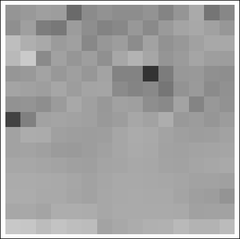
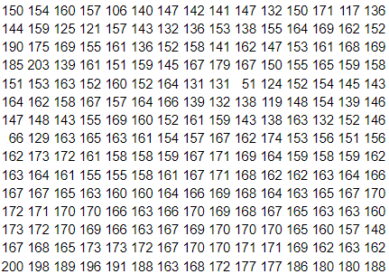
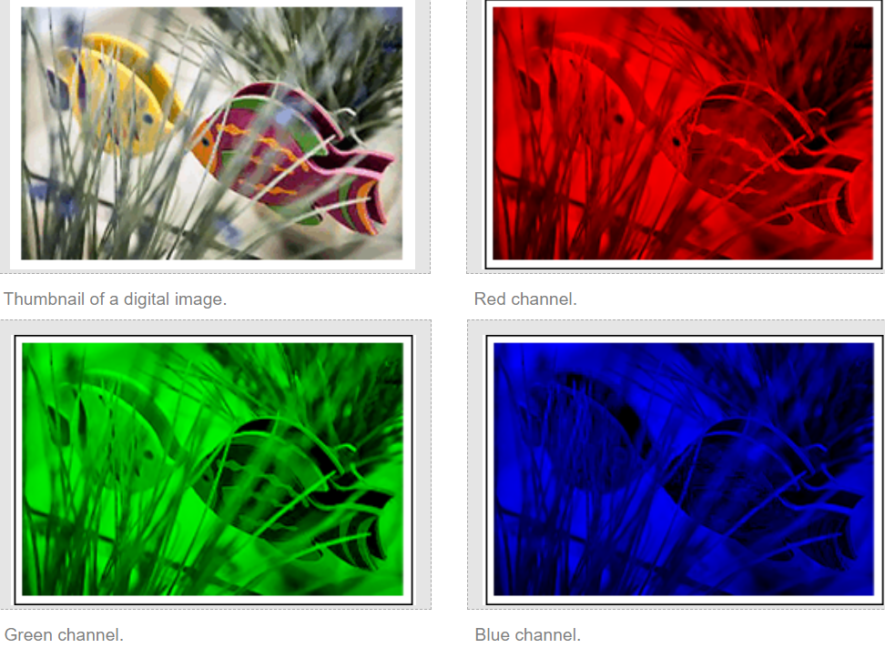
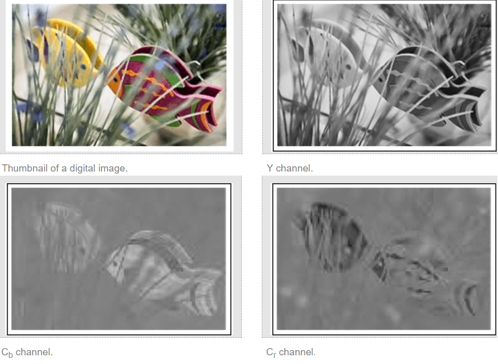
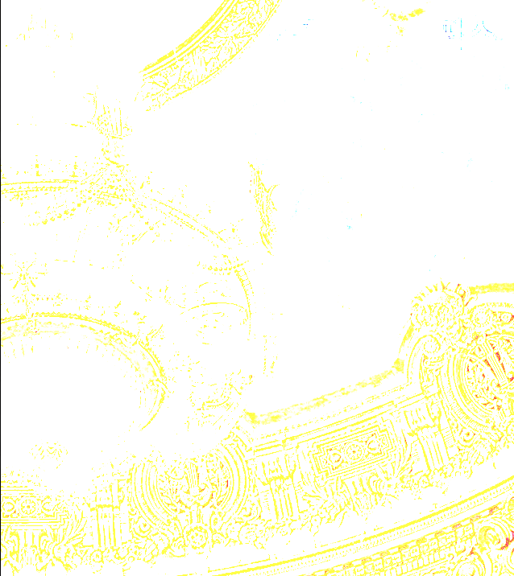

- [Image Processing](#image-processing)
- [Digital Image Basics](#digital-image-basics)
  - [1. Grayscale Images](#1-grayscale-images)
    - [1.1. Pixel Intensity( Image intensity )](#11-pixel-intensity-image-intensity-)
    - [1.2. Resolution( 해상도 )](#12-resolution-해상도-)
    - [1.3. (15 \* 15) Pixel Portion of the Image](#13-15--15-pixel-portion-of-the-image)
    - [1.4. Stored Image Size](#14-stored-image-size)
  - [2. Color Images](#2-color-images)
    - [2.1. Pixel Intensity](#21-pixel-intensity)
    - [2.2. Channels](#22-channels)
    - [2.3. Color Space Conversion](#23-color-space-conversion)
    - [2.4. RGB space to YCbCr space](#24-rgb-space-to-ycbcr-space)
- [1. 이미지 읽고 저장하기](#1-이미지-읽고-저장하기)
  - [1.2. 이미지 읽기](#12-이미지-읽기)
  - [1.3. 이미지 저장](#13-이미지-저장)
  - [1.4. 이미지 밝게 하기](#14-이미지-밝게-하기)
    - [1.4.1. 문제 1 : 이미지 변형](#141-문제-1--이미지-변형)
    - [1.4.2. 문제 2: RGB channel 포화](#142-문제-2-rgb-channel-포화)
    - [1.4.3. channel 포화 해결법](#143-channel-포화-해결법)
  - [1.5. Relative Luminance Y : 사람의 밝기 판단](#15-relative-luminance-y--사람의-밝기-판단)

<br>

# Image Processing
[ Digital Image Processing Basics ](https://www.geeksforgeeks.org/digital-image-processing-basics/)<br>
Image Processing은 computer가 `High-Quality Image를 얻는 것`,  `Image로부터 의미 있는 정보를 얻는 것`, `Image 작업을 자동화하는 것`이 목표다<br>

<br>

# Digital Image Basics
[ **Digital Image Basics** ](https://www.whydomath.org/node/wavlets/imagebasics.html)<br>
`Image는 2차원 함수( 좌표, 행렬 )로 정의`한다<br>

`pixel`: picture element<br>

<br>

## 1. Grayscale Images
`흑백 이미지`를 알아본다<br>

### 1.1. Pixel Intensity( Image intensity )
`Image의 특정 지점 (x, y)에서의 amplitude( 진폭 )은 image intensity( 이미지 강도, 밝기 )를 나타낸다`<br> 
Digital Image는 amplitude value가 유한한 범위 내에서 정의된다<br>

<br>

### 1.2. Resolution( 해상도 )
`high-resolution image를 만드려면 더 많은 pixel이 필요`하다<br>
pixel이 많으면 많을수록 더 세밀한 이미지를 얻을 수 있다<br>

<br>

### 1.3. (15 * 15) Pixel Portion of the Image
 <br>
15 * 15 pixel의 크기를 가진 image를 표현하는 방법<br>

<br>

### 1.4. Stored Image Size
`Image는 정해진 해상도( pixel counts )`와 `pixel 당 정해진 밝기 값( 대부분 0 ~ 255, white ~ black )`을 가진다<br>

이러한 `image of size M * N pixels를 저장할 때, 하나의 pixel을 8bit로 저장하기 때문에 image의 용량은 M * N * 8 bits`이다<br>
pixel 하나가 0 ~ 255 값을 표현할 수 있기 때문에 $2^8$ bits( = 1 byte ) 크기를 차지하며, 이러한 pixel이 m * n개 있기 때문이다<br>

만약 768 * 512 크기의 image라면, 768 * 512 * 8 = 3,145,728 bits 용량을 차지한다<br>

<br><br>

## 2. Color Images
color images는 grayscale images 보다 더 많은 용량을 차지한다<br>
Grayscale images에서 하나의 pixel이 screen에 render되는데 필요한 gray intensity는 1bytes이다<br>
`Color images는 screen에 render되려면 하나의 pixel이 red, green, blue의 intensity를 가지기 때문에 3bytes`이다<br>

<br>

### 2.1. Pixel Intensity
color image의 pixel intensity는 grayscale image와 같은 0 ~ 255 값을 가진다<br>

<br>

### 2.2. Channels
`channel이란, image에서 각 기본 색상 성분을 분리한 grayscale image를 말한다`<br>
예시를 보면 이해가 빠르다<br>

color image에서 channel은 R, G, B가 존재하며, JEPG2000에서 channel은 Y, Cb, Cr이 존재한다<br>

<br>

여기서 Red channel은 빨간색 성분을 담당하며, 이 channel의 각 pixel 값은 빨간색의 intensity를 나타낸다<br>
각 channel은 전체 image와 동일한 크기를 가지며, 해당 색상에 대한 밝기 정보를 가진다<br>

즉, `하나의 channel은 그 image에서 특정 색상만 표현한 grayscale image이다`<br>

<br>

### 2.3. Color Space Conversion
`이미지 압축`을 시도하는 application에서 RGB color space가 최적이 아니라, `인간은 luminance와 chrominance에서 작은 변화에 잘 적응`하는 것으로 나타났다<br>

`luminance channel은 pixel의 밝기에 관한 정보`를 전달하고, `Chrominance는 동일한 밝기에서 color와 기준 channel 간의 차이`를 나타낸다<br>

RGB color에는 3가지 channels이 있기 때문에 `luminance가 1개, chrominance가 2개의 channel을 사용해서 color image의 image compression을 위한 새로운 공간을 사용`한다<br>
예를 들면, 압축 이미지 space에는 JPEG2000이 있는데, 이것은 YCbCr space이다<br>
Y channel은 luminance이고, 나머지 Cb, Cr은 chrominance channels이다<br>

<br>

### 2.4. RGB space to YCbCr space
압축된 이미지를 저장하려면 `RGB space를 YCbCr space로 변환`하는 것이 좋다<br>

먼저 `rgb의 각 pixel intensity 값에서 255를 나눠서 0 ~ 1 사이의 값`을 가져야 한다<br>

$(r, g, b) = (r / 255, g / 255, b / 255)$<br>

`Y channel( luminance )`는 $y = 0.299r + 0.587g + 0.114b$ 공식을 이용해서 얻는다<br>
이러한 공식은 시간이 지나면서 달라질 수 있다<br>
한 가지 변하지 않는 내용은 `r, g, b와 곱하는 실수를 모두 더하면 1`이다<br>

YCbCr space는 blue와 red를 사용하며, `Cb channel`은 $Cb = (b - y)/1.772$로 정의하고, `Cr channel`은 $Cr = (r - y)/1.402$로 정의한다<br>
여기서 Y channel이 refernce channel( 기준 채널 )이다<br>

<br>
RGB space를 YCbCr space로 변환한 결과이다<br>
이는 `이미지를 압축해서 저장하는 방식에서 사용`할 수 있다<br>


<br><br>

<br><br>

# 1. 이미지 읽고 저장하기
일반적으로 `graphics에서 pixel의 색상 값`을 $0.0f \sim 1.0f$ 사이의 `float로 표현`한다<br>
0.0f는 검정색이고, 1.0f는 흰색이다<br>

`화면에 출력하거나 파일로 저장하기 위해서는 float 값을 0 ~ 255 범위의 정수( uint8_t )로 변환`해야 한다<br>

$0.0f \sim 1.0f \to 0 \sim 255$ 이다.<br>

따라서 float 값을 uint8_t로 변환하기 위해 `float * 255 연산을 수행`한다<br> 

<br>

## 1.2. 이미지 읽기
`색깔 값을 이미지 파일에 저장할 때는 uint8_t( unsigned char, 8bit, 0 ~ 255 )을 사용`한다.<br>
이를 유념하고 이미지를 읽는 방법에 대해 알아본다<br>

`Image Processing( 이미지 프로세싱 )을 통해 이미지를 읽어들일 때`
1. 중간 단계로 `uint8_t를 4채널 float( 32bit, 0.0f ~ 1.0f )로 변환( 8bit -> 32bit )`한다.
2. 32bit 이미지 데이터를 가져와서 저장한다.</br>

저장된 이미지는 uint8_t이기 때문에 8bit를 32bit로 변환한다<br>
HDR( High Dynamic Range )을 사용하거나 컴퓨터 shader로 수치 연산을 할 때는 `float를 사용하는 경우가 많기 때문`이다.
</br>
</br>
32bit 또는 64bit를 사용할지는 직접 제어할 수 있다. 참고로 딥러닝에서는 32bit가 부담되기 때문에 16bit float를 사용하는 경우도 있다.

<br>

## 1.3. 이미지 저장
반대로 `이미지 파일로 저장할 때는 32bit( float )를 8bit( unsigned char, uint8_t )로 다시 변환`해야 한다.

<br>

## 1.4. 이미지 밝게 하기
`이미지의 RGB 값에 1보다 큰 값을 곱하면 밝아지고, 1보다 작은 값을 곱하면 어두워진다`.<br>
즉, 이미지의 각 픽셀에 존재하는 RGB에 1.Nf 값을 곱해서 밝게 만들 수 있다.<br>

### 1.4.1. 문제 1 : 이미지 변형
<br>

문제는 이렇게 밝게 만든 이미지를 저장하면 다른 이미지로 보일 수 있다. 위 이미지의 왼쪽이 원본이고, 오른쪽이 원본을 밝게 만든 뒤 저장한 이미지다.<br>

`0.0f ~ 1.0f 사이의 값에 1.Nf를 곱하면 1.0f를 초과( overflow )할 수 있다`. 이 상태에서 255를 곱하고 uint8_t로 캐스팅하면 overflow 때문에 원하는 값으로 저장할 수 없다.</br>

이러한 문제는 코드 상에서 직접 조절해야 한다. cpp의 경우, `std::clamp()를 통해 0.0f ~ 1.0f 값을 벗어나지 않도록 고정`할 수 있다.</br>

### 1.4.2. 문제 2: RGB channel 포화
<br>

또 다른 문제는 `최대한 밝게 처리해도 이미지에 특정 색상( 노란색 또는 빨간색 )이 남는 현상`이 발생할 수 있다.</br>

RGB 이미지에서 밝기를 증가시키면 각 픽셀의 RGB 값에 동일한 `scale factor`( 어떤 양을 늘리거나 줄이거나 또는 곱하는 수 )가 곱해진다<br>
(0.8, 0.7, 0.6)인 RGB 값에 밝기를 증가시키기 위해 1.5f를 곱하면, (1.2, 1.05, 0.9)로 변환된다<br>
R과 G는 `channel이 포화`되면서 255로 clamping되고 B는 229로 변환된다<br>
이때 `포화되지 않은 채널이 여전히 더 낮은 값을 가지기 때문에 이미지가 밝게 처리된 후에도 특정 색상이 강하게 남는 현상이 발생`한다<br>

### 1.4.3. channel 포화 해결법
`이미지를 읽어들일 때 각 픽셀의 RGB 값에 아주 작은 값을 한 번만 더하면 해결`할 수 있다.<br>

이는 `밝기 증가에 따른 왜곡을 줄이고 균형을 맞추기 위한 방법`이다<br>
모든 channel에 작은 값을 더해서 상대적으로 낮은 channel이 너무 어두워지지 않도록 하고, 포화된 channel은 덜 부각되게 만든다<br>

<br>

## 1.5. Relative Luminance Y : 사람의 밝기 판단
`"픽셀의 RGB에 어떤 값을 곱해야 사람의 눈으로 밝게 보일까?"에 대한 답`을 과학자들이 도출해낸 값이다.

```cpp
Relative_Luminance_Y = 0.2126 * R + 0.7152 * G + 0.0722 * B

// cpp 예시
auto& a = this->GetPixel(x, y);
const float relativeLuminance = a.color[0] * 0.2126f + a.color[1] * 0.7152f + a.color[2] * 0.0722f;
```