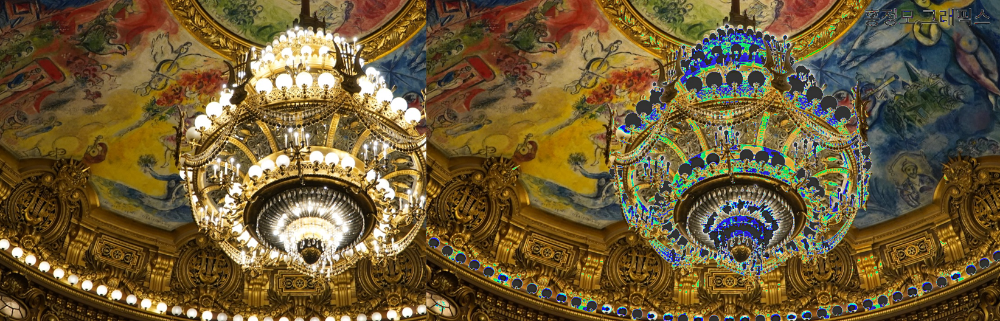

# Index
- [Index](#index)
- [1. 이미지 읽고 저장하기](#1-이미지-읽고-저장하기)
  - [1.1. channels](#11-channels)
  - [1.2. 이미지 읽기](#12-이미지-읽기)
  - [1.3. 이미지 저장](#13-이미지-저장)
  - [1.4. 이미지 밝게 하기](#14-이미지-밝게-하기)
    - [1.4.1. 문제 1 : 이미지 변형](#141-문제-1--이미지-변형)
    - [1.4.2. 문제 2: RGB channel 포화](#142-문제-2-rgb-channel-포화)
    - [1.4.3. channel 포화 해결법](#143-channel-포화-해결법)
  - [1.5. Relative Luminance Y : 사람의 밝기 판단](#15-relative-luminance-y--사람의-밝기-판단)
- [2. convolution 이해하기](#2-convolution-이해하기)
  - [2.1. kernel](#21-kernel)
  - [2.2. convolution](#22-convolution)
  - [2.3. seperable convolution](#23-seperable-convolution)
    - [2.3.1. 2D Gaussian kernel](#231-2d-gaussian-kernel)
    - [2.3.2. 왜 사용하나?](#232-왜-사용하나)
- [3. Gaussian 필터( kernel ) 만들기](#3-gaussian-필터-kernel--만들기)
- [4. Bloom 효과 만들기](#4-bloom-효과-만들기)
    - [4.1. 이미지의 어두운 픽셀은 검정색으로 바꾼다](#41-이미지의-어두운-픽셀은-검정색으로-바꾼다)
    - [4.2. 바꾼 이미지에 Gaussian Filter를 적용](#42-바꾼-이미지에-gaussian-filter를-적용)
    - [4.3. 원본 이미지 + (1, 2번 과정을 거친)이미지](#43-원본-이미지--1-2번-과정을-거친이미지)

<br>

Bloom Effect를 만들기 위해 알아야 할 개념<br>

<br>

# 1. 이미지 읽고 저장하기
일반적으로 `graphics에서 pixel의 색상 값`을 $0.0f \sim 1.0f$ 사이의 `float로 표현`한다<br>
0.0f는 검정색이고, 1.0f는 흰색이다<br>

`화면에 출력하거나 파일로 저장하기 위해서`는 float 값을 $0 \sim 255$ 범위의 `정수( uint8_t )로 변환`해야 한다<br>
$0.0f \sim 1.0f \to 0 \sim 255$ 이다.<br>
따라서 float 값을 uint8_t로 나타내기 위해선 `float * 255 연산을 수행`한다<br>

## 1.1. channels
`R, G, B, A가 채널을 의미`한다.
</br>RGB만 있으면 3개 채널, RGBA라면 4개 채널이 존재한다. 

<br>

## 1.2. 이미지 읽기
`색깔 값을 이미지 파일에 저장할 때는 uint8_t( unsigned char, 8bit, 0 ~ 255 )을 사용`한다.<br>
이를 유념하고 이미지를 읽는 방법에 대해 알아본다<br>

`Image Processing( 이미지 프로세싱 )을 통해 이미지를 읽어들일 때`
1. 중간 단계로 `uint8_t를 4채널 float( 32bit, 0.0f ~ 1.0f )로 변환( 8bit -> 32bit )`한다.
2. 32bit 이미지 데이터를 가져와서 저장한다.</br>

저장된 이미지는 uint8_t이기 때문에 8bit를 32bit로 변환한다<br>
HDR( High Dynamic Range )을 사용하거나 컴퓨터 shader로 수치 연산을 할 때는 `float를 사용하는 경우가 많기 때문`이다.
</br>
</br>
32bit 또는 64bit를 사용할지는 직접 제어할 수 있다. 참고로 딥러닝에서는 32bit가 부담되기 때문에 16bit float를 사용하는 경우도 있다.

<br>

## 1.3. 이미지 저장
반대로 `이미지 파일로 저장할 때는 32bit( float )를 8bit( unsigned char, uint8_t )로 다시 변환`해야 한다.

<br>

## 1.4. 이미지 밝게 하기
`이미지의 RGB 값에 1보다 큰 값을 곱하면 밝아지고, 1보다 작은 값을 곱하면 어두워진다`.<br>
즉, 이미지의 각 픽셀에 존재하는 RGB에 1.Nf 값을 곱해서 밝게 만들 수 있다.<br>

### 1.4.1. 문제 1 : 이미지 변형
<br>

문제는 이렇게 밝게 만든 이미지를 저장하면 다른 이미지로 보일 수 있다. 위 이미지의 왼쪽이 원본이고, 오른쪽이 원본을 밝게 만든 뒤 저장한 이미지다.<br>

`0.0f ~ 1.0f 사이의 값에 1.Nf를 곱하면 1.0f를 초과( overflow )할 수 있다`. 이 상태에서 255를 곱하고 uint8_t로 캐스팅하면 overflow 때문에 원하는 값으로 저장할 수 없다.</br>

이러한 문제는 코드 상에서 직접 조절해야 한다. cpp의 경우, `std::clamp()를 통해 0.0f ~ 1.0f 값을 벗어나지 않도록 고정`할 수 있다.</br>

### 1.4.2. 문제 2: RGB channel 포화
<br>

또 다른 문제는 `최대한 밝게 하더라도 이미지에 노란색 또는 빨간색이 남는 현상`이 발생한다.</br>

RGB 이미지에서 밝기를 증가시키면 각 픽셀의 RGB 값에 동일한 `scale factor`( 어떤 양을 늘리거나 줄이거나 또는 곱하는 수 )가 곱해진다<br>
(0.8, 0.7, 0.6)인 RGB 값에 밝기를 증가시키기 위해 1.5f를 곱하면, (1.2, 1.05, 0.9)로 변환된다<br>
R과 G는 `channel이 포화`되면서 255로 clamping되고 B는 229로 변환된다<br>
이때 `포화되지 않은 채널이 여전히 더 낮은 값을 가지기 때문에 이미지가 밝게 처리된 후에도 특정 색상이 강하게 남는 현상이 발생`한다<br>

### 1.4.3. channel 포화 해결법
`이미지를 읽어들일 때 각 픽셀의 RGB 값에 아주 작은 값을 한 번만 더하면 해결`할 수 있다.<br>

이는 `밝기 증가에 따른 왜곡을 줄이고 균형을 맞추기 위한 방법`이다<br>
모든 channel에 작은 값을 더해서 상대적으로 낮은 channel이 너무 어두워지지 않도록 하고, 포화된 channel은 덜 부각되게 만든다<br>

<br>

## 1.5. Relative Luminance Y : 사람의 밝기 판단
`"픽셀의 RGB에 어떤 값을 곱해야 사람의 눈으로 밝게 보일까?"에 대한 답`을 과학자들이 도출해낸 값이다.

```cpp
Relative_Luminance_Y = 0.2126 * R + 0.7152 * G + 0.0722 * B

// cpp 예시
auto& a = this->GetPixel(x, y);
const float relativeLuminance = a.color[0] * 0.2126f + a.color[1] * 0.7152f + a.color[2] * 0.0722f;
```

<br>
<br>

# 2. convolution 이해하기
## 2.1. kernel
Image Processing에서의 kernel이란? ( **[wiki](https://en.wikipedia.org/wiki/Kernel_(image_processing))** 참고 )<br>

|Operation|Kernel|
|:---|:---:|
| `Identity` | $`\begin{bmatrix} 0 & 0 & 0 \\ 0 & 1 & 0 \\ 0 & 0 & 0 \end{bmatrix}`$ |
| `Box blur` | $`\frac{1}{9}\begin{bmatrix} 1 & 1 & 1 \\ 1 & 1 & 1 \\ 1 & 1 & 1 \end{bmatrix}`$ |
| `Gaussian blur 3 * 3` | $`\frac{1}{16}\begin{bmatrix} 1 & 2 & 1 \\ 2 & 4 & 2 \\ 1 & 2 & 1 \end{bmatrix}`$ |
| `Gaussian blur 5 * 5` | $`\frac{1}{256}\begin{bmatrix} 1 & 4 & 6 & 4 & 1 \\ 4 & 16 & 24 & 16 & 4 \\ 6 & 24 & 36 & 24 & 6 \\ 4 & 16 & 24 & 16 & 4 \\ 1 & 4 & 6 & 4 & 1 \end{bmatrix}`$ |

아래는 `원본 이미지( identity )에 kernel 값을 convolution 한 결과`이다.<br>

| identity | box blur | gaussian blur3 | gaussian blur5 |
| :---: | :---: | :---: | :---: |
|  |  |  |  |

`Box blur`를 보면 3 * 3 행렬에 모든 값이 1이고, 이를 9로 나눈다. 즉, `평균을 구한다`.<br>
`Gaussian blur`는 행렬이 어떤 방향으로 보더라도 `대칭`을 이룬다.<br>

Box와 Gaussian blur는 행렬의 총합으로 행렬을 나눈다는 것을 알 수 있다.

<br>

## 2.2. convolution
`image와 kernel( 또는 필터 )라고 불리는 두 행렬을 합성하여 새로운 이미지를 생성하는 과정`이다<br>
<br>

`kernel을 이미지의 모든 픽셀에 적용시키는 과정`을 convolution이라 한다.( **[wiki](https://en.wikipedia.org/wiki/Convolution)** 의 Discrete convolution gif 참고 )</br>
원본 이미지에 kernel 값을 convolution해서 결과 이미지를 얻는다.</br>

즉, 이미지에 특정 효과를 주고 싶으면 효과에 맞는 kernel 값을 찾아서 convolution하면 된다.</br>

</br>

## 2.3. seperable convolution
image processing 및 computer vision에서 사용하는 `최적화 기법`이다<br>
`2D convolution을 두 개의 1D convolution으로 분리하여 계산하는 방법으로, 계산 복잡도를 크게 줄인다`<br>
즉, 이미지에 한 번에 2차원 kernel을 적용하는 대신에 1차원 kernel을 두 번 적용한다.</br>

### 2.3.1. 2D Gaussian kernel
```
[ 2D Gaussian kernel ]
1 2 1
2 4 2
1 2 1
```
이를 2개의 1D kernel로 분리<br>
```
horizontal: [1 2 1]
vertical:   [1 2 1]
```
수평 1D kernel은 원본 이미지의 모든 행에 대해 연산을 수행한다<BR>
수직 1D kernel은 원본 이미지의 모든 열에 대해 연산을 수행한다<br>
그 결과는 `2D kernel을 한 번 연산한 것과 동일한 결과`를 얻게 된다<br>

<br>

### 2.3.2. 왜 사용하나?
`계산 비용이 절감`된다<br>
2D convolution의 계산 복잡도는 $O(K^2 * n^2)$이다.<br>
반면에 Seperable Convolution은 두 번의 1D convolution을 수행하기 때문에 $O(k * n^2)$로 줄어든다<br>

`memory 사용량이 감소`된다<br>
2D kernel에 비해 1D kernel 2개가 memory 공간을 덜 차지한다<br>
이로 인해 큰 이미지를 처리할 때 유리하다<br>


</br>
</br>

# 3. Gaussian 필터( kernel ) 만들기
box blur는 모든 픽셀이 동등한 가치를 가졌다. 하지만 `Gaussian blur는 가운데 값에 가중치가 높고 주변으로 멀어질수록 가중치가 낮아진다`.</br>
얼마나 가중치가 낮아지는지 Gaussian Function을 이용해서 구하지만, 이미 전문가분들이 최적화 해놓은 값이 있다.<br>
```cpp
// 위치에 따른 가중치 계산
const float weights[5] = { 0.0545f, 0.2442f, 0.4026f, 0.2442f, 0.0545f };
```
위 가중치가 전문가분들이 가장 좋다고 보이는 값이다.<br>
가운데 픽셀값은 가중치가 높고 주변으로 멀어질수록 가중치가 낮아진다.<br>
참고로 `위 5개의 숫자를 더하면 1`이다.<br>

<br>
<br>

# 4. Bloom 효과 만들기
### 4.1. 이미지의 어두운 픽셀은 검정색으로 바꾼다
<br>

Bloom 효과를 만들기 위해서는 `이미지의 모든 픽셀 중 밝은 부분은 그대로 둔 뒤에 어두운 부분은 검정색으로 바꾼다`.<br>

그렇다면 밝음과 어두움을 결정 짓는 기준이 필요하다.<br>
[Relative Luminance Y](#relative-luminance-y) 값이 사람의 눈으로 인지할 수 있는 밝음의 기준이다.<br>

### 4.2. 바꾼 이미지에 Gaussian Filter를 적용
<br>

`바꾼 이미지에 Gaussian blur를 적용`한다.<br>
위 이미지는 Gaussian blur를 100번 적용한 결과 이미지이다.<br>

### 4.3. 원본 이미지 + (1, 2번 과정을 거친)이미지
<br>

`위 순서로 만들어진 이미지와 원본 이미지를 더하면 Bloom 효과가 적용`된다.<br>

