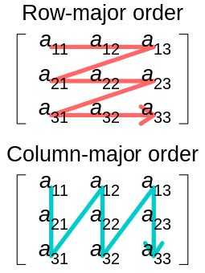

- [Matrix](#matrix)
  - [1. Vector로 Matrix를 표현하는 방법](#1-vector로-matrix를-표현하는-방법)
    - [1.1. 표기법: row vector, column vector](#11-표기법-row-vector-column-vector)
      - [square matrix( 정방 행렬 )](#square-matrix-정방-행렬-)
    - [1.2. 표기법: Matrix to row vector](#12-표기법-matrix-to-row-vector)
    - [1.3. 표기법: Matrix to column vector](#13-표기법-matrix-to-column-vector)
  - [2. Matrix Multiplication](#2-matrix-multiplication)
    - [2.1. Matrix Multiplication : Formula( Math Expression )](#21-matrix-multiplication--formula-math-expression-)
    - [2.2. Matrix Multiplication : Properties](#22-matrix-multiplication--properties)
    - [2.2. Vector-Matrix Multiplication](#22-vector-matrix-multiplication)
      - [Linear Combination](#linear-combination)
  - [3. Transpose( 전치 행렬 )](#3-transpose-전치-행렬-)
    - [3.1. Transpose : properties](#31-transpose--properties)
  - [4. Identity Matrix( 단위 행렬 )](#4-identity-matrix-단위-행렬-)
  - [5. Inverse Matrix( 역행렬 )](#5-inverse-matrix-역행렬-)
    - [5.1. Minor Matrix](#51-minor-matrix)
    - [5.2. Cofactor Matrix](#52-cofactor-matrix)
    - [5.3. Adjoint Matrix](#53-adjoint-matrix)
  - [5.4. Inverse Matrix : Properties](#54-inverse-matrix--properties)
  - [5.5. Compute the Inverse Matirx](#55-compute-the-inverse-matirx)

<br>

#### 핵심 요약
```cpp
u` = uT     // DirectXMath는 Row-major Matrix 사용
u` = Tu     // HLSL은 Column-major Matrix 사용

u : vector 또는 point
T : Transformation[ Translation, Rotation, Scaling ] Matrix
```
Transformation을 행렬로 표현   
즉, 어떠한 vector나 point를 변환하고 싶으면 Matrix를 곱한다   

<br><br>

# Matrix
matrix는 `vector를 여러 개 묶은 것` 또는 `2차원 배열 형태`를 가진다   
   
2차원 배열 형태이므로 row-major order로 vector를 묶었거나 column-major order로 vector를 묶은 것으로 판단할 수 있다( [m_by_n_matrix.md](/2_Math/matrix/m_by_n_matrix.md/#1-row-col-용어) )   

## 1. Vector로 Matrix를 표현하는 방법

### 1.1. 표기법: row vector, column vector
$$\mathbf{u} = \begin{bmatrix}
  u_1, u_2, u_3
\end{bmatrix} \space \mathbf{v} = \begin{bmatrix}
  1 \\
  2 \\
  3 \\
  4
\end{bmatrix}$$

위 수식은 벡터 u, v를 행렬로 나타내는 방법이다   
왼쪽 수식은 `row 하나로 벡터를 표현( row vector )`하고, 오른쪽 수식은 `column 하나로 벡터를 표현( column vector )`한다   
DirectX는 row vector를 선호한다   

<hr>

#### square matrix( 정방 행렬 )
row와 column의 개수가 같은 matrix   

<hr>

### 1.2. 표기법: Matrix to row vector
*( Asterisk, Star )   

$$\begin{bmatrix}
  A_{11} & A_{12} & A_{13} \\
  A_{21} & A_{22} & A_{23} \\
  A_{31} & A_{32} & A_{33}
\end{bmatrix} = \begin{bmatrix}
  \leftarrow \mathbf{A_{1,*}} \rightarrow \\
  \leftarrow \mathbf{A_{2,*}} \rightarrow \\
  \leftarrow \mathbf{A_{3,*}} \rightarrow
\end{bmatrix}$$

$$\mathbf{A_{1,*}} = \begin{bmatrix}
  A_{11}, A_{12}, A_{13}
\end{bmatrix} \\ \mathbf{A_{2,*}} = \begin{bmatrix}
  A_{21}, A_{22}, A_{23}
\end{bmatrix} \\ \mathbf{A_{3,*}} = \begin{bmatrix}
  A_{31}, A_{32}, A_{33}
\end{bmatrix}$$

하나의 matrix를 `여러 개의 row vector가 모여있는 것`으로 볼 수 있다   

### 1.3. 표기법: Matrix to column vector

$$\begin{bmatrix}
  A_{11} & A_{12} & A_{13} \\
  A_{21} & A_{22} & A_{23} \\
  A_{31} & A_{32} & A_{33}
\end{bmatrix} = \begin{bmatrix}
  \uparrow & \uparrow & \uparrow \\
  \mathbf{A_{*, 1}}, & \mathbf{A_{*, 2}}, & \mathbf{A_{*, 3}} \\
  \downarrow & \downarrow & \downarrow
\end{bmatrix}$$

$$\mathbf{A_{*, 1}} = \begin{bmatrix}
  A_{11} \\ A_{12} \\ A_{13}
\end{bmatrix} \quad \mathbf{A_{*, 2}} = \begin{bmatrix}
  A_{21} \\ A_{22} \\ A_{23}
\end{bmatrix} \quad \mathbf{A_{*, 3}} = \begin{bmatrix}
  A_{31} \\ A_{32} \\ A_{33}
\end{bmatrix}$$

하나의 matrix를 `여러 개의 column vector가 모여있는 것`으로 볼 수 있다   

<br>

## 2. Matrix Multiplication
### 2.1. Matrix Multiplication : Formula( Math Expression )
고등학생 때는 `a11*b11 + a12*b12 + a13*b13`처럼 행렬을 곱했는데, 이는 `Dot product와 같은 방식`이다   

$$
A = \begin{bmatrix} 1 & 2 & 3 \\ 4 & 5 & 6 \end{bmatrix} \quad 
B = \begin{bmatrix} 2 & 1 \\ 0 & -1 \\ -1 & 2 \end{bmatrix}
\\
AB = \begin{Bmatrix}
  (1, 2, 3) \cdot (2, 0, -1) & (1, 2, 3) \cdot (1, -1, 2) \\
  (4, 5, 6) \cdot (2, 0, -1) & (4, 5, 6) \cdot (1, -1, 2)
\end{Bmatrix}
\\
= \begin{bmatrix}
  -1 & 5 \\ 2 & 11
\end{bmatrix}
$$

따라서 Graphics에서는 A( 2 * 3 matrix )와 B( 3 * 2 matrix )를 곱할 때, Dot product를 이용한다   

$$
C_{ij} = A_{i, *} \cdot B_{*, j}
$$

이를 수식으로 정리하면, `A의 row vector와 B의 column vector를 Dot product한 결과가 결과 행렬의 한 element( C-ij )를 결정`한다   
또한 `row vector와 column vector의 elements 갯수가 같아야 곱할 수 있다`   

### 2.2. Matrix Multiplication : Properties

$$1. \space AB \neq BA$$

일반적으로 Matrix Multiplication은 곱하는 순서에 따라 결과가 달라지며, 이는 3D space에서 회전을 적용할 때 사용되는 개념이다   

$$2. \space (AB)C = A(BC)$$

### 2.2. Vector-Matrix Multiplication

$$
\mathbf{uA} = \begin{bmatrix} x, y, z \end{bmatrix} \begin{bmatrix}
  \uparrow & \uparrow & \uparrow \\
  \mathbf{A_{*, 1}}, & \mathbf{A_{*, 2}}, & \mathbf{A_{*, 3}} \\
  \downarrow & \downarrow & \downarrow
\end{bmatrix}
$$

$$
\mathbf{uA} = \begin{bmatrix} 
  \mathbf{u \cdot A_{*, 1}} & \mathbf{u \cdot A_{*, 2}} & \mathbf{u \cdot A_{*, 3}}
\end{bmatrix}
\\
= x\mathbf{A_{1, *}} + y\mathbf{A_{2, *}} + z\mathbf{A_{3, *}}
$$

vector와 matrix의 multiplication의 결과는 vector이다   
`vector를 matrix를 이용해서 Transformation한다는 개념`이기 때문이다   

uA는 vector의 elements 수와 matrix의 row( line )의 수가 같아야 곱할 수 있다   
또한 uA의 내부를 전개하고 Matrix의 Property를 이용하면 vector-matrix multiplication을 scalar * row-vector 형태로 정리할 수 있다   

<hr>

#### Linear Combination

$$
\mathbf{uA} = x\mathbf{A_{1, *}} + y\mathbf{A_{2, *}} + z\mathbf{A_{3, *}}
$$

vector-matrix multiplication 형식을 Linear Combination( 선형 결합 )이라 한다   
<hr>

$$
\mathbf{Au} = \begin{bmatrix}
  \leftarrow & \mathbf{A_{*, 1}} & \rightarrow \\ 
  \leftarrow & \mathbf{A_{*, 2}} & \rightarrow \\ 
  \leftarrow & \mathbf{A_{*, 3}} & \rightarrow
\end{bmatrix} 
\begin{bmatrix} x \\  y \\ z \end{bmatrix}
$$

uA를 Au로 표현할 수 있다   
이때 A는 column-vector가 아니라 row-vector이며, u는 row-vector가 아닌 column-vector로 나타낸다   

<br>

## 3. Transpose( 전치 행렬 )

$$
A = \begin{bmatrix}
  1 & 2 & 3 \\ 4 & 5 & 6
\end{bmatrix}, \quad 
B = \begin{bmatrix}
  a & b & c \\ d & e & f \\ g & h & i
\end{bmatrix}, \quad 
C = \begin{bmatrix}
  5 \\ 4 \\ 3 \\ 2 \\ 1
\end{bmatrix}
$$

$$
A^T = \begin{bmatrix}
  1 & 4 \\ 2 & 5 \\ 3 & 6
\end{bmatrix}, \quad
B^T = \begin{bmatrix}
  a & d & g \\ b & e & h \\ c & f & i
\end{bmatrix}, \quad
C^T = \begin{bmatrix}
  5 & 4 & 3 & 2 & 1
\end{bmatrix}
$$

The transpose of a matrix는 `행렬을 대각선 방향으로 뒤집는 연산자`다   

<br>

### 3.1. Transpose : properties

1. $(A + B)^T = A^T + B^T$
2. $(cA)^T = cA^T$
3. $(AB)^T = B^TA^T$
4. $(A^T)^T = A$
5. $(A^{-1})^T = (A^T)^{-1}$

<br><br>

## 4. Identity Matrix( 단위 행렬 )
숫자 1과 같은 역할이며, [square matrix](#square-matrix-정방-행렬-)이다   

$$
\mathbf{I} = \begin{bmatrix} 1 & 0 \\ 0 & 1 \end{bmatrix}, \quad
\begin{bmatrix} 1 & 0 & 0 \\ 0 & 1 & 0 \\ 0 & 0 & 1 \end{bmatrix}
$$

$$
\mathbf{AI = A} \\
\mathbf{IB = B}
$$

M이 I와 같은 크기를 가진 square matrix 라면 $\mathbf{MI = IM = M}$이다   
`벡터와 I의 곱에서도 자기 자신`이 나온다   


<br><br>


## 5. Inverse Matrix( 역행렬 )
Inverse Matrix의 의미가 중요하다   

`특정 벡터를 matrix를 이용하여 Transformation 했을 때, 마음에 들지 않아서 다시 되돌리고 싶은 경우`가 있다   
이때 Inverse Matrix를 곱하여 원래 벡터로 되돌린다   

아래 3가지 Matrix( Minor, Cofactor, Adjoint )는 Inverse Matrix를 표현하기 위한 도구다   

<br>

### 5.1. Minor Matrix
`Minor Matrix는 Inverse Matirx를 구할 때 사용`한다   

$$
A = \begin{bmatrix}
  A_{11} & A_{12} & A_{13} \\ A_{21} & A_{22} & A_{23} \\ A_{31} & A_{32} & A_{33}
\end{bmatrix}
$$

$$
\bar{A}_{11} = \begin{bmatrix} A_{22} & A_{23} \\ A_{32} & A_{33} \end{bmatrix} \\
\bar{A}_{12} = \begin{bmatrix} A_{11} & A_{13} \\ A_{31} & A_{33} \end{bmatrix} \\
\bar{A}_{13} = \begin{bmatrix} A_{21} & A_{22} \\ A_{32} & A_{32} \end{bmatrix}
$$

자신이 포함된 row와 column line을 무시한 나머지 elements를 나타낸다   
Minor Matrix는 Matrix를 Determinant( 어떤 행렬의 판별식, **절댓값** )로 나타낼 때 사용한다   

$$
\det \begin{bmatrix}
  A_{11} & A_{12} & A_{13} \\ A_{21} & A_{22} & A_{23} \\ A_{31} & A_{32} & A_{33}
\end{bmatrix} = A_{11}\det\begin{bmatrix} A_{22} & A_{23} \\ A_{32} & A_{33} \end{bmatrix}
- A_{12} \det\begin{bmatrix} A_{21} & A_{23} \\ A_{31} & A_{33} \end{bmatrix}
+ A_{13} \det\begin{bmatrix} A_{21} & A_{22} \\ A_{31} & A_{32} \end{bmatrix}
$$

여기서 `determinant는` A 행렬의 $A_{11}$의 `Minor Matirx의 절댓값`을 의미한다   
즉, A matrix의 절댓값은 위 수식을 이용해서 구한다   

### 5.2. Cofactor Matrix

$$
C_A = C_{ij} = (-1)^{i+j} \det \bar{A}_{ij}
$$

A matrix의 Cofactor Matrix를 $C_A$라고 표기한다   

### 5.3. Adjoint Matrix

$$
A^* = C^T_A
$$

A matrix의 Cofactor Matrix의 Transpose가 Adjoint Matrix이다   

<br>

## 5.4. Inverse Matrix : Properties

1. `square matrix만 inverse matrix`를 가질 수 있다
2. $M^{-1}$로 표기
3. 모든 square matrix가 inverse matrix를 가질 수 없다
   1. `Invertible matrix` : inverse matrix를 가질 수 있는 matrix
   2. `Singular matrix` : inverse matrix를 가질 수 없는 matrix
4. 하나의 matrix는 하나의 inverse matrix를 가진다
5. $MM^{-1} = M^{-1}M = I$, 자기 자신이다

Singular matrix의 예시 중 하나는 모든 elements가 0인 matrix이다   
inverse matrix를 구하기 위해서 Determinant를 나눠야 하는데, 0 값으로 나눌 수 없기 때문이다   

## 5.5. Compute the Inverse Matirx

$$
A^{-1} = \frac{A^*}{\det A}
$$

이렇게 보면 inverse matrix를 구하기 위해선 많은 연산량을 요구한다   
`Graphics에서는 특정 상황에서 inverse matrix를 위 수식으로 구하는 것이 아니라 Inverse Trnasformation( 역변환 )을 통해 효율적으로 구할 수 있다`   

$$p` = pM$$
$$p`M^{-1} = pMM^{-1}$$
$$p`M^{-1} = pI$$
$$p`M^{-1} = p$$

위 과정은 벡터 p'을 원래 벡터 p로 되돌리는 과정으로써, inverse matrix가 어떻게 사용되는지 보여준다   