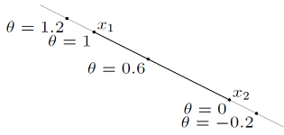

- [Line, Line Segment](#line-line-segment)
  - [1. Line](#1-line)
  - [2. Line Segment](#2-line-segment)
- [Affine](#affine)
  - [Affine Combination( Affine Sum )](#affine-combination-affine-sum-)

 

`Point는 location 정보`만 담는다 

# Line, Line Segment
`Affine Combination에 필요한 개념` 

**[Line, line segment, ray](https://convex-optimization-for-all.github.io/contents/chapter02/2021/02/08/02_01_01_Line_line-segment_ray/)** 

line( 직선 ), line segment( 선분 ), ray( 반직선 ) 

Line은 두 점을 지나면서 양쪽 방향으로 무한히 커지는 선을 말한다 
Line Segment는 두 점 사이에서만 정의되는 선을 말한다 
Ray는 한 점에서 시작해서 다른 점을 지나면서 무한히 커지는 선을 말한다 

 
두 점( Point ) x1과 x2를 지나는 line, line-segment를 나타내는 그림이다 

$\theta$의 범위에 따라 line, line-segment, ray가 어떻게 정의될 지 판단해본다 

 

## 1. Line
두 Point x1, x2를 지나는 Line은 아래 수식으로 표현할 수 있다 

$$y = \theta x_1 + (1 - \theta)x_2 \text{ with } \theta \in \mathbb{R}$$

이때 $\theta$는 임의의 실수이며, **$\boldsymbol{\theta}$가 0이면 y는 x2가 되고, $\boldsymbol{\theta}$가 1이면 y는 x1이 된다** 
따라서 $\theta$가 0보다 작거나 1보다 크면 x1, x2 범위를 벗어나는 것을 확인할 수 있다 

 

## 2. Line Segment
Line 수식에서 **$\boldsymbol{\theta}$ 범위를 0 ~ 1로 제한하면 line-segment**이다 

$$y = \theta x_1 + (1 - \theta)x_2 \text{ with } 0 \leq \theta \leq 1$$

이때 $\boldsymbol{\theta}$가 `0에 가까울수록 x2에 다가가고, 1에 가까울수록 x1에 다가간다` 

이러한 `line-segment 수식은 Affine Combination에서 활용`한다 

  

# Affine
Graphics에서 Affine은 Affine transformation에서 사용하는 단어다 
`point, line, plane을 변환했을 때 계속 point, line, plane으로 유지되는 것을 말한다` 

`예1`, 3D space에서 line에 Affine transformation을 적용하면, 곡선이 되지 않고 line이 된다 
참고로 line은 point( 길이가 0인 line )로 변환될 수 있다 

`예2`, 3D space의 plane을 render할 때, 2D space로 projection되는 변환이 Affine transformation이다 

 

## Affine Combination( Affine Sum )
$$y = \theta x_1 + (1 - \theta)x_2 \text{ with } 0 \leq \theta \leq 1$$
[line segment 수식](#2-line-segment)의 계수의 합을 1로 제한한 것을 Affine Combination이라 한다 
`Point의 계수를 가중치로 볼 때, 이러한 weights의 합들이 1이 되도록 combination( 조합, 섞음 )한다`는 의미로 사용되는 용어다 