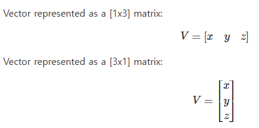
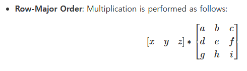
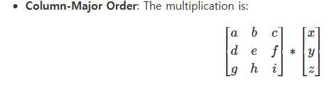
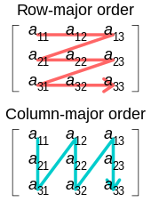

[Scratchapixel - Geometry - Row Major vs Column major](https://www.scratchapixel.com/lessons/mathematics-physics-for-computer-graphics/geometry/row-major-vs-column-major-vector.html)

# Row-Major vs Column-Major in Graphics
DirectXMath와 glm의 Matrx를 보는 방법이 달랐다.   
DirectXMath는 Row-major, GLM은 Column-major matrix이다.   

## 1. Vector 표현 방식
   
vector를 row로 표현할지, column으로 표현할지에 대한 차이점이 있다.   
`이는 행렬곱에도 영향을 준다.`   

   
   

Row-major는 vector * matrix이고, column-major는 matrix * vector이다.   

## 2. Matrix 데이터 저장 방식
   
어떤 순서로 데이터를 저장하는지에 대해 차이가 있다.   
Row-major는 Row 순서대로, Column-major는 Column 순서대로 데이터가 저장된다.   
```cpp
// Row-major matrix( DX )
|1 0 0 0|
|0 1 0 0|
|0 0 1 0|
|1 2 3 1|

// Column-major matrix( GLM )
|1 0 0 1|
|0 1 0 2|
|0 0 1 3|
|0 0 0 1|
```