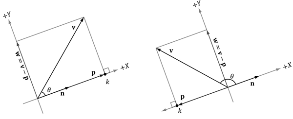
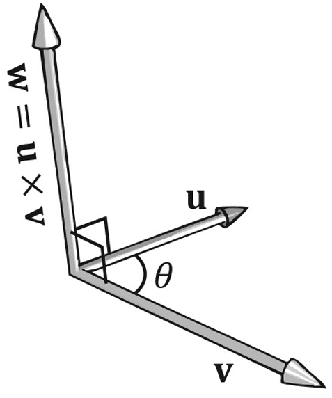

- [Vectors](#vectors)
  - [1. Vectors and Coordinate Systems](#1-vectors-and-coordinate-systems)
  - [2. Left-Handed vs Right-Handed Coordinate Systems](#2-left-handed-vs-right-handed-coordinate-systems)
  - [3. Basic Vector Operations](#3-basic-vector-operations)
- [Length And Unit Vectors](#length-and-unit-vectors)
  - [1. Using Pythagorean Theorem for Length of Vector](#1-using-pythagorean-theorem-for-length-of-vector)
  - [2. Normalizing Vector for Pure Direction](#2-normalizing-vector-for-pure-direction)
- [The Dot Product](#the-dot-product)
  - [1. Dot Product Properties](#1-dot-product-properties)
    - [1.1. Orthogonal vs Perpendicular](#11-orthogonal-vs-perpendicular)
  - [2. Trigonometry](#2-trigonometry)
  - [3. Orthogonal Projection](#3-orthogonal-projection)
    - [3.1. Orthogonal Projection Result](#31-orthogonal-projection-result)
    - [3.2. unit vector가 존재하는 경우](#32-unit-vector가-존재하는-경우)
    - [3.3. unit vector가 없는 경우](#33-unit-vector가-없는-경우)
    - [3.4. Orthogonal Decomposition](#34-orthogonal-decomposition)
  - [4. Orthogonalization](#4-orthogonalization)
    - [4.1. 2D Orthogonalization](#41-2d-orthogonalization)
    - [4.2. 3D Orthogonalization](#42-3d-orthogonalization)
    - [4.3. N Orthogonalization( Gram-Schmidt Orthogonalization )](#43-n-orthogonalization-gram-schmidt-orthogonalization-)
- [The Cross Product](#the-cross-product)
  - [1. cross product properties](#1-cross-product-properties)
  - [2. Pseudo 2D Cross Product](#2-pseudo-2d-cross-product)
  - [3. Orthogonalization with the Cross Product](#3-orthogonalization-with-the-cross-product)
- [Points](#points)

vector를 기하학적으로, 수치적으로 표현되는 방식을 알아본다.   
vector에 대한 operations와 이에 대한 기하학적 응용을 알아본다.   
vector functions와 DirectXMath library에 익숙해진다.   

# Vectors
**vector는 magnitude( 크기 )와 direction( 방향 )을 표현**한다   

이러한 특성을 기하학적으로 표현한 것이 위의 directed line segment이다.   

**vector가 가진 properties( magnitude, direction )는 location을 이동해도 변하지 않기 때문에 vector를 그리는 location은 중요하지 않다**. 때문에 vector를 평행 이동해도 의미는 같다.   
따라서 두 vector가 같음을 판단하기 위해서는 magnitude와 direction이 같아야 한다. 기하학적으로 두 directed line segment가 완전히 겹치면 두 vector가 동일함을 나타낸다.   

## 1. Vectors and Coordinate Systems
**컴퓨터는 vector의 기하학적 의미를 모르기 때문에 이를 수치적으로 표현하는 방법이 필요**하다.   

모든 vector의 tail을 3D coordinate systems의 origin( 원점 )으로 평행 이동한다. 그리고 나서 vector의 head의 corrdinates( 좌표 )를 지정함으로써 각 vector를 식별할 수 있다. 위 그림에서 $\mathbf{p}$는 (x, y, z)로 표현되며, **프로그램은 3개의 `float`를 보고 vector를 표현**할 수 있다.   

하나의 **vector는 frame에 상대적인 좌표를 가진다**.   
표현 방식이 다를 뿐이지 directed line segment에 있는 direction과 magnitude는 변하지 않는다. 이는 Celsius 또는 Fahrenheit에 따라 물의 끓는점에 대한 표현이 다른 것과 비슷하다. 물리적인 물의 끓는 점은 변하지 않지만 표현 방식만 다를 뿐이다.   

3D Computer Graphic에서 **하나 이상의 frame of reference를 사용**하며, **서로 다른 frame을 옮겨다니면서 vector를 표현할 줄 알아야 한다**.   

## 2. Left-Handed vs Right-Handed Coordinate Systems
**Direct3D는 Left-Handed Cooridnate System을 사용**한다.   

Left-Handed Coordinates는 양의 z축이 monitor 안을 향한다. 반면에 Right-Handed Coordinates는 monitor 바깥을 향한다.   

## 3. Basic Vector Operations
벡터의 scalar multiplication, addition, substraction operations에 대해 알아본다.   

   

**a 그림은 두 벡터의 scalar multiplication의 기하학적 의미를 표현**한다.   
$-\frac{1}{2}\mathbf{v}$는 $\mathbf{v}$에 대해 **반대 방향**을 가지고 **길이가 $\frac{1}{2}$이다**.   
즉, **음수 벡터**는 원래 벡터 방향의 **flipping**이고, **scalar multiplication**은 벡터의 길이를 **scaling**한 것이다.   

**b 그림은 두 벡터의 addition의 기하학적 의미를 표현**한다.   
벡터의 덧셈은 $\mathbf{u}$의 tail이 $\mathbf{v}$의 head에 위치하도록 평행이동( 반대도 똑같다 )한다.   
그러면 $\mathbf{v}$의 tail에서 시작하여 평행 이동된 $\mathbf{u}$의 head에서 끝나는 벡터를 얻는다.   

   

이러한 덧셈 규칙( tail과 head 위치 )을 적용하여 두 Forces( vector )를 더해본다.   
**같은 방향으로 향하는 두 Forces를 더하면 더 강한 Force**를 얻지만, **반대 방향으로 향하는 두 Forces를 더하면 더 약한 Force**를 얻는다.   

**c 그림은 두 벡터의 뺄셈의 기하학적 의미를 표현**한다.   
**$\mathbf{v} - \mathbf{u}$는 $\mathbf{u}$의 head에서 $\mathbf{v}$의 head로 향하는 vector**를 반환한다.   
만약 vector를 point로 생각하면, **point(u)에서 point(v)로 향하는 vector를 반환하고, length는 point(u)와 point(v)의 distance**를 나타낸다.   

# Length And Unit Vectors
기하학적으로 벡터의 magnitude는 directed line segment의 Length가 나타낸다. 이러한 magnitude를 수식으로 나타내면 $||\mathbf{u}||$이다.   

## 1. Using Pythagorean Theorem for Length of Vector
$||\mathbf{u}||$를 계산하기 위해서 피타고라스 정의를 두 번 적용한다.   

$$||\mathbf{u}|| = \sqrt{y^2 + a^2} = \sqrt{y^2 + (\sqrt{x^2 + z^2})^2 = \sqrt{x^2 + y^2 + z^2}}$$

xz-plane에서 [hypotenuse](https://www.math.net/hypotenuse) a를 구하기 위해서 한 번, a와 y를 이용해서 $||\mathbf{u}||$를 구하기 위해 한 번으로 총 두 번을 이용한다.   

## 2. Normalizing Vector for Pure Direction
**일반적으로 벡터의 Length는 다루지 않고, 방향 데이터만 표현**하길 원한다.   
이러한 방향 벡터를 만들기 위해서 Length를 1로 만들고, 이러한 과정을 **normalizing** 이라 부른다.   

$$\hat{\mathbf{u}} = \frac{\mathbf{u}}{||\mathbf{u}||} = (\frac{x}{||\mathbf{u}||}, \frac{y}{||\mathbf{u}||}, \frac{z}{||\mathbf{u}||})$$

**벡터의 길이를 unit length로 만들기 위해서( normalizing ) 벡터의 각 components를 magnitude($||\mathbf{u}||$)로 나눈다**.   

# The Dot Product

$${\mathbf{u}}\cdot{\mathbf{v}} = u_xv_x + u_yv_y + u_zv_z$$

Dot Product는 벡터의 곱으로 표현하며, 결과는 scalar value이다. 그래서 **scalar product**라고 부르기도 한다.   
Dot Product는 수식으로 corresponding components의 곱의 합으로 표현한다.   

Dot Product는 기하학적 의미를 명확하게 제시하지 않는다. 때문에 코사인 법칙을 사용함으로써 Dot product의 관계를 알아본다.   

$${\mathbf{u}}\cdot{\mathbf{v}} = ||\mathbf{u}||\space||\mathbf{v}||\cos\theta$$

$\theta$는 항상 0과 $\pi$ 사이의 범위를 가진다.   
**두 벡터간의 Dot product는 두 벡터의 magnitude로 scaling된 $\cos\theta$를 말하며**, 만약 두 벡터가 unit vector라면, $\cos\theta$로 나타낸다.   

## 1. Dot Product Properties
해당 방정식을 통해 Dot product의 3가지 속성을 알 수 있다.   

   

만약 **두 벡터의 dot product 결과가 0**이라면, 두 벡터는 **직교 또는 수직( orthogonal, perpendicular )이다**.   
만약 **두 벡터의 dot product 크기가 양수**라면, 두 벡터간의 각도( $\theta$ )는 90도보다 작다( acute angle, 예각 ).   
만약 **두 벡터의 dot product 크기가 음수**라면, 두 벡터간의 각도는 90도보다 크다( abtuse angle, 둔각 ).   

### 1.1. Orthogonal vs Perpendicular
두 용어는 기본적으로 서로 직각으로 만난다는 공통점을 가지지만, 의미가 조금 다르다.   

**Perpendicular( 수직 )은 기하학에서 두 Line이나 Line Segment가 만나서 이루는 Angle이 90도일 때** 수직이라 말한다.   
**Orthogonal( 직교 )는 두 벡터나 두 함수 또는 두 axis( 축 ) 등이 서로에 대해 독립적인 상태로, Dot product가 0이되는 관계**를 말한다.   

Perpendicular는 일반적으로 도형에 국한되어 사용되며, Orthogonal은 좌표축 간의 독립성, 함수 공간에서의 직교성 등인 추상화된 공간에 대해 표현할 때 사용한다.   

## 2. Trigonometry

**삼각형의 각 변의 길이와 각도에 대한 관계**를 나타낸다.   

$$\sin A = \frac{opposite}{hypotenuse} = \frac{a}{h}$$
$$\cos A = \frac{adjacent}{hypotenuse} = \frac{b}{h}$$
$$\tan A = \frac{opposite}{adjacent} = \frac{a}{b} = \frac{\frac{a}{h}}{\frac{b}{h}} = \frac{\sin A}{\cos A}$$

## 3. Orthogonal Projection
Projection은 공중에 떠있는 점에 빛을 비추었을 때, 땅에 보이는 점의 그림자다.   
Orthogonal Projection은 **어떤 Vector Space에서 특정 Subspace 위로 수직으로 내리는 projection을 남긴 벡터를 도출**한다.   
즉, **Vector Space의 Orthogonal 성분만을 남긴 벡터를 의미**한다.   

$proj_n(\mathbf{v})$ 와 $perp_n(\mathbf{v})$는 Orthogonal Projection의 두 구성 요소를 나타낸다.   

- $proj_n(\mathbf{v})$는 $\mathbf{v}$를 $\mathbf{n}$ 방향으로 Orthogonal projection( 직교 사영 )한 벡터 : **parallel component**
- $perp_n(\mathbf{v})$는 $\mathbf{v}$에서 $\mathbf{p}$를 뺀 나머지로, $proj_n(\mathbf{v})$와 perpendicular가 되는 나머지 벡터 : **orthogonal component**

**여기서 방향이 중요**하다. 2D 공간에서는 못 느끼지만, 3D 공간에서는 방향의 의미를 알 수 있다.   
Orthogonalization의 3D 부분에서 살펴보자.   

### 3.1. Orthogonal Projection Result
$\mathbf{v}$가 $\mathbf{n}$에 대해 Orthogonal Projection 되었을 때, 그 **결과는 $proj_n(\mathbf{v})$라**고 부르며, **이는 $\mathbf{n}$ 방향( 또는 $S$라는 subspace 방향 )으로만 평행한 성분**이다.   
**동시에 $\mathbf{v}$에는 $perp_n(\mathbf{v})$라 하는 $\mathbf{n}$에 perpendicular한 성분도 존재**한다.   

이를 위해서 $\mathbf{n}$ 방향을 알아야 하기 때문에 unit vector를 알아야 한다.   
이제 해당 결과를 도출하는 과정을 간단히 살펴본다.   

### 3.2. unit vector가 존재하는 경우
**unit vector $\mathbf{n}$에 대해 $\mathbf{v}$를 Orthogonal Projection한 결과인 $\mathbf{p}$를 나타낸다**. 이러한 p를 구하는 방식을 알아본다.   

$\mathbf{p}$는 k와 $\mathbf{n}$의 곱으로 나타낼 수 있으며, n과 p가 반대 방향을 가리킬 때, k는 음수다. 또한 [Trigonometry](#2-trigonometry)를 이용해서 우리는 $k = ||\mathbf{v}|| \cos \theta$를 구할 수 있다.   
따라서 $\mathbf{p} = k\mathbf{n} = (||\mathbf{v}|| \cos\theta)\mathbf{n}$으로 $\mathbf{p}$를 구할 수 있지만, $\mathbf{n}$은 unit vector이므로 다른 방식으로 구해야 한다.   

$$\mathbf{p} = (||\mathbf{v}|| \cos\theta)\mathbf{n} = (||\mathbf{v}||\cdot1\cos\theta)\mathbf{n} = (||\mathbf{v}||\space||\mathbf{n}|| \cos\theta)\mathbf{n} = (\mathbf{v}\cdot\mathbf{n})\mathbf{n}$$

$$\mathbf{p} = proj_n(\mathbf{v})$$

특히 $k = \mathbf{v}\cdot\mathbf{n}$은 **두 벡터 중 하나가 unit vector일 때, 두 벡터의 기하학적 의미를 설명**한다. 우리는 **이러한 $\mathbf{p}$를 $\mathbf{n}$에 대해 $\mathbf{v}$의 orthogonal projection이라 부른다**.   

### 3.3. unit vector가 없는 경우
하나의 vector는 항상 unit vector가 되야하므로, normalize 과정을 수행해서 다시 계산한다.   

### 3.4. Orthogonal Decomposition
$$\mathbf{v} = \mathbf{p} + \mathbf{w} = proj_n(\mathbf{v}) + perp_n(\mathbf{v})$$

이 식은 $\mathbf{v}$를 $n$ 방향에 projection한 성분과 그와 perpendicular인 성분으로 나누어 표현한 것이다.   
**이를 $\mathbf{v}$를 $n$ 방향 성분과 그에 수직인 성분으로 Orthogonal Decomposition( 직교 분해 )하는 것을 의미**한다.   

벡터를 분할하는 이유는 특정 direction으로의 성분과 그에 perpendicular한 성분을 구분함으로써 다양한 문제를 쉽게 다룰 수 있기 때문이다.   
1. physics의 friction( 마찰력 )은 표면에 대해 parallel한 방향, normal force( 정반력 )는 표면에 대해 perpendicular한 방향만을 고려하기 때문에 두 성분을 구분해서 계산하는 것이 편하다.
2. light 효과를 계산하기 위해서 normal vector를 기준으로 light vector를 분해하면, light intensity나 direction을 계산하기 편리하다.
3. point와 line 혹은 plane 사이의 distance를 구할 때, line 또는 plane을 정의하는 normal vector 방향으로의 projection을 통해 문제를 간단히 풀 수 있다.

## 4. Orthogonalization
주어진 벡터 집합 내의 원소들이 서로 Orthogonal 하도록 변환하는 과정이다. 즉, **원래 서로 90도를 이루지 않는 일반 벡터들을 Dot product가 0이 되도록 만드는 과정**이다.   

각 벡터들이 서로 orthogonal하고 unit vector라면, $\{\mathbf{v_0}, \dots , \mathbf{v_{n-1}} \}$로 구성된 벡터 집합은 **orthonormal**라 불린다.   
하지만 **3D computer graphics에서는 수치 정밀도 문제로 인해 orthogonal한 벡터들이 un-orthogonal하게 변한다**. 이를 2D, 3D( 2개 또는 3개의 벡터를 포함하는 집합 ) 측면에서 다뤄볼 것이다.   

### 4.1. 2D Orthogonalization
   

위 그림은 $\{\mathbf{v_0}, \mathbf{v_1} \}$ 벡터 집합을 orthogonalize하여 $\{\mathbf{w_0}, \mathbf{w_1} \}$로 orthonormal한 벡터 집합으로 만든 것이다.   

$$\mathbf{w_1} = \mathbf{v_1} - proj_{w_0}(v_1)$$

먼저 $\mathbf{w_0} = \mathbf{v_0}$로 시작하고, $\mathbf{v_1}$를 $\mathbf{w_0}$에 orthogonal projection한 결과를 이용하면, 서로 orthogonal한 $\{\mathbf{w_0}, \mathbf{w_1} \}$이 생성된다.   
그리고 각 $\mathbf{w_0}, \mathbf{w_1}$을 unit vector로 normalize하면 orthonormal set을 생성할 수 있다.   

### 4.2. 3D Orthogonalization

위 그림은 $\{\mathbf{v_0}, \mathbf{v_1}, \mathbf{v_2} \}$ 벡터 집합을 orthogonalize하여 $\{\mathbf{w_0}, \mathbf{w_1} \mathbf{w_2} \}$로 orthonormal한 벡터 집합으로 만든 것이다.   

$\mathbf{w_0} = \mathbf{v_0}$로 시작하고, $\mathbf{v_1}$를 $\mathbf{w_0}$에 orthogonal projection한 결과를 이용하면, 서로 orthogonal한 $\{\mathbf{w_0}, \mathbf{w_1} \}$이 생성된다.   

$$\mathbf{w_2} = \mathbf{v_2} - proj_{w_0}(v_2) - proj_{w_1}(v_2)$$

그 다음에 $\mathbf{v_2}$를 $\mathbf{w_0}$와 $\mathbf{w_1}$에 대해 orthogonal하도록 만든다.   
만드는 방법은 $\mathbf{v_2}$를 $\mathbf{w_0}$에 대해 orthogonal projection한 부분과 $\mathbf{v_2}$를 $\mathbf{w_1}$에 대해 orthogonal projection한 부분을 빼는 것이다.   

*이를 보면 3D space에서 $\mathbf{v_2}$를 $\mathbf{w_0}$와 $\mathbf{w_1}$의 **방향**에 대해 Orthogonal Projection 한다는 것을 알 수 있다.*   

마지막으로 $\{\mathbf{w_0}, \mathbf{w_1} \mathbf{w_2} \}$를 unit vector로 normalize하면 orthonormal set을 얻을 수 있다.   

### 4.3. N Orthogonalization( Gram-Schmidt Orthogonalization )
일반적인 $\{\mathbf{v_0}, \dots , \mathbf{v_{n-1}} \}$ 벡터 집합을 orthogonalize하여 $\{\mathbf{w_0}, \dots , \mathbf{w_{n-1}} \}$인 orthonormal set을 얻는 방법을 **Gram-Schmidt Orthogonalization**이라 부른다.   

   

# The Cross Product
벡터 곱의 두 번째 형태는 cross product이다. scalar 값을 도출하는 Dot Product와 달리, **새로운 vector를 반환**한다. 게다가 **cross product는 3D vector에 대해서만 정의**한다.   

$$\mathbf{w} = \mathbf{u} \times \mathbf{v}$$

두 벡터 $\mathbf{u}$와 $\mathbf{v}$를 cross product하면, **두 벡터에 대해 서로 orthogonal한 또 다른 벡터 $\mathbf{w}$가 생성**된다.   

## 1. cross product properties

$$\mathbf{w} = \mathbf{u} \times \mathbf{v} \qquad \mathbf{z} = \mathbf{v} \times \mathbf{u}$$
$$\mathbf{w} \neq \mathbf{z}$$

$$\mathbf{u} \times \mathbf{v} = -\mathbf{v} \times \mathbf{u}$$

$\mathbf{w} = (0, 6, -2)$라면, $\mathbf{v} = (0, -6, 2)$값이 나온다.   
즉, anti-commutative( 순서에 상관있음 )임을 알 수 있으며, 세 번째 수식같은 관계도 도출할 수 있다.   

만약 left-handed coordinates system을 사용한다면, 엄지를 제외한 손가락들을 $\mathbf{u}$ 방향으로 향하고 나서, 이러한 손가락들을 구부리면 $\mathbf{v}$를 향하게 되고, 엄지 손가락은 cross product의 결과인 $\mathbf{w}$를 향한다.   
여기서**벡터 $\mathbf{u}$는 cross product의 피연산자 순서의 첫 번째 벡터를 의미하고, $\mathbf{v}$는 두 번째 벡터를, $\mathbf{w}$는 반환된 벡터를 의미**한다.   

반환된 벡터 $\mathbf{w}$가 두 벡터에 대해 orthogonal 함을 보여주기 위해서, Dot product를 사용한다.   

## 2. Pseudo 2D Cross Product

$\mathbf{u}$와 orthogonal한 벡터 $\mathbf{v}$를 찾는데 유용하다.   
즉, **하나의 2D 벡터에 대해 직교한 다른 벡터를 찾는데 사용**한다.   

## 3. Orthogonalization with the Cross Product
[4.3.](#43-n-orthogonalization-gram-schmidt-orthogonalization-)에선 하나의 벡터 집합을 orthogonalize하는 방법인 Gram-Schmidt 절차를 알아봤다.   

**3D 공간에서 하나의 벡터 집합을 orthogonalize 하는 또 다른 방법이 존재**하는 데, 이때 Cross Product를 사용한다.   

   

**첫 번째**, $\mathbf{w_0} = \frac{\mathbf{v_0}}{||\mathbf{v_0}||}$로 unit vector로 만든다.   
**두 번째**, $\mathbf{w_2} = \frac{\mathbf{w_0} \times \mathbf{v_1}}{||\mathbf{w_0} \times \mathbf{v_1}||}$로 세팅한다. $\mathbf{w_2}$가 $\mathbf{w_0}$와 $\mathbf{v_1}$에 orthogonal하면서 unit vector가 됨을 의미한다.   
**마지막**, $\mathbf{w_1} = \mathbf{w_2} \times \mathbf{w_0}$로 세팅한다. $\mathbf{w_2}$와 $\mathbf{w_0}$은 orthogonal하고 $|| \mathbf{w_2} \times \mathbf{w_0} || = 1$이기 때문에, $\mathbf{w_1}$는 $\mathbf{w_2}$와 $\mathbf{w_0}$에 orthogonal하고 unit vector임을 알 수 있다.   

세 과정을 통해서 $\{\mathbf{w_0}, \mathbf{w_1}, \mathbf{w_2} \}$는 orthonormal 한 벡터 집합을 생성할 수 있다.   

여기서 **중요한 점은 첫 번째 세팅에서 $\mathbf{w_0}$는 $\mathbf{v_0}$의 방향을 그대로 가져간다**는 것이다. **이와 반대로 $\mathbf{w_1}$와 $\mathbf{w_2}$는 방향이 변경**됐다.   
예를 들면, 나중에 $\mathbf{v_2}$로 방향을 나타내는 $\{\mathbf{v_0}, \mathbf{v_1}, \mathbf{v_2} \}$를 사용하여 camera의 방향을 표현할 수 있다. 
이러한 **벡터를 orthonormalizing 할 때, 우리가 보는 방향을 변경하고 싶지 않기 때문에**, 위 세 과정에서 $\mathbf{v_2}$의 방향을 고정하여 orthogonalization을 수행하고, 나머지 $\mathbf{v_0}$와 $\mathbf{v_1}$의 방향은 수정한다.   

# Points
이때까지의 Vector는 position을 설명하지 않았지만, position을 표현할 필요가 있다.   

Coordinate System을 기준으로 우리는 공간 내부의 3D position을 표현하기 위해서 표준 위치로 Vector를 사용할 수 있다. 이것을 **position vector 또는 Point**라 부른다.   
이 경우에는 **vector의 tip( 벡터의 끝점: direction과 magnitude를 나타냄 )이 location을 의미**한다.   

   

몇 개의 vector operations는 points에 대해 호환된다. 예를 들면, 두 점 q와 p의 뺄셈은 p에서 q로 이동하는 $\mathbf{v}$를 나타내고, 점 p와 $\mathbf{v}$의 덧셈은 vector에 의해서 point가 이동하여 얻어진 점 q를 의미한다.   
이처럼 **좌표계에 상대적으로 Point를 표현하기 때문에 vector algebra framework에 자연스럽게 통합되어 point 연산을 위한 추가 작업을 할 필요가 없다**.   
참고로 points의 합은 affine combination이라는 특수한 경우를 의미하고, 이는 points의 가중치의 평균과 유사하다.   

