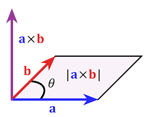

- [vector](#vector)
      - [Displacements](#displacements)
- [Dot product](#dot-product)
    - [특징](#특징)
    - [Dot Product 사용처](#dot-product-사용처)
- [Cross product](#cross-product)
    - [특징](#특징-1)
      - [**in Graphics**](#in-graphics)
    - [Cross Product 사용처](#cross-product-사용처)
- [Programming](#programming)
  - [1. GLM](#1-glm)
    - [glm::vec3 사용법](#glmvec3-사용법)
    - [glm::normalize()](#glmnormalize)
    - [glm::dot(), glm::cross()](#glmdot-glmcross)
    - [기타: vec4,](#기타-vec4)

<BR>

# vector
   
`vector는 magnitude( 크기 )와 direction( 방향 )을 표현`한다   
참고로 `unit vector`는 magnitude를 제거( normalizing )했기 때문에 `direction만 표현하고 싶을 때` 구한다   
vector는 location( 위치 ) 정보를 가지지 않는다   

## 1. Displacements
vector로 `이동하는 행위를 표현`하는 용어이며, 변위라고 번역한다   
이때 이동의 주체는 point이다   

### 1.1. position vector
   

어떤 좌표계에 대해서 point를 정의하고 싶으면, 해당 좌표계의 원점으로부터 좌표 축들의 방향을 기준으로 어떤 방향으로 얼마나 가면 point가 나오는지 판단할 수 있다   
이를 `원점으로부터 상대적인 displacement를 이용해서 point가 어디에 있는지 표현`할 수 있다   

즉, 어떤 좌표계의 상대적인 point의 위치를 표현할 때, vector를 사용할 수 있다   
이러한 point를 표현하는 벡터라는 의미를 구분하기 위해서 `position vector( 위치 벡터 )`라고 부른다   

### 1.2. point operation
point에서 point를 빼면 vector가 나온다   
이러한 성질을 이용하면 `point p가 p'로 가는 방법을 표현`할 수 있다   
   
즉, point p에서 point p'로 가는 displacement를 구하고 싶을 때, 목적지인 p'에서 시작점인 p를 빼면 된다   

위 과정을 응용하면 point p에 displacement를 더하면 p'를 구할 수 있다   
즉, `point에 vector를 더하면 또 다른 point를 구할 수 있다`   

<br><br>

# Dot product
[ Dot product ](https://www.mathsisfun.com/algebra/vectors-dot-product.html)<br>

scalar 끼리 연산을 할 때는 dot, cross 연산자에 차이가 없이 곱셈을 의미하지만 vector 끼리 연산은 다르다   
<br>
$A \cdot B$ <br>

`연산 결과가 scalar`이기 때문에 scalar product라고도 불린다<br>
inner product 또는 projection product라는 용어도 있다<br>

`하나의 vector에 투영( projection )한다는 의미`를 가진다<br>

## 1. Dot product 방법
    

$$\vec{u} \cdot \vec{v} = u_xv_x + u_yv_y + u_zv_z = |u||v| \cos\theta$$

이때 각도의 범위는 0 ~ 180이다.   


## 2. Dot product 특징
1. `두 vector가 서로 직각일 때, dot product 결과는 0`이다
2. `두 vector가 같은 방향을 가리키면 a * b`이다
3. $\vec{u} \cdot \vec{v}$ > 0이면, 각도가 90도보다 작다( 예각 )
4. $\vec{u} \cdot \vec{v}$ < 0이면, 각도가 90도보다 크다( 둔각 )

<br>

위 두 가지 특징은 cos 함수를 그려보면 명확하다<br>
이때 180도 구간을 보면 `두 vector의 방향이 서로 반대 방향인 경우, Dot product 결과가 -1`임을 알 수 있다<br>

- 두 벡터 a, b가 같은 방향을 향하고 있으면, $0^\circ \leq \theta < 90^\circ$ `결과는 양수`
- 두 벡터 a, b가 서로 수직이라면, $\theta = 90^\circ$
- 두 벡터 a, b가 서로 반대 방향이라면, $90^\circ < \theta \leq 180^\circ$ `결과는 음수`

## 3. Dot Product 사용처
### 3.1. 두 vector가 직각인지 확인
직각 삼각형에서 두 변의 길이를 알면, 피타고라스 정의를 이용해서 나머지 한 변의 길이를 구할 수 있다<br>

### 3.2. 두 vector의 방향이 상대적으로 어떤지 판단
특히 Graphics에서 `두 unit vector의 방향을 판단`할 때 사용한다<br>
두 벡터의 Dot product의 결과가 양수, 음수인지에 따라 두 벡터의 방향이 대강 같은지, 다른지 판단할 수 있다   

이는 **삼각형의 앞면을 판단할 때도 이용하는 성질**이다   

### 3.3. Orthogonal Set 구하기
[Orthogonal Projection](#orthogonal-projection)   
임의의 벡터들의 집합의 각 원소들이 모두 서로에 대해 직각이면 Orthogonal Set이다   
직각 여부를 판단하기 위해서 Dot product를 사용한다   

### 3.4. 물리학에서 Work를 판단
<br>
$Work = Force \cdot Distance$ <br>
$Work = Force \times Distance \times \cos \theta$ <br>
Work가 Force * Distance인 경우는 물건에 힘을 주는 방향과 이동 방향이 같은 경우이다<br>


<br><br>


# Cross product
[ Cross product ](https://www.mathsisfun.com/algebra/vectors-cross-product.html)<br>

<br>
$A \times B$ <br>

Dot product와 달리 `vector 값을 반환`하기 때문에 vector product라는 이름도 있다<br>
`3차원에서 사용`한다<br>

#### **in 2D space**
   
2차원 공간에서 두 벡터 u와 v에 대해 cross product를 수행하려면, x좌표의 부호를 바꾼다   
이는 `곧 특정 벡터를 90도로 회전시키는 것과 동일`하다   

Cross product를 나타내는 `"Right Hand Rule"`도 존재한다<br>

## 1. Cross product 특징
1. `두 vector가 같은 방향 또는 반대 방향을 가리킬 때 길이가 0` => cross product를 사용하는 의미가 없다
2. `두 vector가 직각일 때 cross product의 결과는 최대 길이`를 가진다
3. left, right `coordinates에 따라 결과 벡터의 방향이 달라진다`
4. `두 벡터의 연산 순서`에 따라 cross product의 `결과 벡터의 방향이 달라진다`
   - $u \times v$와 $v \times u$의 결과 벡터의 방향이 반대


#### **in Graphics**
두 vector a와 b를 Cross Product한 결과로 c vector를 얻었을 때

- `c는 a와 b vector와 수직`이다
- a와 b가 서로 다른 vector인 경우, `a와 b vector로 평면을 정의할 수 있다`

위 두 가지 특징을 보면, a와 b vector로 얻은 한 평면의 normal vector를 구할 수 있다<br>

## 2. Cross Product 사용처
### 2.1. 두 벡터의 수직인 벡터를 구할 때
Cross Product가 처음으로 사용된 용도다   
두 벡터가 서로 다른 벡터( 같은 방향 또는 반대 방향을 가리키는 벡터가 아님 )일 때, cross product를 이용하여 각 벡터에 대해 수직인 벡터를 구할 수 있다   

### 2.2. 삼각형의 넓이를 구할 때
서로 다른 벡터가 아니면 평면을 정의할 수 없다   

  <br>

$\mathbf{a}와 \mathbf{b}\text{가 이루는 삼각형의 넓이} = \frac{\parallel \mathbf{a} \times \mathbf{b} \parallel}{2}$ <br>

cross product의 결과 vector의 length는 `피연산자 vector의 삼각형 넓이의 2배`이다<br>
이는 반대로 말하면, 두 vector가 이루는 삼각형 넓이를 구하기 위해서는 cross product 결과의 length를 2로 나누면 된다<br>


<br><br>


# Orthogonal Projection
한글로 번역하면 직각 투영이다   
   
위에서 벡터 v와 n이 존재할 때, 벡터 v를 다른 벡터 n에 projection하여 p를 구한다   
이때 수직으로 투영하기 때문에 Orthogonal projection이라 한다   

## 1. Orthogonal Projection 2가지 수식
### 1.1. Unit vector

$$p = proj_{\hat{n}}(v)$$
$$ = k\hat{n}$$
$$ = (|v||\hat{n}|\cos\theta)\hat{n}$$
$$ = (v \cdot \hat{n})\hat{n}$$

여기서 v와 n 벡터를 알고 있고, n은 normalizing해서 사용하기에 unit vector이다   
v를 n으로 Orthogonal projection해서 생기는 `벡터 p를 구하는 것이 목표`다   

p는 unit vector에 scalar k를 곱한 결과이며, 이러한 k는 $|v|\cos\theta$로 구한다   
이때, $|\hat{n}|$은 1이기 때문에 마치 n hat의 절대값이 곱해진 것처럼 적으면, v와 n hat의 dot product로 전개할 수 있다   

Dot project는 음수가 나올 수 있기에 k도 음수가 될 수 있다   

### 1.2. Normal vector

$$ = \frac{(v \cdot n)}{|n|^2}n$$

만약 unit vector가 아닌 일반적인 벡터에 대한 n으로 p를 구하고 싶으면, 위 식을 이용한다   

## 2. Orthogonalization
임의의 벡터 집합을 서로 Orthogonal한 벡터들의 집합으로 변환하는 것을 의미한다   

벡터들의 집합인 $\{ v_0, ... , v_{n-1} \}$의 `모든 벡터들이 서로 수직이라면, Orthogonal Set`이다   
수직 여부를 Dot product로 판단할 수 있다   
만약 `집합 안의 벡터들이 모두 unit vector인 경우, Orthonormal Set`이다   

참고로 **집합에는 같은 elements가 존재하지 않고**, 길이가 0인 벡터가 존재하면 안 된다   

### 2.1. 2D Orthogonalization
2차원 공간에서는 서로 Orthogonal한 벡터를 2개만( x, y ) 찾을 수 있다   
때문에 set에는 2개의 vector만 존재한다   

   

$$\{v_0, v_1\} \text{ to } \{w_0, w_1\}$$

$$w_0 = v_0$$

$$w_1 = v_1 - proj_{w_0}(v_1)$$

w0는 v0로 그대로 사용하되, w1만 w0에 수직이 되도록 만들면 된다   
v1을 w0에 대해 Orthogonal Projection을 수행하지만, 다른 방향으로 projection해야 하기 때문에 이를 뺀다   
즉, w0에 수직인 벡터를 찾기 위해 v1을 w0에 대해 projection한 값을 뺐다   

### 2.2. Gram-Schmidt Orthogonalization
`2D 공간의 Orthogonalization을 임의의 차원으로 확장하는 것을 의미`한다   

$$w_2 = v_2 - proj_{w_0}(v_2) - proj_{w_1}(v2)$$

3D 공간에는 서로 Orthogonal한 벡터가 3개가 존재한다   

$$w_0 = v_0$$

$$\text{For } 1 \leq i \leq n - 1, \space w_i = v_i - \Sigma^{i-1}_{j=0}proj_{w_j}(v_i)$$

$$\text{Orthonormal Set을 구한다면 각 벡터에 대해 } w_i = \frac{w_i}{|w_i|}$$

### 2.3. Orthonormalization with the Cross Product

$$\hat{w_0} = \frac{v_0}{|v_0|}$$

$$\hat{w_2} = \frac{\hat{w_0} \times v_1}{|\hat{w_0} \times v_1|}$$

$$\hat{w_1} = \hat{w_2} \times \hat{w_0}$$


<br><br>


# Programming
[ glm 환경 설정 ](HongLab/part1_BasicConceptsOfRendering/1_DirectX11_환경설정.md)<br>
`DirectXMath.h, GLM, SimpleMath을 이용해서 수학 연산`을 진행한다<br>
참고로 위 3가지 library에서 vector와 point를 구분하지 않았기 때문에 문맥에 따라 개발자가 결정한다<br>

glm은 수학 연산은 직관적이기 때문에 초보 개발자에게 적합하다<br>
DirectXMath는 성능이 더 좋지만, 복잡한 사용법을 익혀야 한다<br>

## 1. GLM
**[GLM Documents](https://openframeworks.cc/documentation/glm/)**<br>
Open`GL M`athematics<br>

### glm::vec3 사용법
```cpp
#include <glm/glm.hpp>
#include <glm/gtx/string_cast.hpp>    // cout 출력( to_string() )

using namespace std;  // cpp 파일에서는 사용해도 괜찮다
using namespace glm;

int main()
{
  // glm의 vector 생성자( float )
  glm::vec3 a(1.0f, 2.0f, 3.0f);
  glm::vec3 b(7.0f, 8.0f, 9.0f);

  glm::dvec3 double_vec(1.0, 1.0, 1.0);   // Ray Tracing은 정밀도가 높기에 double 활용

  // glm vector를 문자열로 출력
  cout << glm::to_string(b - a) << endl;

  // 사칙연산
  auto c = b - a;

  // vector * scalar
  c = a * 10.0f;

  // vector magnitude
  float len = glm::length(c);

  // vector.size()
  // always glm::vec2.length() == 2, glm::vec3.length() == 3, glm::vec4.length() == 4
  cout << (b - a).length() << endl;
}
```

<br>

### glm::normalize()
```cpp
// unit vector 만들기
auto u = glm::normalize(b - a);
```
normalize() 작업은 인자로 전달받은 vector에 length를 나눠준다<br>
때문에 `length가 0.0인 vector를 unit vector로 만들려고 시도하면 에러가 발생`한다<br>
```cpp
// normalize 못하는 경우
if (glm::length(u) < 1e-4f) {
  // length를 0으로 간주하고 다른 방법으로 처리
  // log 출력, 기본값 지정 등
}
```
원래 length가 0인 vector를 normalize하면 안되지만, 현실적으로 복잡한 계산을 하기 때문에 모든 걸 판단하기 힘들다<br>
이러한 이유로 `if문으로 안전 장치를 마련하는 것을 권장`한다<br>

<br>

### glm::dot(), glm::cross()

```cpp
#include <glm/glm.hpp>
using namespace glm;

float aDotB = glm::dot(a, b);
cout << aDotB << endl;
cout << glm::dot(vec3(1, 0, 0), vec3(0, 1, 0)) << endl;
```

```cpp
glm::vec3 vecX{ 1.0f, 0.0f, 0.0f };
glm::vec3 vecY{ 0.0f, 1.0f, 0.0f };

glm::vec3 crossXY = glm::cross(vecX, vecY);   // (0, 0, 1)
glm::vec3 crossYX = glm::cross(vecY, vecX);   // (0, 0, -1)
```
**[ right-handed coordinates ](/5_CS/Graphics/3_Coordinate_Systems.md)**<br>
거의 모든 library의 `cross() 함수의 좌표계는 right-handed coordinates`이다<br>
떄문에 **인자로 전달되는 vector의 순서에 따라 z 방향이 달라진다**<br>

<br>

### 기타: vec4, 
```cpp
// vec3, vec4는 Graphics에서 많이 사용
glm::vec4 v4(glm::vec3(2.0f), 1.0f);

// vec3 elements : union으로 3가지 경우를 포함
cout << v3.x << " " << v3.y << " " << v3.z << endl;
cout << v3.r << " " << v3.g << " " << v3.b << endl;
cout << v3[0] << " " << v3[1] << " " << v3[2] << endl;
```
