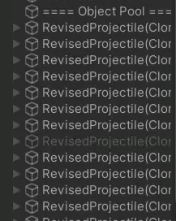

# Object Pool에서 가져온 Object의 위치
게임을 만들 때, pool에서 가져온 Object의 위치를 세팅한다. 
이때 특정 위치에 object를 배치하기 위해 SetParent()를 통해 간편하게 위치를 옮길 수 있다. 

문제는 pool에서 가져온 Object는 많은 수를 사용한다는 의미이고, `SetParent()는 runtime에서 자주 호출하면 overhead`를 불러 일으킨다. 

  
때문에 `pool에서 가져온 object는 가장 바깥에 위치하는 것을 권장`한다. 

***SetParent()가 overhead를 일으키는 이유***

