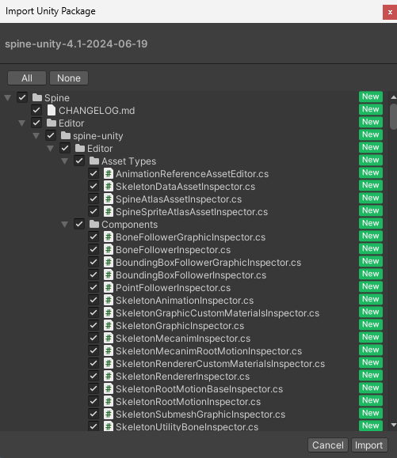
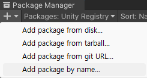
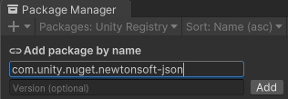
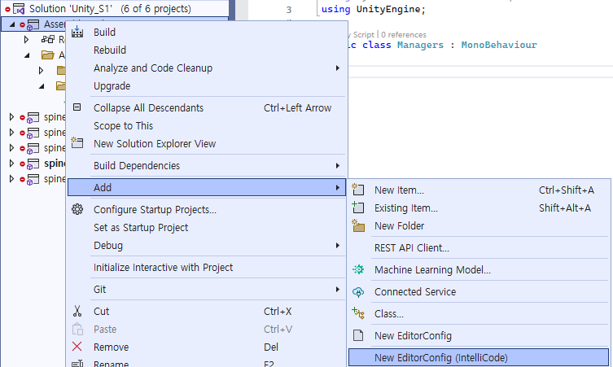
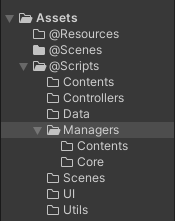

- [1. Unity 환경 설정](#1-unity-환경-설정)
- [2. Visual Studio 환경 설정](#2-visual-studio-환경-설정)
- [3. 폴더 구조](#3-폴더-구조)
    - [Managers 폴더 내부](#managers-폴더-내부)
    - [@Resources 폴더 내부](#resources-폴더-내부)
  
</br></br></br>

# 1. Unity 환경 설정
1. [ Build Settings - Android - Switch Platform ] : 모바일 게임을 만들기 때문에 `Android Platform`으로 미리 세팅한다.
2. Package Managers에서 `Addressables를 다운`받는다. 이는 `패치 시스템`에 영향을 끼친다.
3. 2D 게임에서 `Animation 방식`이 2가지 있다. Spine, Sprite 중 Spine을 사용한다. spine unity download를 검색하여 `spine-unity 4.1 for Unity`를 다운받아서 실행시킨다.</br>
 </br>
`모두 import를 진행`한다.
1. `데이터를 관리하는 Json 파일`을 위해서 Package Managers에서 `name으로 Package를 가져오는 방법`이 사용해본다.</br>
  </br>
`com.unity.nuget.newtonsoft-json`를 입력하여 다운로드를 진행한다.</br>
참고로 spine처럼 다운로드를 이용해서 newtonsoft를 가져와도 된다.</br>

</br></br></br>

# 2. Visual Studio 환경 설정
1. visual studio 세팅 중 `EditorConfig 파일을 생성`한다. solution 파일이 존재하는 폴더에 저장한다.</br>
 </br>
코드 상에 한글을 입력한 뒤에 git에 push하면 `git에서 한글이 깨질 수 있다`. 원래는 파일마다 utf-8로 다시 저장해서 관리했지만, editor config 파일을 이용하면 `모든 파일을 utf-8로 관리` 할 수 있다.</br>
이후 해당 파일에 접근해서 다음과 같은 방식으로 작성한다.</br>
```
root = true

[*]
charset = utf-8
```

</br></br></br>

# 3. 폴더 구조
`나만의 방식으로 사용하기 위해서 @를 붙였다.`</br>
`Addressables 방식`으로 사용하여 `built-in을 막아주기도 한다`.</br>


### Managers 폴더 내부
Engine에서 활용하는 Core 폴더와 게임 컨텐츠와 관련된 Contents 폴더로 구분한다.</br>
참고로 파일명에 `Ex`가 붙은 것은 `유니티 자체에서 제공하는 클래스 파일 이름과 일치하는 것을 방지`한다.</br>

### @Resources 폴더 내부
Language와 Font를 관리하는 Font 폴더</br>
Animation을 관리하는 Spine 폴더</br>
Image를 관리하는 Sprite 폴더</br>
