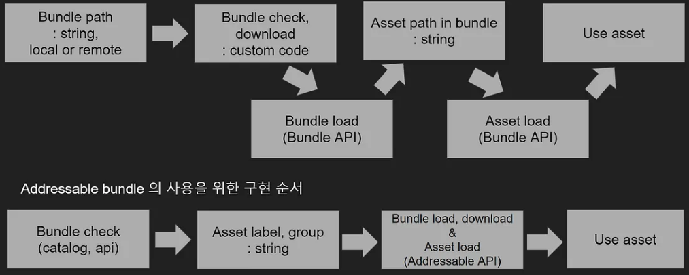

- [Addressable](#addressable)
  - [1. Addressable 이전 Asset 관리 방식](#1-addressable-이전-asset-관리-방식)
    - [Resources 폴더 문제점](#resources-폴더-문제점)
    - [Resources 폴더를 사용하는 이유](#resources-폴더를-사용하는-이유)
    - [Asset Bundle](#asset-bundle)
    - [Asset Bundle 문제점](#asset-bundle-문제점)
  - [2. Addressable Asset](#2-addressable-asset)
    - [Bundle 의존성 관리 =\> Group과 Label( Key )](#bundle-의존성-관리--group과-label-key-)
    - [Bundle Version 관리 =\> Catalog( 핵심 )](#bundle-version-관리--catalog-핵심-)
    - [Asset Path 변경 =\> Address( reference )](#asset-path-변경--address-reference-)
  - [3. 사용법](#3-사용법)
    - [세팅](#세팅)
    - [Group](#group)
    - [Label](#label)
    - [Profile](#profile)
    - [Build](#build)
    - [Addressable.InstantiateAsync와 Object.Instantiate 중 후자를 사용하는 이유](#addressableinstantiateasync와-objectinstantiate-중-후자를-사용하는-이유)
- [출처](#출처)


# Addressable
Unity에서 사용하는 Asset 관리 시스템이다. `Asset Bundle + Bundle 관리 시스템`</br>

## 1. Addressable 이전 Asset 관리 방식
`Resources 폴더`과 `Asset Bundle`을 사용했다.</br>
두 방식 모두 Asset을 특정 경로에 생성( 혹은 Built-in ) 시켜 놓고 Load API를 통해 사용한다.</br>
```
[ 과정 ]
1. Asset이 위치한 Path 준비
  - Resources 폴더 방식: /Resources에 Asset을 생성
  - Asset Bundle: Bundle 내부에 Asset Path를 입력

2. Asset의 Path를 이용해서 Resource.Load() API로 Loading

3. Load한 Asset을 사용( Instance, Reference )
```

</br></br></br>

### Resources 폴더 문제점
Resource 폴더를 사용하면 프로젝트를 빌드하면서 `c# 코드와 resource 파일들이 apk에 묶어서 배포( built-in )`한다.</br>

모바일 스토어에 올린 뒤에는 패치를 진행한다.</br>

패치를 한다는 것은 다양한 resource가 추가된다는 뜻이고, 또 다시 빌드를 통해 방대한 resource와 c# 파일을 묶는 과정이 필요하다.</br>
즉, Resource로 인한 `build 시간이 증가`한다.</br>

가장 큰 문제는 스토어에 올리기 위해 `심사를 받는 기간`이다.</br>
길면 몇 주간 이뤄지는데, 이 기간동안 새로운 패치를 유저에게 제공할 수 없다는 의미이다.</br>

이외에도</br>
Resources가 apk에 Built-in되어 `용량이 증가`한다.</br>

앱을 실행할 때 `indexing 과정이 발생`하기 때문에 실행 시간이 증가한다.</br>

</br></br></br>

### Resources 폴더를 사용하는 이유
그럼에도 해당 방식을 채택하는 2가지 경우가 있다.</br>

1. 앱을 실행하고 이용하는데 `필수적인 Resource`인 경우
2. `Update가 빈번하지 않고`, `Remote로 Update할 필요가 없는 경우`

### Asset Bundle
Asset의 Bundle( 묶음 )</br>
Resources 폴더의 하위에 있는 특정 폴더를 압축한 것과 유사하다.</br>
Resources 폴더에서 Load 하는 것처럼 `Bundle에서 Asset을 Load하여 사용`한다. Asset Bundle에 Asset을 포함시켜 배포( 혹은 Built-in )해서 Load하는 방식이다.</br>
즉, `Local 혹은 Remote로 관리`할 수 있다.</br>

Resources 폴더 방식의 제한 사항들을 보완하기 위한 방법이다.</br>

</br></br></br>

### Asset Bundle 문제점

1. Bundle `의존성` 관리
2. Bundle `Version` 관리
3. Bundle에 저장한 `Asset Path 변경`


Asset의 Bundle 의존성으로 인해 다른 Bundle에서 같은 Asset을 저장하는 경우가 있다.</br>
즉, `Resource에 중복`이 발생한다.</br>

라이브 중인 A게임에서 0.1 버전의 bundle에 `호환`되도록 설계했다.</br>
시간이 흘러 0.2 버전의 bundle이 등장했습니다.</br>
A 게임이 업데이트하지 않고 0.1 버전 bundle을 사용하는 경우, A 게임은 0.2 버전 bundle에서 제공되는 데이터 구조나 Resource 형식을 처리할 수 없다.</br>
이로 인해 A 게임 사용자가 0.2 버전 bundle을 다운로드하여 사용하려고 하면 A 게임은 정상적으로 동작하지 않을 수 있다.</br>

bundle 내부에 Asset의 Path는 string 형태다.</br>
이를 외부 코드에서 Load하여 사용한다. 만약 bundle 내부의 path가 변경되면 `외부 코드에서도 변경된 path를 사용하도록 작업`해야 한다.</br>


</br></br></br>


## 2. Addressable Asset
Asset Bundle의 문제점을 해결하기 위해 도입됐다( `Asset Bundle + Bundle 관리 시스템` ).</br>


웹 서버를 이용해서 필요한 resource만 클라이언트에 전달하면 되기 때문이다.</br>
운영 측면에서 엄청난 유연성을 챙길 수 있다.</br>

</br></br></br>

### Bundle 의존성 관리 => Group과 Label( Key )
Group은 Bundle 단위이다.</br>
Group 내 Asset에는 각각의 ID( key )와 같은 부류라는 Label을 기입할 수 있다.</br>
</br>

Bundle에서 `Asset을 사용하기 위한 구현 과정이 간단`해졌다.</br>
 </br>

`서로 다른 Bundle( Group )이라도 의존성이 있다면 일괄 관리`할 수 있다.</br>
이는 Bundle의 Download & Load 단계에서 Asset 들의 의존성( Label, Key가 제대로 기입 )을 API에서 일괄 관리한다.</br>
즉, `Label( Key ) 관리`만 한다면, 기존 `Asset Bundle의 의존성에 의한 중복이나 수동 관리를 해결`할 수 있다.</br>

</br></br></br>


### Bundle Version 관리 => Catalog( 핵심 )
Catalog란, `Asset의 Address( Group, Label 정보 포함 )와 Asset 매핑 정보가 기재된 파일`이다.</br>
Catalog 덕분에 의존성 문제를 해결하고, bundle 자체의 version도 관리할 수 있다.</br>

앱을 `배포할 때 앱이 사용할 catalog의 version이 함께 기재`된다.</br>
이로 인해 저장소에 사용할 catalog와 bundle만 존재하면 새롭게 배포하는 catalog와 bundle 때문에 문제가 발생할 여지가 없다.</br>

</br></br></br>

### Asset Path 변경 => Address( reference )
기존 bundle에는 asset의 path가 포함되기에 외부 코드에서 사용하고 있을 때 path 값을 매칭해야 했다.</br>
Addressable은 `Asset의 Path를 참조`한다.</br>

1. Addressable Bundle에는 `Asset의 path와 mapping 된 Address`가 존재
2. Adress는 Group 단위로 묶이며, label이라는 별도의 태그 부여 가능
3. Client에서 `Address 혹은 Group, Label을 통해서 Asset을 Load` 가능
4. Asset Path가 바껴도 `Address, Group, Label만 바뀌지 않으면 반영할 필요 없음`

</br></br></br>

## 3. 사용법

### 세팅
1. Package Manager에서 Addressables를 다운받는다.
2. Window - Package Manager - Addressable - Group 창을 띄운다.
3. Addressables Settings 생성한다.

</br></br></br>

### Group
개발 단계에서는 신경쓰지 않아도 되지만, 배포하기 전에는 Asset을 어떤 Group으로 나눌지 결정한다.</br>

@Resource 폴더 내부의 파일은 배포를 해도 적용되지 않는다.</br>

각 파일을 Inspector View에서 Addressable 옵션을 체크 또는 파일을 Group에 Drag-Drop을 통해 Group에 올라가면서 배포 파일에 반영된다.</br>

Group에 존재하는 파일의 경로를 변경하면, Group에서 자동으로 추적한 뒤에 수정해주기 때문에 편리하다.</br>

Group을 우클릭하여 Simplify Addressable Names를 통해 경로의 제일 마지막 글자로 통일할 수 있다.</br>

</br></br></br>

### Label


</br></br></br>

### Profile
Local과 Remote의 경로를 설정할 수 있다.</br>
Local인 Unity Editor를 통해서 Resource를 받아오거나, Remote인 Server를 통해서 받아오거나를 선택할 수 있다.</br>

</br></br></br>

### Build
bundle 파일을 생성한다.</br>
`bundle 파일`은 이름을 보면 알 수 있듯이 `hash 값으로 관리`된다.</br>


파일에 변화가 있는 경우에만 새로운 bundle 파일을 생성한다.</br>
`수정된 파일이 있는 경우 기존의 bundle 파일은 그대로 남고 새로운 bundle 파일이 추가`된다.</br>


따라서 Group을 나누는 기준도 중요하다. 자주 update하는 group과 거의 update하지 않는 group을 나누는 것도 방법이다.</br>
`Unity Document에 Group을 나누는 다양한 정책`을 소개한다.</br>

</br></br></br>

### Addressable.InstantiateAsync와 Object.Instantiate 중 후자를 사용하는 이유
Addressable 메소드로 prefab을 생성했으면, Addresable 메소드 계열로 prefab을 해제해야 한다.</br>

Addressable 메소드는 `reference count가 적용`되어 asset을 사용하지 않을 때 바로 삭제하지 않는다.</br>
두 번 loading하고 한 번 release한 경우 reference count가 일치하지 않기 때문에 삭제되지 않는다.</br>

`reference count를 맞춰주는 작업`이 까다롭기 때문에 후자로 사용한다.</br>
Unity Editor에서 Prefab을 삭제하는 경우 해당 Prefab이 Addressable로 만든 prefab인지 알 수 없다.</br>


때문에 Load 할 때는 Addressable로 가져오지만, Prefab을 생성할 때는 Object.Instantiate 정책을 채용했다.</br>

</br></br></br>

# 출처
[Unity Addressable Asset을 왜?]( https://medium.com/pinkfong/unity-addressable-asset-%EB%A5%BC-%EC%99%9C-3017f3fa2edc )

