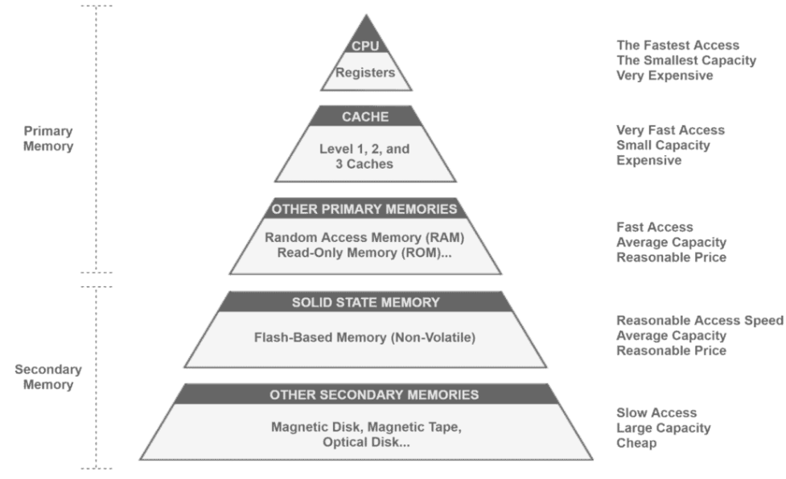

- [Introduction](#introduction)
    - [알아볼 내용](#알아볼-내용)
- [1. Computer Memory Basics](#1-computer-memory-basics)
  - [`1.1.` primary memory](#11-primary-memory)
    - [1.1.1. `registers`](#111-registers)
    - [1.1.2. `cache memory`](#112-cache-memory)
  - [`1.2.` secondary memory](#12-secondary-memory)
- [2. Cache Memory](#2-cache-memory)
  - [2.1. The Principle of Locality](#21-the-principle-of-locality)
    - [Temporal locality( 시간적 지역성 )](#temporal-locality-시간적-지역성-)
    - [Spatial locality( 공간적 지역성 )](#spatial-locality-공간적-지역성-)
  - [2.2. Cache Miss and Cache Hit](#22-cache-miss-and-cache-hit)
    - [Cache Miss](#cache-miss)
    - [Cache Hit](#cache-hit)
- [3. Context Switching](#3-context-switching)

 

[참고 사이트](https://www.baeldung.com/cs/cache-memory) 

# Introduction
cache는 일반적으로 `CPU와 같은 특정 HW 구성 요소에 최대한 가깝게 할당된 작은 memory`이다. 
CPU와 가깝기 때문에 cache memory는 register를 제외한 일반적인 memory에 비해 `낮은 지연으로 데이터를 제공`한다. 

### 알아볼 내용
1. memory 계층 구조를 중심으로 Computer memory에 대한 전반적인 내용
2. cache memory에 대한 내용과 cache hit, cache miss 개념
3. cpu에서 context-switching이 cache memory에 미치는 영향

 
 

# 1. Computer Memory Basics
피라미드 구조의 5계층으로 computer memory가 구성된다. 
 

primary memory( 기본 메모리 )와 secondary memory( 보조 메모리 )의 차이점을 이해한다. 

## `1.1.` primary memory
`CPU에 직접 access` 하고 `volatile( 휘발성 ) memory`이다. 

예외적으로 ROM은 primary memory임에도 불구하고 non-volatile memory이다. 

### 1.1.1. `registers`
CPU 내부에 포함되기 때문에 가장 빠른 access time을 가진다. 
registers는 CPU의 memory unit을 구성하기 때문에 CPU의 제한된 물리적 공간을 다른 unit과 공유한다. 

### 1.1.2. `cache memory`
cache는 전용 data bus를 사용해서 CPU와 데이터를 교환함으로써 `CPU와 정말 비슷한 속도를 제공`하는 memory이다 

 

## `1.2.` secondary memory
`CPU가 access하기 위해선 primary memory에 할당`되어야 하고 `non-volatile( 비휘발성 ) memory`이다. 

 
 

# 2. Cache Memory
cache는 전용 data bus를 사용해서 CPU와 데이터를 교환함으로써 CPU와 정말 비슷한 속도를 제공하는 memory이다. 
`CPU가 memory에 빠르고 효율적으로 access 할 수 있도록 데이터나 명령을 기다리는 process( waiting 상태 )로 인한 CPU idleness 상태를 줄여준다`. 
즉, CPU 효율성을 높인다. 

## 2.1. The Principle of Locality
cache는 `CPU가 자주 사용하는 명령어와 데이터 일부를 예측`하여 이를 secondary memory에서 load한다. 
이러한 예측은 `principle of locality에 기반`한다. 
CPU가 `특정 기간` 동안 `특정 memory 영역`에 `반복적으로 access하는 경향을 고려`한다. 
즉, 이 원칙은 시간적, 공간적 지역성을 모두 의미한다 

### Temporal locality( 시간적 지역성 )
cache memory에 최근에 load된 데이터가 단 기간에 여러 번 재사용된다면, 이 기간 동안 해당 data를 cache에서 제거하거나 교체하면 안 된다. 

### Spatial locality( 공간적 지역성 )
최근에 load 된 데이터의 주소와 가까운 주소를 가진 데이터가 곧 사용될 확률이 높은 경우, cache memory는 이러한 관련 데이터를 가능한 한 빨리 load 해야 한다. 

 

## 2.2. Cache Miss and Cache Hit
CPU Core는 Task를 처리하는 동안 memory에 여러 번 access 한다. 
`CPU는 일반적으로 cache hierarchy에 따라 빠른 메모리에서 느린 메모리로 컴퓨터 메모리에 access 한다`. 
이 과정에서 Cache Miss가 발생한다. 
예를 들면, 필요한 데이터가 L3 cache에 있는 경우, CPU는 먼저 L1, L2 cache access에 실패한 후 L3 cache에서 데이터를 찾는다. 
이는 2개의 cache miss( L1, L2 )와 1개의 cache hit( L3 )가 발생했음을 알 수 있다. 

### Cache Miss
특정 데이터나 명령어를 검색하기 위해 cache를 조회했지만, access한 cache에서 해당 데이터나 명령어를 찾을 수 없는 경우 발생한다. 

### Cache Hit
특정 데이터나 명령어를 검색하기 위해 cache를 조회한 결과, access한 cache에서 해당 데이터나 명령어를 사용할 수 있는 경우이다. 
이때 cache는 요청된 resource를 반환한다. 

`cache miss가 cache hit보다 적을수록 cache memory의 성능이 좋다`. 

 
 

# 3. Context Switching
[Context Switching에 대한 설명](/6_CS/6_ContextSwitching.md)

Multitasking 컴퓨터에서는 여러 process가 CPU 실행 시간을 공유한다. 
하지만 일반적으로 CPU core 수는 컴퓨터에서 실행되는 process보다 적다. 
따라서 `CPU는 process의 실행을 일정 간격으로 예약`한다. 
`Context-Switching`은 CPU core에서 실행 중인 process를 중단하고 새 process 또는 이전에 중단된 process를 실행하는 것이다. 

process에는 여러 데이터와 명령어가 필요하며, 이를 `process working set`이라고 말한다. 
cache memory는 이러한 process working set의 일부 또는 전체를 load 한다. 
Context-Switching이 발생한 후에, `cache는 clear() 하거나 이전에 실행된 process working set이 남은 경우가 많다`. 

즉, `Context-Switching으로 인해 CPU core에서 process 실행이 시작될 때 많은 cache miss가 발생`한다. 

