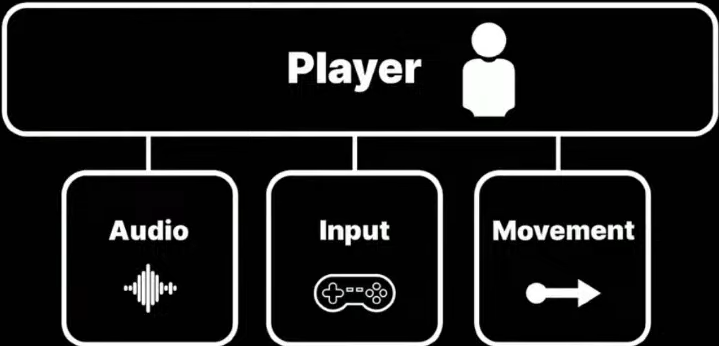

- [요약](#요약)
- [Single Responsibility ( 단일책임원칙 )](#single-responsibility--단일책임원칙-)
  - [예시](#예시)
    - [Single Responsibility 적용 이전](#single-responsibility-적용-이전)
    - [Single Responsibility 적용 이후](#single-responsibility-적용-이후)
- [Open-Closed ( 개방폐쇄원칙 )](#open-closed--개방폐쇄원칙-)
  - [예시](#예시-1)
    - [Open-closed 적용 이전](#open-closed-적용-이전)
    - [Open-closed 적용 이후](#open-closed-적용-이후)
- [Liskov Subsitution ( 리스코프치환 )](#liskov-subsitution--리스코프치환-)
  - [예시](#예시-2)
    - [Liskov substitution 적용 이전](#liskov-substitution-적용-이전)
    - [Liskov substitution 적용 이후](#liskov-substitution-적용-이후)
- [Interface Segregation ( 인터페이스분리원칙 )](#interface-segregation--인터페이스분리원칙-)
  - [예시](#예시-3)
    - [Interface Segregation 적용 이전](#interface-segregation-적용-이전)
    - [Interface Segregation 적용 이후](#interface-segregation-적용-이후)
- [Dependency Inversion ( 종속성 역전 원칙 )](#dependency-inversion--종속성-역전-원칙-)
  - [예시](#예시-4)
    - [Dependency Inversion 적용 이전](#dependency-inversion-적용-이전)
    - [Dependency Inversion 적용 이후](#dependency-inversion-적용-이후)

</br>

# 요약

`모든 Design Pattern은 SOLID 원칙을 지키려고 노력`한다.</br>

1. Single Responsibility
   - class는 `하나의 작업만 수행`, `변경할 이유는 하나`만
2. Open-closed
   -  `이미 작동하는 방식을 변경하지 않고도 class 기능을 확장` 가능
3. Liskov substitution
   -  하위 클래스는 기본 클래스를 대체할 수 있어야 한다. `기본 클래스의 방향성을 유지`
4. interface segregation
   -  `interface를 작게 유지`, `client는 필요한 것만 interface를 가져와서 사용`
5. Dependency inversion
   -  추상화에 의존, `하나의 구체 클래스에서 다른 클래스로 직접 의존 금지`

</br>
</br>

# Single Responsibility ( 단일책임원칙 )
`모든 클래스는 하나의 책임`만 가진다.</br>


1. Readability( 가독성 )
   - `짧은 분량의 클래스`
   - 대부분의 개발자는 lines 수를 200 ~ 300개 정도로 제한한다.
   - `lines 수를 규정하고 이를 초과하면 더 작게 리팩터링할 것인지 결정`한다.
2. Extensibility( 확장성 )
   - `상속이 쉬움`
   - 의도치 않은 기능 장애를 걱정할 필요가 없다.
3. Re-usability( 재사용성 )
   - 모듈식 설계로 `재사용 가능`

</br>

Unity의 GameObject에는 작고 다양한 Component가 내부에 포함된다.</br>
각 Component는 한 가지 작업을 수행하며, 이러한 Component가 함께 작동하여 복잡한 동작을 만든다.</br>

</br>

## 예시

### Single Responsibility 적용 이전
</br>

Player Script는 여러 기능을 수행하고 있다.</br>

```c#
// Not Single Responsibility
public class UnrefactoredPlayer : MonoBehaviour
{
  [SerializeField] private string inputAxisName;
  [SerializeField] private float positionMultiplier;
  private float yPosition;
  private AudioSource bounceSfx;

  private void Start() {
    bounceSfx = GetComponent<AudioSource>();
  }

  private void Update() {
    float delta = Input.GetAxis(inputAxisName) * Time.deltaTime;
    yPosition = Mathf.Clamp(yPosition + delta, -1, 1);
    transform.position = new Vector3(transform.position.x, yPosition * positionMultiplier, transform.position.z);
  }

  private void OnTriggerEnter(Collider other) {
    bounceSfx.Play();
  }
}
```
Player 클래스가 Audio, Input, Movement 3가지 기능을 담당한다.</br>
프로젝트를 진행하다 보면 점점 유지하기 어려운 구조를 가진다.</br>

</br>

### Single Responsibility 적용 이후
</br>

```c#
// Single Responsibility
[RequireComponent(typeof(PlayerAudio), typeof(PlayerInput), typeof(PlayerMovement))]
public class Player : MonoBehaviour
{
  [SerializeField] private PlayerAudio playerAudio;
  [SerializeField] private PlayerInput playerInput;
  [SerializeField] private PlayerMovement playerMovement;

  private void Start() {
    playerAudio = GetComponent<PlayerAudio>();
    playerInput = GetComponent<PlayerInput>();
    playerMovement = GetComponent<PlayerMovement>();
  }

  // 외부 클래스
  public class PlayerAudio : MonoBehaviour {}
  public class PlayerInput : MonoBehaviour {}
  public class PlayerMovement : MonoBehaviour {}
}
```
Player 클래스는 외부 모듈을 활용한다.</br>
각 모듈은 오직 한 가지 역할만 수행한다.</br>
이러면 PlayerMovement와 같은 모듈은 NPC의 movement를 구현할 때도 사용할 수 있다.</br>


</br>
</br>

# Open-Closed ( 개방폐쇄원칙 )

OCP는 class가 확장에는 개방적이고, 수정에는 폐쇄적이어야 한다는 원칙이다.</br>

1. `확장( 상속 )`에 대해 열려있다.
   - 모듈의 동작을 확장할 수 있다.
   - `요구 사항이 변경될 때, 새로운 동작을 추가해 모듈을 확장`할 수 있다.
   - 즉, `모듈이 하는 일을 변경할 수 있다`.
2. 수정에 대해 닫혀있다.
   - `기존 코드를 수정하지 않아도 모듈의 기능을 확장하거나 변경`할 수 있다.
   - `모듈의 라이브러리( ex. DLL )의 수정이 필요 없다`.

</br>

`Debugging이 쉬워진다`. 기존 코드는 그대로고 새로운 코드의 로직만 추가됐기 때문이다.</br>
interface와 abstract를 활용함으로써 `확장하기 까다로운 switch, if문을 로직에 넣지 않아도 된다`.</br>


</br>

## 예시

### Open-closed 적용 이전
</br>


```c#
public class Rectangle { public float width; public float height; }
public class Circle { public float radius; }

public class AreaCalculator
{
  public float GetRectangleArea(Rectangle rectangle)
  {
    return rectangle.width * rectangle.height;
  }

  public float GetCircleArea(Circle circle)
  {
    return circle.radius * circle.radius * Mathf.PI;
  }
}
```
도형이 늘어날수록 AreaCalculator에서 관리하는 GetArea() 함수가 증가한다.</br>

Shape 클래스를 만들고 Shape를 처리할 method를 만들 수도 있지만, 각 shape 형식을 처리하도록 로직 안에 여러 개의 if문이 존재한다.</br>

기존 코드( AreaCalculator의 내부 )를 수정하지 않고, 새로운 Shape를 사용할 수 있도록 확장해보자.</br>


</br>

### Open-closed 적용 이후
</br>
```c#
public abstract class Shape
{
  public abstract float CalculateArea();
}

public class Rectangle : Shape
{ 
  public float width; 
  public float height; 
  public override float CalculateArea() { return width * height; }
}
public class Circle 
{ 
  public float radius; 
  public override float CalculateArea() { return radius * radius * Mathf.PI; }
}

// Shape의 Area를 구하는 클래스
public class AreaCalculator
{
  public float GetArea(Shape shape) { return shape.CalculateArea(); }
}
```
새로운 다각형이 필요할 때마다 Shape에서 상속하는 새 클래스를 정의한다.</br>
도형을 추가하더라도 원본 코드를 전혀 변경하지 않고 AreaCalculator의 기능을 확장할 수 있다.</br>

`Debugging이 쉬워진다`.</br>
결과값에 오류가 발생하면 AreaCalculator를 볼 필요가 없다.</br>
기존 코드는 변경한 적이 없고, 새로운 코드만 잘못된 로직이 있는지 살펴보면 되기 때문이다.</br>

</br>
</br>

# Liskov Subsitution ( 리스코프치환 )

**`interface로 역할에 맞는 기능을 가져다 사용하는 것을 권장`한다.**</br>

child class는 super class의 방향성을 지켜줘야 한다.</br>
하위 클래스를 강력하고 유연하게 만드는 원칙이다.</br>
`OOP 상속을 사용하면 하위 클래스를 통해 기능을 추가할 수 있지만`, `복잡성이 증가`할 수 있다.</br>

super class에서 상속을 요구하는 메소드를 child class에서 사용했을 때, 내용이 비어있으면 안 된다.</br>
부모 클래스에서 자식 클래스에게 무조건 상속을 요구하는 메소드가 있다. 이를 자식 클래스에서 override 한 뒤, 아무런 내용을 채우지 않는 것을 의미한다.</br>

1. `child class에서 super class의 기능을 제거하지 않는다`.
2. `abstract class를 단순하게 유지`한다.
   - super class에 들어가는 로직이 많을수록 LSP를 위반할 확률이 커진다.
   - super class는 child class들의 일반적인 기능만 표현한다.
3. `implementation 대신 composition을 우선`한다.
   - 기능의 전달은 interface 또는 별도의 class로 대신한다.


</br>

이 때문에 abstraction을 단순하게 유지하기 위해 `inheritance 보다 composition을 권장`한다.</br>
이는 `abstract로 상속을 받는 구조( inheritance )`보다는 `interface를 가져다 사용하는 것( composition )`을 의미한다.</br>

</br>

## 예시

### Liskov substitution 적용 이전
 </br>

```c#
public class Vehicle
{
  public float speed = 100;
  public Vector3 direction;

  public void GoForward() {}
  public void Reverse() {}
  public void TurnRight() {}
  public void TurnLeft() {}
}
```
자동차와 기차는 모두 Vehicle 기능을 가진다.</br>
문제는 자동차는 도로에 따라 움직이고, 기차는 레일에 따라 움직인다.</br>
기차는 rail을 이탈할 수 없기 때문에 TurnLeft와 TurnRight method는 Train 클래스에서 작동하지 않는다.</br>
이 때문에 `기차는 GoForward() 기능만` 있으면 움직이는데 지장이 없고, `나머지 기능은 상속만 받고 내용을 채우지 않게 된다`.</br>

Train은 Vehicle의 하위 클래스이므로 Vehicle 클래스가 허용되는 모든 위치에서 사용할 수 있어야 한다.</br>

이를 `interface를 이용해서 수정`한다.

</br>

### Liskov substitution 적용 이후
</BR>

```c#
public interface ITurnable { 
  public void TurnRight();
  public void TurnLeft();
}
  
public interface IMovable { 
  public void GoForward();
  public void Reverse();
}

// 기능 조립
public class RoadVehicle : IMovable, ITurnable {
  public float speed = 100f;
  public float turnSpeed = 5f;

  public virtual void GoForward() {}
  public virtual void Reverse() {}
  public virtual void TurnRight() {}
  public virtual void TurnLeft() {}
}

public class RailVehicle : IMovable {
  public float speed = 100f;

  public virtual void GoForward() {}
  public virtual void Reverse() {}
}
```
LSP를 적용하기 위해서 Vehicle 클래스를 삭제하고, 대부분의 기능을 interface로 옮긴다.</br>

이러한 사고 방식이 직관적이지 않은 것처럼 보일 수 있다. 이를 `Circle-ellipse problem( 원-타원 문제 )`라고 한다.</br>
사람들이 생각하는 모든 실제 등과 관계가 상속으로 전환되지 않는다.</br>
`SW Design은` 실제 세상에 대한 사전 지식이 아닌, `class 계층 구조`이다.


</br>
</br>

# Interface Segregation ( 인터페이스분리원칙 )

어떠한 Client도 자신이 사용하지 않는 method에 강제로 종속될 수 없다.</br>
즉, `interface 규모가 커지지 않도록` 작성한다.</br>

`많은 기능을 가진 interface를 구체적이고 작은 단위로 분리`한다.</br>
의존성을 약화하고 유연성을 강화한다.</br>

LSP처럼 `ISP도 implementation 보다 composition을 우선시`한다.</br>

</br>

## 예시

### Interface Segregation 적용 이전
```c#
public interface IUnitStats
{
  public float Health { get; set; }
  public int Defence { get; set; }
  public void Die();
  public void TakeDamage();
  public void RestoreHealth();
  public float MoveSpeed { get; set; }
  public float Acceleration { get; set; }
  public void GoForward();
  public void Reverse();
  public void TurnLeft();
  public void TurnRight();
  public int Strength { get; set; }
  public int Dexterity { get; set; }
  public int Endurance { get; set; }
}
```
다양한 유닛이 존재하는 게임을 만들 때, 각 Unit에는 체력과 속도를 비롯한 다양한 스탯이 존재한다.</br>

문제는 부술 수 있는 통이나 파괴 가능한 object를 만드는 경우, 이러한 object에도 체력이라는 개념이 필요하다.</br>
또한 이것들은 unit에 부여된 능력 중 상당수를 사용하지 않는다.</br>

</br>

### Interface Segregation 적용 이후
</br>

```c#
public interface IMovable {
  public float MoveSpeed { get; set; }
  public float Acceleration { get; set; }

  public void GoForward();
  public void Reverse();
  public void TurnLeft();
  public void TurnRight();
}


public interface IDamageable() 
{ 
  public float Health { get; set; }
  public int Defense { get; set; }
  public void Die();
  public void TakeDamage();
  public void RestoreHealth();
}


public interface IUnitStats() 
{ 
  public int Strength { get; set; }
  public int Dexterity { get; set; }  // 손재주
  public int Endurance { get; set; }  // 지구력
}


// 폭발하는 통에 필요한 기능
public interface IExplodable() 
{ 
  public float Mass { get; set; }
  public float ExplosiveForce { get; set; }
  public float FuseDelay { get; set; }

  public void Explode();
}

public class ExplodingBarrel : MonoBehaviour, IDamageable, IExplodable {}
public class EnemyUnit : MonoBehaviour, IDamageable, IMovable, IUnitStats {}
```
Unit Stat interface를 분리하여 다양한 클래스에서 `각자 필요한 기능을 사용`할 수 있다.</br>

</br>
</br>

# Dependency Inversion ( 종속성 역전 원칙 )

`클래스 간의 coupling을 줄이기 위한 원칙`이다.</br>

`다른 클래스와 관계가 있는 클래스는 Dependency 혹은 Coupling 관계가 있다`고 부른다.</br>

하나의 클래스는 `다른 클래스와 직접적인 관계가 있으면 안 된다`.</br>
`dependency(종속성) 또는 coupling(결합)이 발생`하기 때문이다.</br>

A class와 B class 간의 dependency 또는 coupling이 클수록 하나의 class를 수정할 때, 다른 클래스도 수정해야 하는 상황이 발생한다.</br>
또한 A class에서 발생한 오류가 B class로 전염될 수 있다.</br>

`coupling은 낮추고 cohesion은 높이는 것을 목표`로 삼는다.</br>
 </br>

내부 로직이나 private 로직으로 작동하는 객체를 cohesion이 높은 것으로 간주한다.</br>


</br>

## 예시

### Dependency Inversion 적용 이전
</br>
상위 수준인 Switch가 하위 수준인 Door에 의존하고 있다.</br>

```c#
public class Switch : MonoBehaviour {
  public Door door;
  public bool isActivated;
  public void Toggle() {
    if (isActivated) {
      isActivated = false;
      door.Close();
    } else {
      isActivated = true;
      door.Open();
    }
  }
}

public class Door : MonoBehaviour {
  public void Open() {}
  public void Close() {}
}
```
게임의 기믹에 대한 switch를 살펴보자.</br>
switch class는 door에 의존하고 있다.</br>

door만 있는 상황에서는 문제가 없다. 하지만 함정 기믹이 추가된다면 문제가 발생한다.</br>
이 경우에는 switch class에서 각 함정과 문에 대한 기능( method )를 추가해야 한다.</br>
또한 추가한다는 것은 OCP를 위반한다.</br>

### Dependency Inversion 적용 이후
</br>


```c#
public interface ISwitchable 
{
  public bool isActive { get; }

  public void Activate();
  public void Deactivate();
}

public class Door : MonoBehaviour, ISwitchable 
{
  private bool isActive;
  public bool IsActive => isActive;

  public void Activate() { isActive = true; }
  public void Deactivate() { isActive = false; }
}

public class Switch : MonoBehaviour 
{
  public ISwitchable client;

  public void Toggle() {
    if (client.isActive) {
      client.Deactivate();
    } else {
      client.Activate();
    }
  }
}
```
class 사이에 ISwitchable이라는 interface를 삽입한다.</br>

Switch class는 Door에 Dependency하지 않고 ISwitchable Client에 의존한다.</br>
interface가 switch를 문에 고정하지 않는다.</br>

이 덕분에 Switch가 활성화할 수 있는 class를 추가할 수 있다.</br>
switch를 사용하기 위해선 class가 client( ISwitchable )을 가지면 된다.</br>