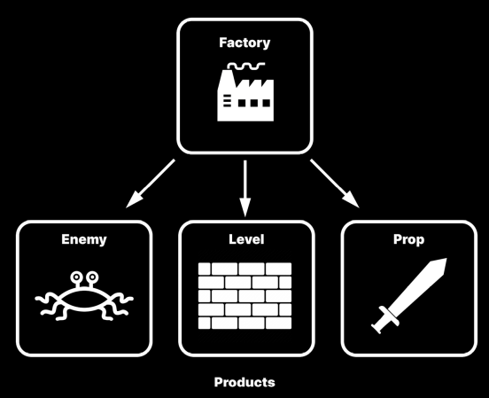
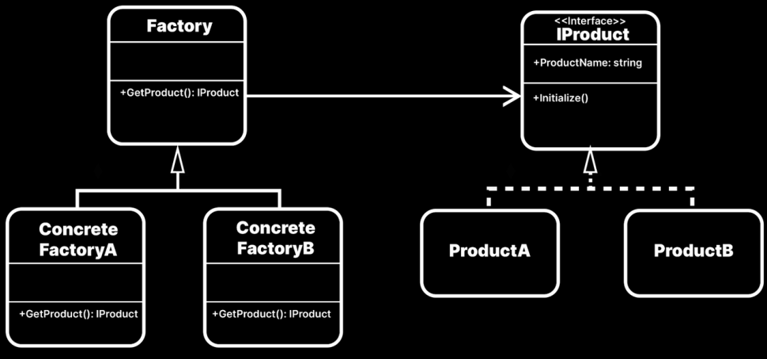

- [Factory Pattern 이란?](#factory-pattern-이란)
- [언제 사용하나?](#언제-사용하나)
- [설계법](#설계법)
- [예시 1 : Factory와 Product](#예시-1--factory와-product)
- [예시 2 : ItemManager](#예시-2--itemmanager)


[Game Programming Pattern Repository](https://github.com/hwalang/Game-Programming-Pattern-For-Unity.git) : Factory Scene을 참고

# Factory Pattern 이란?
</br>
`Object 생성을 위한 Pattern`.</br>

`다른 Object를 만드는 특수 Object`가 있으면 많은 도움을 준다.</br>
많은 게임에서 게임을 진행하는 도중 다양한 요소를 생성하며, 실제로 필요하기 전에는 runtime 시 무엇이 필요한지 모르는 경우가 많다.</br>

</br>
</br>

# 언제 사용하나?

`다양하고 많은 Product를 설정할 때 유용`하다.</br>
또한 Product 유형을 새로 정의하더라도 기존 Product 유형은 변경되지 않는다.</br>

`하지만` Factory Pattern을 구현하기 위해서 다수의 클래스와 child class를 만들어야 한다.</br>
이로 인해 약간의 overhead가 발생하기 때문에 매우 다양한 Product가 필요하지 않다면 FP로 설계하지 않는다.</br>

추가로 Object와 관련된 패턴이기 때문에 `Object Pool Pattern과 연계`된다.</br>

</br>
</br>

# 설계법
`Factory라는 특수 Object를 지정`한다.</br>
하나의 level에서 Factory는 `Product의 생산과 관련된 많은 사항을 캡슐화`한다.</br>

```c#
public class Factory : MonoBehaviour 
{
  public IProduct Create(string type) {
    IProduct product = null;

    switch (type) {
      case "A":
        product = new ProductA();
        break;
      case "B":
        product = new ProductB();
        break;
    }

    product?.ManuFacture();   // 각 product 고유의 제조법 수행
    return product;
  }
}
```
`각 Product가 공통의 interface 혹은 abstract class를 따르는 경우라면, Product에서 고유의 제조 로직을 포함하여 Factory에는 이를 보이지 않도록 할 수 있다`.</br>

새로운 Object를 쉽게 생성할 수 있다.</br>
이는 SOLID 원칙의 OCP나 DIP를 활용한다.</br>

Factory를 sub class로 분리하여 특정 제품만 제조하는 여러 개의 공장을 만들 수 있다.</br>
이러면 적이나 장애물을 비롯한 다양한 Object를 runtime에 생성하는 데 도움을 준다.</br>

Dictionary를 이용해서 `product를 key-value로 저장`하는 것이 좋다.</br>
고유한 문자열 식별자( 이름 또는 ID )를 key로 사용하고 TYPE을 value로 사용한다.</br>
이러면 `product 또는 factory를 편리하게 검색`할 수 있다.</br>


</br>
</br>

# 예시 1 : Factory와 Product
Item을 instance화하는 Factory Pattern을 설계한다.</br>
Prefab을 사용해 GameObject를 만들고, Instance를 생성할 때마다 custom 동작을 실행할 예정이다.</br>
</br>
```c#
public interface IProduct
{
  public string ProductName { get; set; }
  public void Initialize();
}

public abstract class Factory : MonoBehaviour
{
  public abstract IProduct GetProduct(Vector3 position);
}
```
`IProduct Interface는 제품 사이의 공통 요소를 정의`한다.</br>
ProductName과 Initialize()에서 제품이 실행하는 모든 로직이 공통 요소이다.</br>

`Factory에서 IProduct interface만 준수`하면 `필요한 제품(ProductA, ProductB 등)을 원하는 수만큼 정의`할 수 있다.</br>

```c#
public class FactoryA : Factory
{
  [SerializeField] private ProductA productPrefab;

  public override IProduct GetProduct(Vector3 position)
  {
    GameObject instance = Instantiate(productPrefab.gameObject, position, Quaternion.identity);
    ProductA newProduct = instance.GetComponent<ProductA>();

    newProduct.Initialize();    // 각 제품의 자체 로직

    return newProduct;
  }
}

public class ProductA : MonoBehaviour, IProduct
{
  [SerializeField] private string productName = "ProductA";
  public string ProductName { get => productName; set => productName = value; }

  private ParticleSystem particleSystem;

  public void Initialize()
  {
    gameObject.name = productName;
    particleSystem = GetComponentInChildren<ParticleSystem>();
    particleSystem?.Stop();
    particleSystem?.Play();
  }
}
```
각 Product class는 자체 로직을 Initialize()에서 정의한다.</br>

FactoryA는 ProductA의 particleSystem이 있는지 판단하지 않고 모든 제품에 공통적으로 적용되는 Initialize()만 호출한다.</br>

이처럼 `각 Product의 내부 로직을 Product class에서 관리하기 때문에 Factory 코드를 간단하게 유지`할 수 있다.</br>

</br>
</br>

# 예시 2 : ItemManager

`게임을 개발할 때 ItemManager는 필수로 구현`한다.</br>
로그라이크 게임에서 몬스터를 죽이거나 일정 시간이 지나면 맵에 아이템이 등장한다.</br>
이러한 아이템의 종류는 게임마다 다양하다.</br>

```c#
public class ItemManager : MonoBehaviour
{
  public void SpawnItem(ItemType type)
  {
    switch (type) {
      case ItemType.Health:
      case ItemType.Speed:
      case ItemType.Shield:
      case ItemType.Heart:
    }
  }
}
```
가장 단순한 ItemManager이다.</br>
새로운 아이템 종류를 추가할 때마다 case를 증가시킨다.</br>

```c#
public class ItemManager : MonoBehaviour
{
  ItemFactory itemFactory;

  public void SpawnItem(ItemType type)
  {
    GameObject item = itemFactory.CreateItem();
  }
}
```
`ItemManager는 ItemFactory를 사용`하고 `실질적인 내부 로직은 Factory에게 위임`한다.</br>
ItemManager는 새로운 아이템을 추가해도 수정할 필요가 없다.</br>