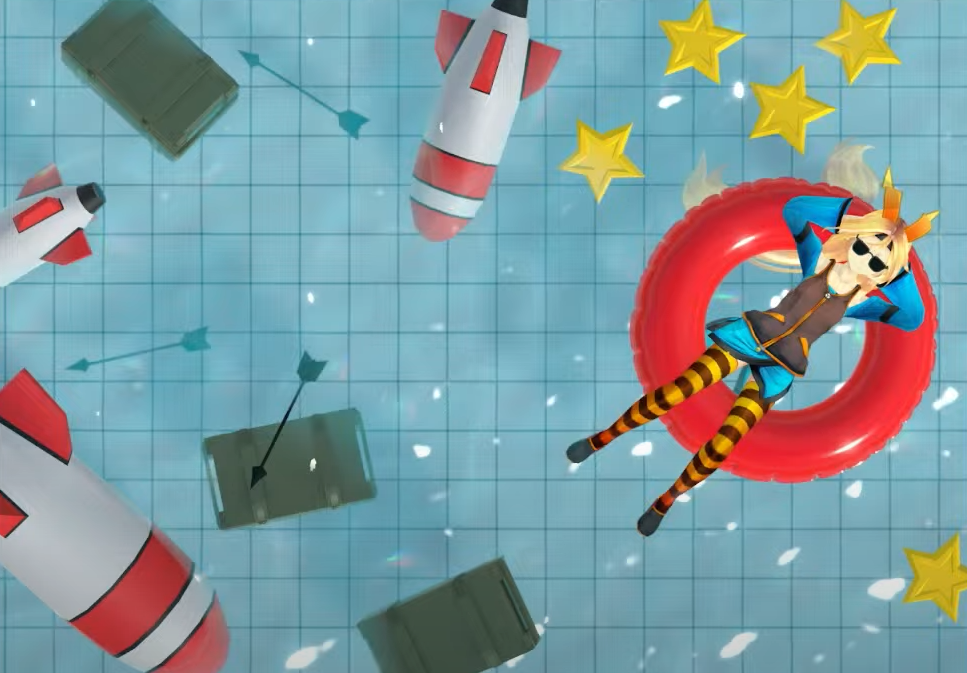

- [Object Pooling을 사용하는 이유](#object-pooling을-사용하는-이유)
- [접근법 1 : custom](#접근법-1--custom)
- [접근법 2 : UnityEngine.Pool](#접근법-2--unityenginepool)
- [예시 1 : Pool System](#예시-1--pool-system)

</br>

</br>

# Object Pooling을 사용하는 이유
`많은 수의 게임 오브젝트를 생성하고 파괴할 때 CPU 부담을 줄이는 최적화 기법`이다.</br>

`Garbage Collection( 이하 GC )의 spike로 불안정한 상황( 끊김 현상 )이 발생하는 것을 줄일 수 있다`.</br>
GC spike는 대량의 Object 생성이나 파괴 시 memory 할당으로 인해 발생하는 경우가 많다.</br>

***GC Spike 알아보기***

</br>
</br>

# 접근법 1 : custom
`Object가 필요할 때`마다 Object를 Instance화 하지 않고 `Object를 관리하는 Pool에 요청하고 활성화`한다.</br>

`사용이 끝난 Object는 파괴하는 대신 비활성화하고 Pool로 반납`한다.</br>

로딩 화면처럼 `사용자가 끊김 현상을 알아차리지 않는 적절한 시점에 Object Pool을 미리 Instance화` 하는 것을 권장한다.</br>

`Pool 크기를 초과하는 Object를 요구할 때 Pool에서 추가 Object를 Instance화 할 수 있지만, 대체로 Pool은 기존의 비활성 Object에서 가져온다`.</br>

`다양한 Script에서 Pooling Object를 생성하는 경우, static 또는 singleton으로 Object Pool을 구현`한다.</br>

`Dictionary로 많은 Pool을 관리`할 수 있다.</br>
다양한 Object를 개별적인 Pool에 저장하고 key-value를 세팅하면 원하는 Pool을 찾을 수 있다.</br>

`Pooling된 Object가 너무 많으면 memory를 소모`한다.</br>
Pool이 너무 많은 resource를 사용하지 않도록 `한도를 초과하는 Object를 제거`한다.</br>

</br>
</br>

# 접근법 2 : UnityEngine.Pool
```c#
using UnityEngine.Pool;
```
Unity 2021에서 `UnityEngine.Pool API를 지원`한다.</br>
stack 기반 ObjectPool을 제공한다.</br>
필요에 따라 CollectionPool( List, HashSet, Dictionary 등 )도 사용할 수 있다.</br>

</br>
</br>

# 예시 1 : Pool System
```c#
public class ObjectPool : MonoBehaviour
{
  [SerializeField] private uint initPoolSize;
  [SerializeField] private PooledObject objectToPool;

  private Stack<PooledObject> stack;

  private void Start() { SetupPool(); }

  // Pool 생성 => 사용자가 끊김 현상( 지연 )을 인지할 수 없는 시점에 호출
  private void SetupPool()
  {
    stack = new Stack<PooledObject>();
    PooledObject instance = null;

    for (int i = 0; i < initPoolSize; ++i) {
      instance = Instantiate(objectToPool);
      instance.Pool = this;
      instance.gameObejct.SetActive(false);
      stack.Push(instance);
    }
  }
}
```
ObjectPool에서 object를 관리한다.</br>
Pool을 관리하는 Collection( 여기선 stack )과 각 Object를 Pool에 올리는 SetupPool()이 존재한다.</br>
SetupPool()은 지연을 인지할 수 없을 때 호출한다.</br>

```c#
public class ObjectPool : MonoBehaviour
{
  ...

  // Pool에서 첫 번째 Active Object를 반환
  public PooledObject GetPooledObject()
  {
    if (stack.Count == 0) {
      PooledObject newInstance = Instantiate(objectPool);
      newInstance.Pool = this;
      return newInstance;
    }

    PooledObject nextInstance = stack.Pop();
    nextInstance.gameObject.SetActive(true);
    return nextInstance;
  }

  public void ReturnToPool(PooledObject pooledObject)
  {
    stack.Push(pooledObject);
    pooledObject.gameObject.SetActive(false);
  }
}
```
Pooling된 항목을 검색( GetPooledObject )하고 Pool로 해당 항목을 반환( ReturnToPool )할 기능도 필요하다.</br>
Pool에 저장했던 Object가 모두 다른 곳에서 사용 중일 때( Count == 0 ), 새로운 Instance를 만들어서 제공한다.</br>

```c#
// Gun
[Tooltip("Reference to Object Pool")]
[SerializeField] ObjectPool objectPool;

GameObject bulletObject = objectPool.GetPooledObject().gameObject;
```
Gun에서 총알을 발사할 때, Instantiate()가 아닌 ObjectPool에서 총알을 가져온다.</br>

```c#
public class PooledObject : MonoBehaviour
{
  // PooledObject를 Component로 가진 GameObject가 Object Pool의 관리 대상임을 암시한다.
  private ObjectPool pool;
  public ObjectPool Pool { get => pool; set => pool = value; }

  public void Release()
  {
    pool.ReturnToPool(this);
  }
}
```
`Pooling된 각 Object는 ObjectPool을 참조하기 위한 PooledObject Component를 가진다`.</br>

총알을 발사할 때, Object.Instantiate()를 호출하는 대신 GetPooledObject()를 호출한다.</br>

</br>
</br>