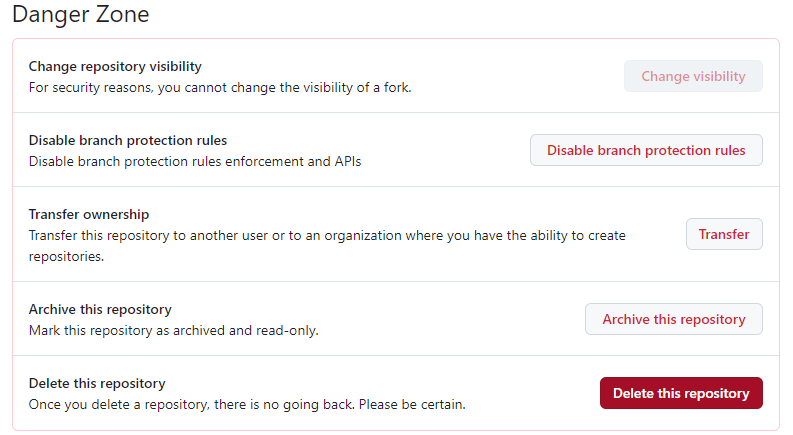

# Fork for GitHub

fork란, 다른 사람의 github repository에서 `내가 어떤 부분을 수정하거나 추가 기능을 넣고 싶을 때`, 내 github repository로 그대로 복제하는 기능이다. 

`fork하는 이유는 original repository에 수정 사항을 요청하고 싶을 때`이다. 
따라서 fork한 repository에서 코드를 수정한 뒤에 original repository에 pull request( 이하 PR )를 요청한다. 
PR이 관리자로부터 승인됐으면 나의 commit이 merge되어 original repository에 반영된다. 

`fork한 repository는 original과 연결`된다. 
따라서 `original repository에 새로운 사항이 반영된 경우, 이를 fork한 repository에 반영`할 수 있다. 

## fork한 repository 해제

1. fork repository 입장
2. settings
3. Danger Zone
4. Delete this repository