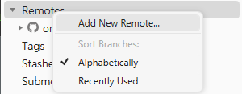
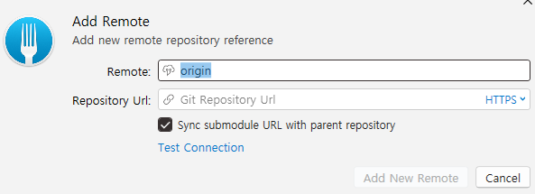

# Clone한 repository를 내 repository로 push하는 방법

1. local에 원하는 repository를 clone한다.
2. github에서 clone한 repository를 저장할 새로운 repository를 생성한다.
3. Fork 툴에서 clone한 repository를 연다.
4. 왼쪽 panel의 Remotes를 오른쪽 클릭한 뒤 `Add New Remote`를 클릭한다.
   
5. 이름은 임의로 지정하고, URL에 방금 생성한 github repository의 URL을 입력한 후 Add 한다.
   
6. 상단 메뉴의 Push 버튼을 클릭하여 local repository를 remote repository로 올린다.
7. github에서 확인한다.
8. local repository를 삭제한다.
   - 기존 local의 왼쪽 panel에 있는 Remotes에 2개가 존재하기 때문이다.
   - origin 하나로 관리하고 싶으면 8 ~ 9번 과정을 거친다.
9.  github repository를 clone하여 가져온다.