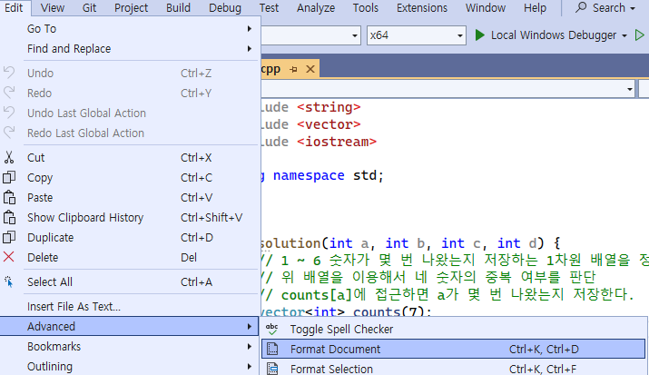

- [visual studio formatter](#visual-studio-formatter)
- [**Clang Format**](#clang-format)

 

# visual studio formatter
visual studio가 기본적으로 가진 기능이다 
`ctrl + k + d` 

 

단점은 generic하게 사용할 수 있도록 세팅했기 때문에 팀의 기준에 맞출 수 없다 

  

# **Clang Format**
[.clang format 파일](/7_VisualStudio%20Tip/) 
visual studio 뿐만 아니라 다양한 환경에서 사용할 수 있다 
`.clang-format 파일만 공유하면 팀 내의 모든 convension이 동일하게 관리`된다 

clang-format 파일을 수정해서 원하는 format을 세팅할 수 있다 
clang-format 파일이 visual studio solution 폴더 내부에 존재하면, `ctrl + k + d`로 format document 기능을 이용할 때, `.clang format의 설정을 적용`한다 